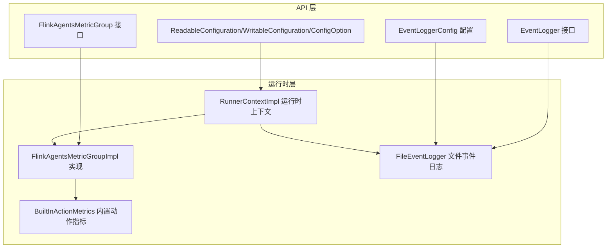
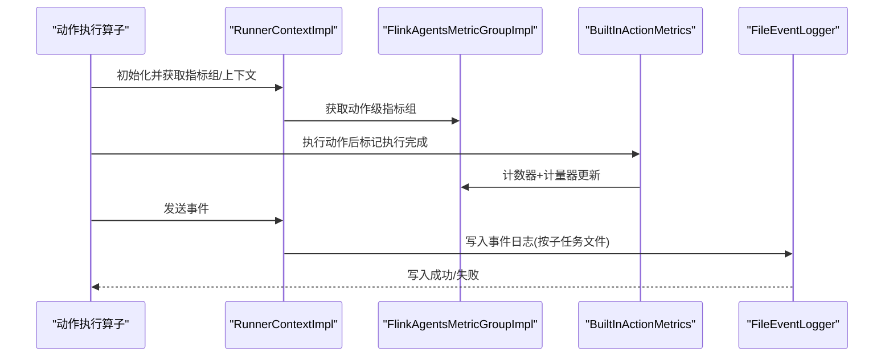
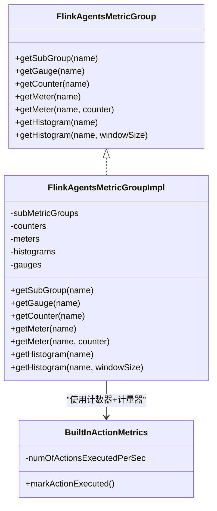
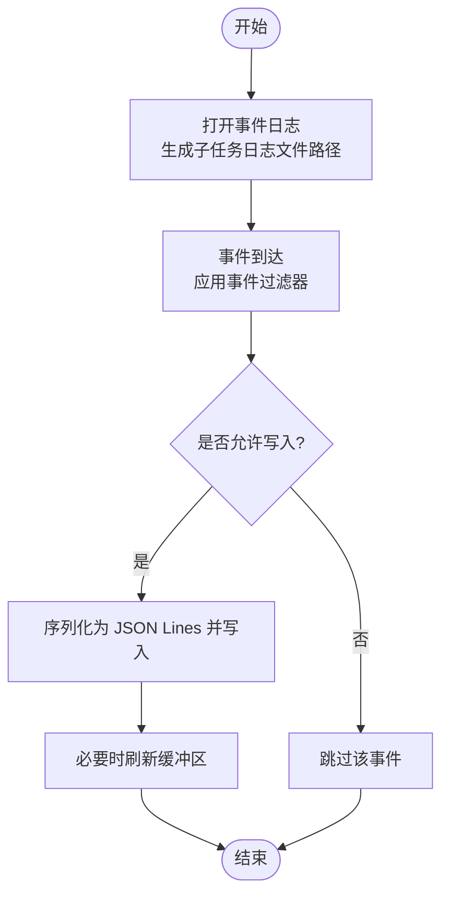
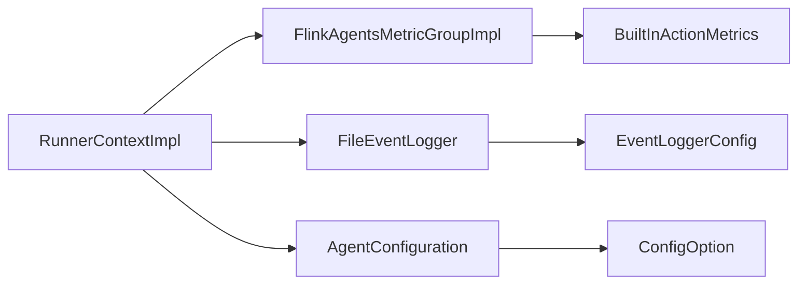

# 监控告警

<cite>
**本文引用的文件**
- [README.md](file://README.md)
- [FlinkAgentsMetricGroup.java](file://api/src/main/java/org/apache/flink/agents/api/metrics/FlinkAgentsMetricGroup.java)
- [FlinkAgentsMetricGroupImpl.java](file://runtime/src/main/java/org/apache/flink/agents/runtime/metrics/FlinkAgentsMetricGroupImpl.java)
- [BuiltInActionMetrics.java](file://runtime/src/main/java/org/apache/flink/agents/runtime/metrics/BuiltInActionMetrics.java)
- [EventLogger.java](file://api/src/main/java/org/apache/flink/agents/api/logger/EventLogger.java)
- [EventLoggerConfig.java](file://api/src/main/java/org/apache/flink/agents/api/logger/EventLoggerConfig.java)
- [FileEventLogger.java](file://runtime/src/main/java/org/apache/flink/agents/runtime/eventlog/FileEventLogger.java)
- [RunnerContextImpl.java](file://runtime/src/main/java/org/apache/flink/agents/runtime/context/RunnerContextImpl.java)
- [ReadableConfiguration.java](file://api/src/main/java/org/apache/flink/agents/api/configuration/ReadableConfiguration.java)
- [WritableConfiguration.java](file://api/src/main/java/org/apache/flink/agents/api/configuration/WritableConfiguration.java)
- [ConfigOption.java](file://api/src/main/java/org/apache/flink/agents/api/configuration/ConfigOption.java)
- [AgentConfiguration.java](file://plan/src/main/java/org/apache/flink/agents/plan/AgentConfiguration.java)
- [ActionExecutionOperatorTest.java](file://runtime/src/test/java/org/apache/flink/agents/runtime/operator/ActionExecutionOperatorTest.java)
</cite>

## 目录
1. [简介](#简介)
2. [项目结构](#项目结构)
3. [核心组件](#核心组件)
4. [架构总览](#架构总览)
5. [详细组件分析](#详细组件分析)
6. [依赖关系分析](#依赖关系分析)
7. [性能考量](#性能考量)
8. [故障排查指南](#故障排查指南)
9. [结论](#结论)
10. [附录](#附录)

## 简介
本文件面向运维工程师，提供 Apache Flink Agents 的监控与告警实施方案。内容覆盖指标采集（系统、应用、业务）、日志管理（级别、轮转、聚合）、告警规则（阈值、趋势、异常检测）、监控仪表盘与可视化（Grafana、Prometheus 集成、自定义图表）、故障检测与自动恢复（健康检查、自动重启、故障转移）、监控数据存储与历史分析等。文档基于仓库中已实现的指标体系与事件日志能力进行落地说明，并给出可操作的配置与流程建议。

## 项目结构
- 指标与度量：在 API 层定义抽象接口，在运行时层提供 Flink 运行时实现；内置动作指标用于统计执行速率。
- 日志：事件日志接口统一抽象，文件事件日志实现提供按子任务分文件的 JSON Lines 写入与过滤能力。
- 配置：通过 ConfigOption 与 AgentConfiguration 提供键值型配置读取与默认值支持。
- 运行时上下文：RunnerContextImpl 提供指标组、事件发送、内存更新等运行期能力。

**图示来源**
- [FlinkAgentsMetricGroup.java](file://api/src/main/java/org/apache/flink/agents/api/metrics/FlinkAgentsMetricGroup.java#L30-L92)
- [FlinkAgentsMetricGroupImpl.java](file://runtime/src/main/java/org/apache/flink/agents/runtime/metrics/FlinkAgentsMetricGroupImpl.java#L38-L104)
- [BuiltInActionMetrics.java](file://runtime/src/main/java/org/apache/flink/agents/runtime/metrics/BuiltInActionMetrics.java#L30-L44)
- [EventLogger.java](file://api/src/main/java/org/apache/flink/agents/api/logger/EventLogger.java#L31-L78)
- [EventLoggerConfig.java](file://api/src/main/java/org/apache/flink/agents/api/logger/EventLoggerConfig.java#L45-L108)
- [FileEventLogger.java](file://runtime/src/main/java/org/apache/flink/agents/runtime/eventlog/FileEventLogger.java#L77-L157)
- [RunnerContextImpl.java](file://runtime/src/main/java/org/apache/flink/agents/runtime/context/RunnerContextImpl.java#L60-L147)

**章节来源**
- [README.md](file://README.md#L1-L44)

## 核心组件
- 指标度量接口与实现
  - 抽象接口提供子度量组、计数器、计量器、直方图、可更新量表等能力。
  - 运行时实现基于 Flink ProxyMetricGroup，提供线程安全的缓存与创建逻辑。
- 内置动作指标
  - 基于计数器与计量器组合，统计“每秒执行动作数量”等关键业务指标。
- 事件日志接口与文件日志实现
  - 统一事件日志抽象，文件实现按子任务生成唯一日志文件，JSON Lines 格式写入，支持事件过滤。
- 运行时上下文
  - 提供指标组获取、事件发送、内存更新等能力，贯穿动作执行生命周期。

**章节来源**
- [FlinkAgentsMetricGroup.java](file://api/src/main/java/org/apache/flink/agents/api/metrics/FlinkAgentsMetricGroup.java#L30-L92)
- [FlinkAgentsMetricGroupImpl.java](file://runtime/src/main/java/org/apache/flink/agents/runtime/metrics/FlinkAgentsMetricGroupImpl.java#L38-L104)
- [BuiltInActionMetrics.java](file://runtime/src/main/java/org/apache/flink/agents/runtime/metrics/BuiltInActionMetrics.java#L30-L44)
- [EventLogger.java](file://api/src/main/java/org/apache/flink/agents/api/logger/EventLogger.java#L31-L78)
- [EventLoggerConfig.java](file://api/src/main/java/org/apache/flink/agents/api/logger/EventLoggerConfig.java#L45-L108)
- [FileEventLogger.java](file://runtime/src/main/java/org/apache/flink/agents/runtime/eventlog/FileEventLogger.java#L77-L157)
- [RunnerContextImpl.java](file://runtime/src/main/java/org/apache/flink/agents/runtime/context/RunnerContextImpl.java#L60-L147)

## 架构总览
下图展示从动作执行到指标与事件日志的关键交互路径，体现监控与告警的数据来源与流向。

**图示来源**
- [RunnerContextImpl.java](file://runtime/src/main/java/org/apache/flink/agents/runtime/context/RunnerContextImpl.java#L144-L160)
- [FlinkAgentsMetricGroupImpl.java](file://runtime/src/main/java/org/apache/flink/agents/runtime/metrics/FlinkAgentsMetricGroupImpl.java#L55-L88)
- [BuiltInActionMetrics.java](file://runtime/src/main/java/org/apache/flink/agents/runtime/metrics/BuiltInActionMetrics.java#L40-L43)
- [FileEventLogger.java](file://runtime/src/main/java/org/apache/flink/agents/runtime/eventlog/FileEventLogger.java#L123-L138)

## 详细组件分析

### 指标体系与采集
- 指标类型
  - 子度量组：按动作名划分维度，便于区分不同动作的性能。
  - 计数器：累计动作执行总数。
  - 计量器：记录事件发生速率（如每秒执行动作数）。
  - 直方图：记录耗时等数值分布（窗口大小可配置）。
  - 可更新量表：标准化字符串值，便于跨语言一致性。
- 关键实现要点
  - 运行时实现对指标对象进行缓存，避免重复创建。
  - 默认窗口大小与视图配置满足通用观测需求。
- 业务指标建议
  - 动作成功率、重试次数、超时比例、响应延迟分位数等，均可通过计数器/计量器/直方图组合实现。

**图示来源**
- [FlinkAgentsMetricGroup.java](file://api/src/main/java/org/apache/flink/agents/api/metrics/FlinkAgentsMetricGroup.java#L30-L92)
- [FlinkAgentsMetricGroupImpl.java](file://runtime/src/main/java/org/apache/flink/agents/runtime/metrics/FlinkAgentsMetricGroupImpl.java#L38-L104)
- [BuiltInActionMetrics.java](file://runtime/src/main/java/org/apache/flink/agents/runtime/metrics/BuiltInActionMetrics.java#L30-L44)

**章节来源**
- [FlinkAgentsMetricGroup.java](file://api/src/main/java/org/apache/flink/agents/api/metrics/FlinkAgentsMetricGroup.java#L30-L92)
- [FlinkAgentsMetricGroupImpl.java](file://runtime/src/main/java/org/apache/flink/agents/runtime/metrics/FlinkAgentsMetricGroupImpl.java#L38-L104)
- [BuiltInActionMetrics.java](file://runtime/src/main/java/org/apache/flink/agents/runtime/metrics/BuiltInActionMetrics.java#L30-L44)

### 日志管理策略
- 日志级别与过滤
  - 通过事件过滤器在写入前筛选事件，减少无关日志量。
- 日志轮转与聚合
  - 文件事件日志按子任务生成独立文件，天然具备轮转基础；结合外部日志系统（如 Logback、Fluent Bit、Filebeat）实现集中聚合与轮转。
- 日志目录与命名
  - 使用作业 ID、任务名、子任务 ID 组合命名，避免冲突，便于定位与检索。
- 写入与刷新
  - 采用追加写入与显式 flush，确保数据落盘。

**图示来源**
- [FileEventLogger.java](file://runtime/src/main/java/org/apache/flink/agents/runtime/eventlog/FileEventLogger.java#L94-L147)
- [EventLoggerConfig.java](file://api/src/main/java/org/apache/flink/agents/api/logger/EventLoggerConfig.java#L94-L108)

**章节来源**
- [EventLogger.java](file://api/src/main/java/org/apache/flink/agents/api/logger/EventLogger.java#L31-L78)
- [EventLoggerConfig.java](file://api/src/main/java/org/apache/flink/agents/api/logger/EventLoggerConfig.java#L45-L108)
- [FileEventLogger.java](file://runtime/src/main/java/org/apache/flink/agents/runtime/eventlog/FileEventLogger.java#L77-L157)

### 告警规则配置
- 阈值告警
  - 基于计量器速率（如每秒动作数）或直方图分位数（如 P95 延迟）设置阈值触发。
- 趋势告警
  - 对计量器/直方图滑动窗口统计进行趋势分析，识别速率下降、延迟上升等异常趋势。
- 异常检测告警
  - 利用直方图统计（均值、最大/最小）与异常边界对比，结合事件日志进行根因定位。
- 告警收敛与抑制
  - 建议结合静默周期与告警合并策略，避免噪声干扰。

说明：以上为通用告警设计思路，具体阈值与规则需结合业务场景与历史数据设定。

### 监控仪表盘与可视化
- Prometheus 集成
  - 将 Flink 运行时指标暴露给 Prometheus，采集器抓取后入库。
- Grafana 面板
  - 基于指标构建面板：吞吐（动作/秒）、延迟（P50/P95）、错误率、重试率、资源使用等。
- 自定义图表
  - 结合事件日志中的结构化字段（如动作名、结果状态）进行多维聚合与钻取。

说明：本节为概念性集成方案，实际部署需配合 Flink 与外部监控系统的配置。

### 故障检测与自动恢复
- 健康检查
  - 通过指标健康探针（如动作执行速率、错误率）判断节点/任务健康状态。
- 自动重启
  - 在容器编排层（如 Kubernetes）基于健康检查失败触发重启策略。
- 故障转移
  - 利用 Flink 的检查点与状态后端，结合高可用配置实现故障后的快速恢复与状态回放。

说明：本节为通用运维实践，具体策略需结合部署环境与 SLA 要求制定。

### 监控数据存储与历史分析
- 存储
  - 指标数据存储于时序数据库（如 Prometheus TSDB），事件日志存储于对象存储或日志系统。
- 历史分析
  - 周期性导出指标与日志，进行离线分析（如回归分析、容量规划、根因分析）。

说明：本节为通用数据工程实践，具体方案需结合团队数据平台能力。

## 依赖关系分析
- 指标依赖
  - RunnerContextImpl 通过 FlinkAgentsMetricGroupImpl 获取动作级指标组；BuiltInActionMetrics 使用计数器与计量器组合实现速率统计。
- 日志依赖
  - FileEventLogger 依赖 EventLoggerConfig 的属性与 EventFilter；事件写入前进行过滤。
- 配置依赖
  - RunnerContextImpl 读取长短期记忆后端配置；AgentConfiguration 支持键值读取与默认值。

**图示来源**
- [RunnerContextImpl.java](file://runtime/src/main/java/org/apache/flink/agents/runtime/context/RunnerContextImpl.java#L109-L125)
- [FlinkAgentsMetricGroupImpl.java](file://runtime/src/main/java/org/apache/flink/agents/runtime/metrics/FlinkAgentsMetricGroupImpl.java#L55-L88)
- [BuiltInActionMetrics.java](file://runtime/src/main/java/org/apache/flink/agents/runtime/metrics/BuiltInActionMetrics.java#L34-L43)
- [FileEventLogger.java](file://runtime/src/main/java/org/apache/flink/agents/runtime/eventlog/FileEventLogger.java#L89-L92)
- [EventLoggerConfig.java](file://api/src/main/java/org/apache/flink/agents/api/logger/EventLoggerConfig.java#L45-L108)
- [AgentConfiguration.java](file://plan/src/main/java/org/apache/flink/agents/plan/AgentConfiguration.java#L36-L134)
- [ConfigOption.java](file://api/src/main/java/org/apache/flink/agents/api/configuration/ConfigOption.java#L28-L102)

**章节来源**
- [RunnerContextImpl.java](file://runtime/src/main/java/org/apache/flink/agents/runtime/context/RunnerContextImpl.java#L109-L125)
- [AgentConfiguration.java](file://plan/src/main/java/org/apache/flink/agents/plan/AgentConfiguration.java#L36-L134)
- [ConfigOption.java](file://api/src/main/java/org/apache/flink/agents/api/configuration/ConfigOption.java#L28-L102)

## 性能考量
- 指标开销
  - 计数器/计量器/直方图均为轻量结构；建议合理设置直方图窗口大小与采样频率。
- IO 开销
  - 事件日志采用追加写入与缓冲刷新，建议结合批量写入与异步刷新降低 IO 压力。
- 内存与序列化
  - 事件必须可序列化，避免运行时异常；建议控制事件体大小与字段数量。

## 故障排查指南
- 指标未更新
  - 检查 RunnerContextImpl 是否正确获取动作级指标组；确认 BuiltInActionMetrics 的标记调用路径。
- 事件日志缺失
  - 检查 EventLoggerConfig 的事件过滤器配置；确认 FileEventLogger 的打开与刷新流程。
- 异常恢复
  - 参考测试用例中的异常场景，验证持久化执行与恢复行为，确保异常不被重复执行。

**章节来源**
- [RunnerContextImpl.java](file://runtime/src/main/java/org/apache/flink/agents/runtime/context/RunnerContextImpl.java#L144-L160)
- [FileEventLogger.java](file://runtime/src/main/java/org/apache/flink/agents/runtime/eventlog/FileEventLogger.java#L94-L147)
- [ActionExecutionOperatorTest.java](file://runtime/src/test/java/org/apache/flink/agents/runtime/operator/ActionExecutionOperatorTest.java#L1308-L1435)

## 结论
本方案基于仓库内已实现的指标与事件日志能力，提供了从采集、存储、分析到可视化的完整监控告警实施路径。通过合理的阈值与趋势规则、完善的日志轮转与聚合策略，以及与 Prometheus/Grafana 的集成，可有效支撑 Apache Flink Agents 的生产级可观测性与自动化运维。

## 附录
- 配置项参考
  - 通过 ConfigOption 与 AgentConfiguration 提供键值读取与默认值能力，便于在运行时动态调整行为。
- 文档与社区
  - 用户文档与社区渠道可获取最新使用指南与问题反馈入口。

**章节来源**
- [ReadableConfiguration.java](file://api/src/main/java/org/apache/flink/agents/api/configuration/ReadableConfiguration.java#L31-L84)
- [WritableConfiguration.java](file://api/src/main/java/org/apache/flink/agents/api/configuration/WritableConfiguration.java#L38-L77)
- [ConfigOption.java](file://api/src/main/java/org/apache/flink/agents/api/configuration/ConfigOption.java#L28-L102)
- [AgentConfiguration.java](file://plan/src/main/java/org/apache/flink/agents/plan/AgentConfiguration.java#L36-L134)
- [README.md](file://README.md#L1-L44)