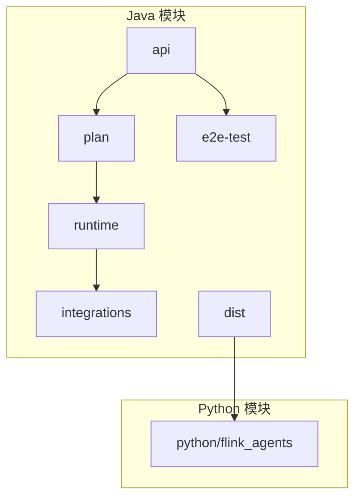
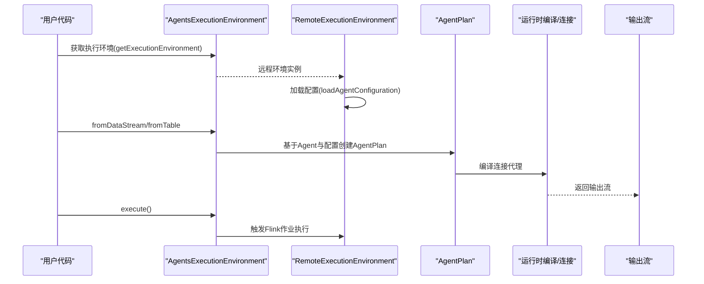
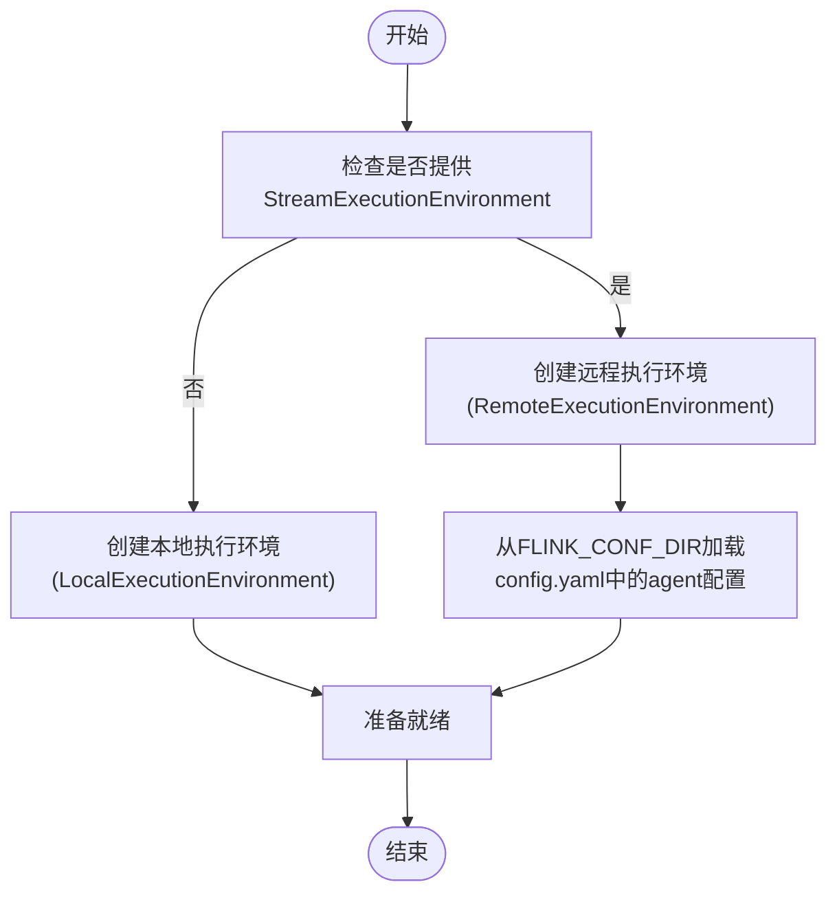
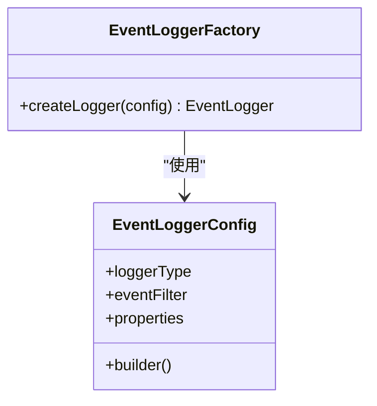
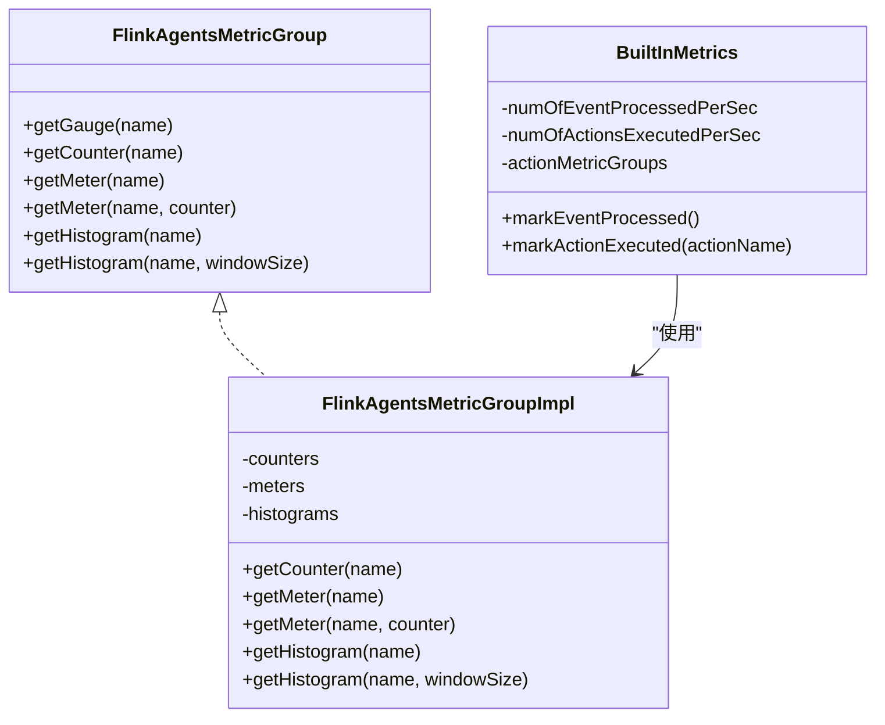
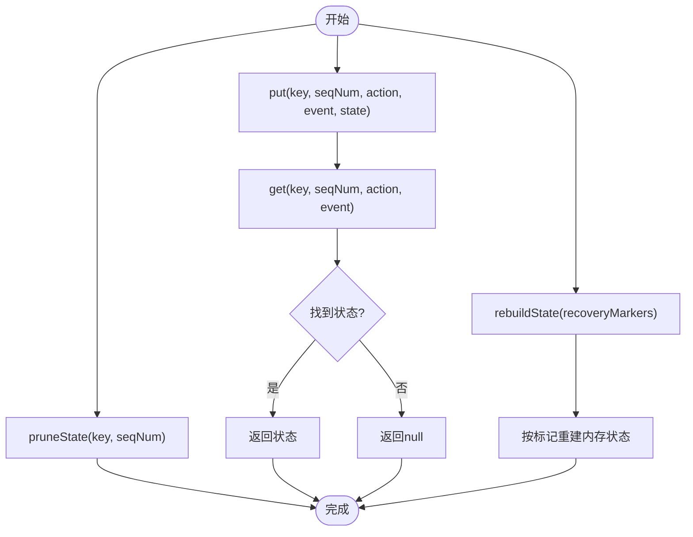
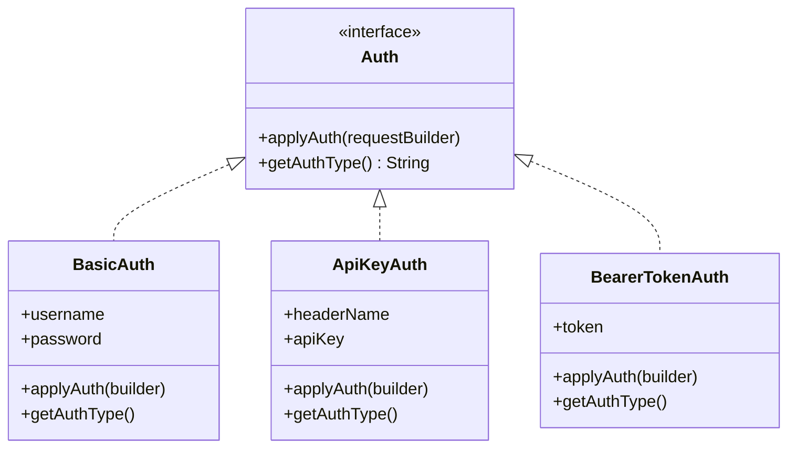
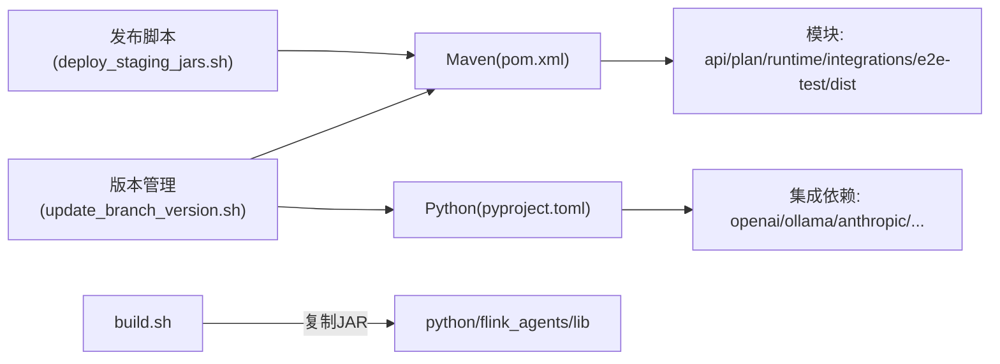

# 部署运维

<cite>
**本文引用的文件**
- [README.md](file://README.md)
- [pom.xml](file://pom.xml)
- [pyproject.toml](file://python/pyproject.toml)
- [build.sh](file://tools/build.sh)
- [deploy_staging_jars.sh](file://tools/releasing/deploy_staging_jars.sh)
- [create_release_branch.sh](file://tools/releasing/create_release_branch.sh)
- [update_branch_version.sh](file://tools/releasing/update_branch_version.sh)
- [AgentsExecutionEnvironment.java](file://api/src/main/java/org/apache/flink/agents/api/AgentsExecutionEnvironment.java)
- [RemoteExecutionEnvironment.java](file://runtime/src/main/java/org/apache/flink/agents/runtime/env/RemoteExecutionEnvironment.java)
- [AgentConfigOptions.java](file://api/src/main/java/org/apache/flink/agents/api/configuration/AgentConfigOptions.java)
- [Configuration.java](file://api/src/main/java/org/apache/flink/agents/api/configuration/Configuration.java)
- [EventLoggerConfig.java](file://api/src/main/java/org/apache/flink/agents/api/logger/EventLoggerConfig.java)
- [EventLoggerFactory.java](file://api/src/main/java/org/apache/flink/agents/api/logger/EventLoggerFactory.java)
- [FlinkAgentsMetricGroup.java](file://api/src/main/java/org/apache/flink/agents/api/metrics/FlinkAgentsMetricGroup.java)
- [FlinkAgentsMetricGroupImpl.java](file://runtime/src/main/java/org/apache/flink/agents/runtime/metrics/FlinkAgentsMetricGroupImpl.java)
- [BuiltInMetrics.java](file://runtime/src/main/java/org/apache/flink/agents/runtime/metrics/BuiltInMetrics.java)
- [BuiltInActionMetrics.java](file://runtime/src/main/java/org/apache/flink/agents/runtime/metrics/BuiltInActionMetrics.java)
- [ActionStateStore.java](file://runtime/src/main/java/org/apache/flink/agents/runtime/actionstate/ActionStateStore.java)
- [ActionState.java](file://runtime/src/main/java/org/apache/flink/agents/runtime/actionstate/ActionState.java)
- [RunnerContextImpl.java](file://runtime/src/main/java/org/apache/flink/agents/runtime/context/RunnerContextImpl.java)
- [Auth.java](file://integrations/mcp/src/main/java/org/apache/flink/agents/integrations/mcp/auth/Auth.java)
- [BasicAuth.java](file://integrations/mcp/src/main/java/org/apache/flink/agents/integrations/mcp/auth/BasicAuth.java)
- [ApiKeyAuth.java](file://integrations/mcp/src/main/java/org/apache/flink/agents/integrations/mcp/auth/ApiKeyAuth.java)
- [BearerTokenAuth.java](file://integrations/mcp/src/main/java/org/apache/flink/agents/integrations/mcp/auth/BearerTokenAuth.java)
- [version_compatibility.py](file://python/flink_agents/api/version_compatibility.py)
- [log4j2-test.properties（运行时测试）](file://runtime/src/test/resources/log4j2-test.properties)
- [log4j2-test.properties（集成测试）](file://e2e-test/flink-agents-end-to-end-tests-integration/src/test/resources/log4j2-test.properties)
</cite>

## 目录
1. [简介](#简介)
2. [项目结构](#项目结构)
3. [核心组件](#核心组件)
4. [架构总览](#架构总览)
5. [详细组件分析](#详细组件分析)
6. [依赖关系分析](#依赖关系分析)
7. [性能考虑](#性能考虑)
8. [故障排除指南](#故障排除指南)
9. [结论](#结论)
10. [附录](#附录)

## 简介
本文件面向系统管理员与运维工程师，提供 Apache Flink Agents 在生产环境中的部署与运维指导。内容涵盖集群部署、容器化部署、云平台部署方案；性能调优与监控配置；安全配置与访问控制；故障排除与运维手册；备份与灾难恢复；版本升级与回滚；以及运维自动化与监控告警配置。

## 项目结构
项目采用多模块 Maven 结构，核心模块包括：
- api：对外 API 与配置接口
- plan：代理计划序列化/反序列化
- runtime：运行时实现（含指标、状态存储、上下文等）
- integrations：第三方集成（如聊天模型、嵌入模型、向量库、MCP 等）
- e2e-test：端到端测试
- python：Python API 包装与示例
- dist：打包产物（构建后生成）

图表来源
- [pom.xml](file://pom.xml#L58-L67)
- [pyproject.toml](file://python/pyproject.toml#L64-L70)

章节来源
- [pom.xml](file://pom.xml#L58-L67)
- [pyproject.toml](file://python/pyproject.toml#L64-L70)

## 核心组件
- 执行环境与入口
  - 运行时执行环境通过工厂方法在本地与远程之间切换，远程环境从 Flink 配置目录加载 agent 配置并连接到 DataStream/Table。
- 配置体系
  - 提供可读写配置接口与一组 Agent 配置项（如日志目录、动作状态存储后端、Kafka 连接参数、作业标识等）。
- 日志记录
  - 统一事件日志配置与工厂，支持按类型注册不同日志器（如文件、数据库、Kafka），并提供过滤器与属性配置。
- 指标体系
  - 提供通用指标组接口与运行时实现，内置事件处理速率、动作执行速率及按动作维度的指标。
- 状态存储
  - 动作状态存储接口定义了持久化/恢复/修剪等能力，并支持从后端重建内存状态。
- 安全与访问控制
  - MCP 认证抽象与多种认证方式（Bearer Token、Basic、API Key），用于对接外部服务的安全访问。

章节来源
- [AgentsExecutionEnvironment.java](file://api/src/main/java/org/apache/flink/agents/api/AgentsExecutionEnvironment.java#L68-L121)
- [RemoteExecutionEnvironment.java](file://runtime/src/main/java/org/apache/flink/agents/runtime/env/RemoteExecutionEnvironment.java#L102-L117)
- [Configuration.java](file://api/src/main/java/org/apache/flink/agents/api/configuration/Configuration.java#L20-L24)
- [AgentConfigOptions.java](file://api/src/main/java/org/apache/flink/agents/api/configuration/AgentConfigOptions.java#L21-L50)
- [EventLoggerConfig.java](file://api/src/main/java/org/apache/flink/agents/api/logger/EventLoggerConfig.java#L45-L136)
- [EventLoggerFactory.java](file://api/src/main/java/org/apache/flink/agents/api/logger/EventLoggerFactory.java#L92-L102)
- [FlinkAgentsMetricGroup.java](file://api/src/main/java/org/apache/flink/agents/api/metrics/FlinkAgentsMetricGroup.java#L40-L92)
- [FlinkAgentsMetricGroupImpl.java](file://runtime/src/main/java/org/apache/flink/agents/runtime/metrics/FlinkAgentsMetricGroupImpl.java#L69-L104)
- [BuiltInMetrics.java](file://runtime/src/main/java/org/apache/flink/agents/runtime/metrics/BuiltInMetrics.java#L34-L72)
- [ActionStateStore.java](file://runtime/src/main/java/org/apache/flink/agents/runtime/actionstate/ActionStateStore.java#L52-L92)
- [Auth.java](file://integrations/mcp/src/main/java/org/apache/flink/agents/integrations/mcp/auth/Auth.java#L37-L59)

## 架构总览
下图展示了从输入流到代理执行再到输出流的整体流程，以及配置、日志、指标与状态存储的关键交互点。

图表来源
- [AgentsExecutionEnvironment.java](file://api/src/main/java/org/apache/flink/agents/api/AgentsExecutionEnvironment.java#L68-L121)
- [RemoteExecutionEnvironment.java](file://runtime/src/main/java/org/apache/flink/agents/runtime/env/RemoteExecutionEnvironment.java#L102-L117)
- [RemoteExecutionEnvironment.java](file://runtime/src/main/java/org/apache/flink/agents/runtime/env/RemoteExecutionEnvironment.java#L191-L214)

## 详细组件分析

### 执行环境与配置加载
- 远程执行环境从 Flink 配置目录加载 YAML 配置文件中的 agent 节点，作为运行时配置来源。
- 支持从 DataStream/Table 输入构建代理流水线，并最终提交给 Flink 执行。

图表来源
- [AgentsExecutionEnvironment.java](file://api/src/main/java/org/apache/flink/agents/api/AgentsExecutionEnvironment.java#L68-L121)
- [RemoteExecutionEnvironment.java](file://runtime/src/main/java/org/apache/flink/agents/runtime/env/RemoteExecutionEnvironment.java#L102-L117)

章节来源
- [AgentsExecutionEnvironment.java](file://api/src/main/java/org/apache/flink/agents/api/AgentsExecutionEnvironment.java#L68-L121)
- [RemoteExecutionEnvironment.java](file://runtime/src/main/java/org/apache/flink/agents/runtime/env/RemoteExecutionEnvironment.java#L102-L117)

### 日志记录与事件过滤
- 使用统一配置对象与工厂创建不同类型的日志器，支持事件过滤与属性传递，便于按需启用文件/数据库/Kafka 等后端。

图表来源
- [EventLoggerConfig.java](file://api/src/main/java/org/apache/flink/agents/api/logger/EventLoggerConfig.java#L45-L136)
- [EventLoggerFactory.java](file://api/src/main/java/org/apache/flink/agents/api/logger/EventLoggerFactory.java#L92-L102)

章节来源
- [EventLoggerConfig.java](file://api/src/main/java/org/apache/flink/agents/api/logger/EventLoggerConfig.java#L45-L136)
- [EventLoggerFactory.java](file://api/src/main/java/org/apache/flink/agents/api/logger/EventLoggerFactory.java#L92-L102)

### 指标与监控
- 指标组接口提供计数器、计量器、直方图等能力；运行时实现负责缓存与复用指标对象。
- 内置指标统计事件处理速率、动作执行速率，并按动作维度细分。

图表来源
- [FlinkAgentsMetricGroup.java](file://api/src/main/java/org/apache/flink/agents/api/metrics/FlinkAgentsMetricGroup.java#L40-L92)
- [FlinkAgentsMetricGroupImpl.java](file://runtime/src/main/java/org/apache/flink/agents/runtime/metrics/FlinkAgentsMetricGroupImpl.java#L69-L104)
- [BuiltInMetrics.java](file://runtime/src/main/java/org/apache/flink/agents/runtime/metrics/BuiltInMetrics.java#L34-L72)

章节来源
- [FlinkAgentsMetricGroup.java](file://api/src/main/java/org/apache/flink/agents/api/metrics/FlinkAgentsMetricGroup.java#L40-L92)
- [FlinkAgentsMetricGroupImpl.java](file://runtime/src/main/java/org/apache/flink/agents/runtime/metrics/FlinkAgentsMetricGroupImpl.java#L69-L104)
- [BuiltInMetrics.java](file://runtime/src/main/java/org/apache/flink/agents/runtime/metrics/BuiltInMetrics.java#L34-L72)

### 动作状态存储与恢复
- 动作状态存储接口定义了 put/get/rebuild/prune/getRecoveryMarker 等能力，支持基于键与序列号的状态检索与重建。
- 运行时上下文在恢复过程中匹配调用结果或清理后续结果，确保一致性。

图表来源
- [ActionStateStore.java](file://runtime/src/main/java/org/apache/flink/agents/runtime/actionstate/ActionStateStore.java#L52-L92)
- [RunnerContextImpl.java](file://runtime/src/main/java/org/apache/flink/agents/runtime/context/RunnerContextImpl.java#L512-L526)
- [ActionState.java](file://runtime/src/main/java/org/apache/flink/agents/runtime/actionstate/ActionState.java#L156-L180)

章节来源
- [ActionStateStore.java](file://runtime/src/main/java/org/apache/flink/agents/runtime/actionstate/ActionStateStore.java#L52-L92)
- [RunnerContextImpl.java](file://runtime/src/main/java/org/apache/flink/agents/runtime/context/RunnerContextImpl.java#L512-L526)
- [ActionState.java](file://runtime/src/main/java/org/apache/flink/agents/runtime/actionstate/ActionState.java#L156-L180)

### 安全与访问控制（MCP）
- 认证接口抽象了多种认证方式，序列化时通过类型信息进行分发，便于在请求中注入认证头或参数。

图表来源
- [Auth.java](file://integrations/mcp/src/main/java/org/apache/flink/agents/integrations/mcp/auth/Auth.java#L37-L59)
- [BasicAuth.java](file://integrations/mcp/src/main/java/org/apache/flink/agents/integrations/mcp/auth/BasicAuth.java#L43-L67)
- [ApiKeyAuth.java](file://integrations/mcp/src/main/java/org/apache/flink/agents/integrations/mcp/auth/ApiKeyAuth.java#L77-L102)
- [BearerTokenAuth.java](file://integrations/mcp/src/main/java/org/apache/flink/agents/integrations/mcp/auth/BearerTokenAuth.java#L27-L40)

章节来源
- [Auth.java](file://integrations/mcp/src/main/java/org/apache/flink/agents/integrations/mcp/auth/Auth.java#L37-L59)
- [BasicAuth.java](file://integrations/mcp/src/main/java/org/apache/flink/agents/integrations/mcp/auth/BasicAuth.java#L43-L67)
- [ApiKeyAuth.java](file://integrations/mcp/src/main/java/org/apache/flink/agents/integrations/mcp/auth/ApiKeyAuth.java#L77-L102)
- [BearerTokenAuth.java](file://integrations/mcp/src/main/java/org/apache/flink/agents/integrations/mcp/auth/BearerTokenAuth.java#L27-L40)

## 依赖关系分析
- 版本与构建
  - Maven 管理多模块与依赖版本；Python 包含对多个集成库的依赖声明。
  - 构建脚本支持仅构建 Java 或 Python，并自动复制对应 Flink 版本的 JAR 到 Python 发行包。
- 发布与版本管理
  - 提供多 JDK 发布脚本与分支版本更新脚本，配合版本兼容性工具保障跨版本一致性。

图表来源
- [pom.xml](file://pom.xml#L58-L67)
- [pyproject.toml](file://python/pyproject.toml#L44-L59)
- [build.sh](file://tools/build.sh#L48-L86)
- [deploy_staging_jars.sh](file://tools/releasing/deploy_staging_jars.sh#L52-L72)
- [update_branch_version.sh](file://tools/releasing/update_branch_version.sh#L46-L62)

章节来源
- [pom.xml](file://pom.xml#L58-L67)
- [pyproject.toml](file://python/pyproject.toml#L44-L59)
- [build.sh](file://tools/build.sh#L48-L86)
- [deploy_staging_jars.sh](file://tools/releasing/deploy_staging_jars.sh#L52-L72)
- [update_branch_version.sh](file://tools/releasing/update_branch_version.sh#L46-L62)

## 性能考虑
- 资源与并发
  - 通过 Flink 侧的并行度、算子并行、状态后端与检查点参数进行整体吞吐与延迟优化。
  - 对动作状态存储与日志后端选择具备高吞吐低延迟特性（如 Kafka）的实现。
- 指标监控
  - 启用内置指标组与自定义指标，关注事件处理速率、动作执行速率与直方图分布，定位瓶颈。
- 日志级别
  - 测试配置默认关闭根日志级别以减少噪声，生产建议结合业务场景开启必要级别的事件日志。

章节来源
- [BuiltInMetrics.java](file://runtime/src/main/java/org/apache/flink/agents/runtime/metrics/BuiltInMetrics.java#L34-L72)
- [FlinkAgentsMetricGroupImpl.java](file://runtime/src/main/java/org/apache/flink/agents/runtime/metrics/FlinkAgentsMetricGroupImpl.java#L69-L104)
- [log4j2-test.properties（运行时测试）](file://runtime/src/test/resources/log4j2-test.properties#L19-L28)
- [log4j2-test.properties（集成测试）](file://e2e-test/flink-agents-end-to-end-tests-integration/src/test/resources/log4j2-test.properties#L19-L28)

## 故障排除指南
- 配置加载失败
  - 若未设置 Flink 配置目录或配置文件不合法，远程执行环境会抛出异常。请检查配置路径与 YAML 格式。
- 状态恢复不一致
  - 恢复时若调用顺序不一致，运行时上下文会清理后续结果以保证一致性。请检查动作状态存储后端可用性与分区/副本配置。
- 日志无法输出
  - 确认已正确注册日志器类型与属性，且事件过滤器允许相应事件通过。
- Python 版本与依赖
  - 确保 Python 版本满足要求，并安装所需集成依赖；如需本地模型服务，请确认本地服务可用。

章节来源
- [RemoteExecutionEnvironment.java](file://runtime/src/main/java/org/apache/flink/agents/runtime/env/RemoteExecutionEnvironment.java#L102-L117)
- [RunnerContextImpl.java](file://runtime/src/main/java/org/apache/flink/agents/runtime/context/RunnerContextImpl.java#L512-L526)
- [EventLoggerConfig.java](file://api/src/main/java/org/apache/flink/agents/api/logger/EventLoggerConfig.java#L144-L176)
- [pyproject.toml](file://python/pyproject.toml#L32-L59)

## 结论
本文提供了从部署到运维的完整实践指南，覆盖集群/容器/云平台部署、性能调优、监控、安全、故障排除、备份恢复、版本升级与自动化监控告警。建议在生产环境中结合自身基础设施与合规要求，细化配置与流程，并持续通过指标与日志进行观测与优化。

## 附录

### 生产环境部署方案

- 集群部署（Flink Standalone/YARN/Kubernetes）
  - 使用远程执行环境接入现有 Flink 集群，通过配置文件指定 agent 行为与资源参数。
  - 关键配置项参考：基础日志目录、动作状态存储后端、Kafka 连接参数、作业标识等。
  
  章节来源
  - [RemoteExecutionEnvironment.java](file://runtime/src/main/java/org/apache/flink/agents/runtime/env/RemoteExecutionEnvironment.java#L102-L117)
  - [AgentConfigOptions.java](file://api/src/main/java/org/apache/flink/agents/api/configuration/AgentConfigOptions.java#L21-L50)

- 容器化部署（Docker/Kubernetes）
  - 将构建产物（dist 产出的 JAR）与 Python 包一并打包至镜像，确保运行时依赖齐全。
  - 建议将配置挂载为 ConfigMap/Secret，避免硬编码敏感信息。
  
  章节来源
  - [build.sh](file://tools/build.sh#L48-L86)
  - [pyproject.toml](file://python/pyproject.toml#L64-L70)

- 云平台部署（AWS/GCP/Azure）
  - 在云上托管 Flink 集群（如托管 Flink 服务或自管集群），通过云存储与消息队列（如 S3/Kafka）作为日志与状态后端。
  - 使用云厂商提供的网络与安全组策略限制访问范围。

### 性能调优与监控配置
- 资源分配
  - 设置合理的并行度、内存与状态后端参数，结合指标观察吞吐与延迟。
- 并发设置
  - 合理划分 KeyBy 与窗口策略，避免热点与背压。
- 指标监控
  - 启用内置指标与自定义指标，结合直方图与速率指标定位异常。

章节来源
- [FlinkAgentsMetricGroup.java](file://api/src/main/java/org/apache/flink/agents/api/metrics/FlinkAgentsMetricGroup.java#L40-L92)
- [BuiltInMetrics.java](file://runtime/src/main/java/org/apache/flink/agents/runtime/metrics/BuiltInMetrics.java#L34-L72)

### 安全配置与访问控制
- 认证授权
  - 使用 MCP 认证抽象对接外部服务，支持 Bearer Token、Basic、API Key 等方式。
- 数据加密
  - 通过 HTTPS/TLS 传输与云存储加密保护静态数据。
- 网络安全
  - 限制访问源 IP、使用私有网络与防火墙规则。

章节来源
- [Auth.java](file://integrations/mcp/src/main/java/org/apache/flink/agents/integrations/mcp/auth/Auth.java#L37-L59)
- [BasicAuth.java](file://integrations/mcp/src/main/java/org/apache/flink/agents/integrations/mcp/auth/BasicAuth.java#L43-L67)
- [ApiKeyAuth.java](file://integrations/mcp/src/main/java/org/apache/flink/agents/integrations/mcp/auth/ApiKeyAuth.java#L77-L102)
- [BearerTokenAuth.java](file://integrations/mcp/src/main/java/org/apache/flink/agents/integrations/mcp/auth/BearerTokenAuth.java#L27-L40)

### 备份与灾难恢复
- 状态备份
  - 使用动作状态存储后端（如 Kafka）进行状态持久化与备份，定期校验恢复路径。
- 配置备份
  - 将 config.yaml 与密钥材料纳入版本化管理与备份策略。
- 恢复演练
  - 定期进行恢复演练，验证从状态后端重建作业的能力。

章节来源
- [ActionStateStore.java](file://runtime/src/main/java/org/apache/flink/agents/runtime/actionstate/ActionStateStore.java#L52-L92)
- [RemoteExecutionEnvironment.java](file://runtime/src/main/java/org/apache/flink/agents/runtime/env/RemoteExecutionEnvironment.java#L102-L117)

### 版本升级与回滚
- 升级流程
  - 使用版本更新脚本统一修改 Maven 与 Python 版本，构建并通过发布脚本部署。
- 回滚策略
  - 保留前一版本制品与配置，快速回退；必要时回滚状态后端数据。
- 兼容性
  - 使用版本兼容性工具检测与比较 Flink 版本，避免不兼容变更。

章节来源
- [update_branch_version.sh](file://tools/releasing/update_branch_version.sh#L46-L62)
- [deploy_staging_jars.sh](file://tools/releasing/deploy_staging_jars.sh#L52-L72)
- [version_compatibility.py](file://python/flink_agents/api/version_compatibility.py#L56-L69)

### 运维自动化与监控告警
- 自动化
  - 使用构建脚本与发布脚本实现一键构建与部署；结合 CI/CD 管道自动化测试与发布。
- 监控告警
  - 基于内置指标与外部监控系统（如 Prometheus/Grafana）建立告警规则，关注事件处理速率、动作执行异常与状态后端健康度。

章节来源
- [build.sh](file://tools/build.sh#L48-L86)
- [FlinkAgentsMetricGroupImpl.java](file://runtime/src/main/java/org/apache/flink/agents/runtime/metrics/FlinkAgentsMetricGroupImpl.java#L69-L104)