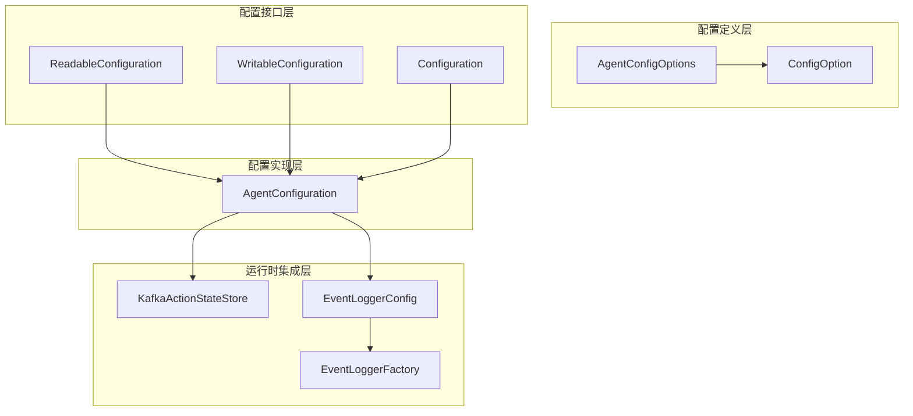
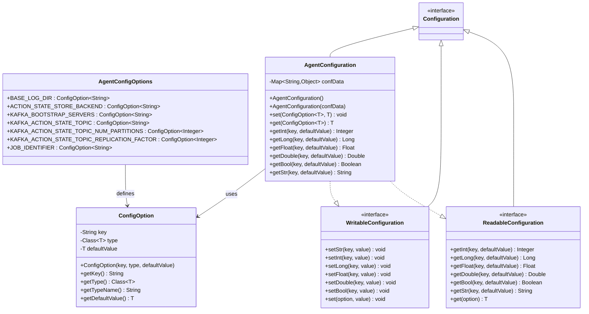
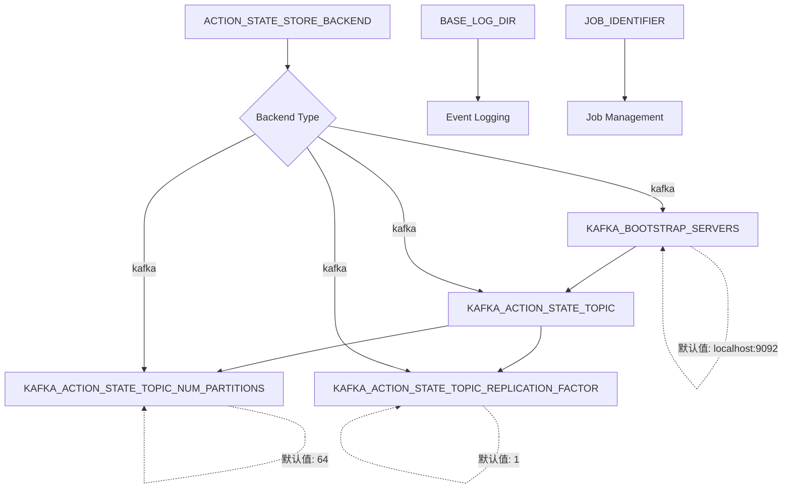
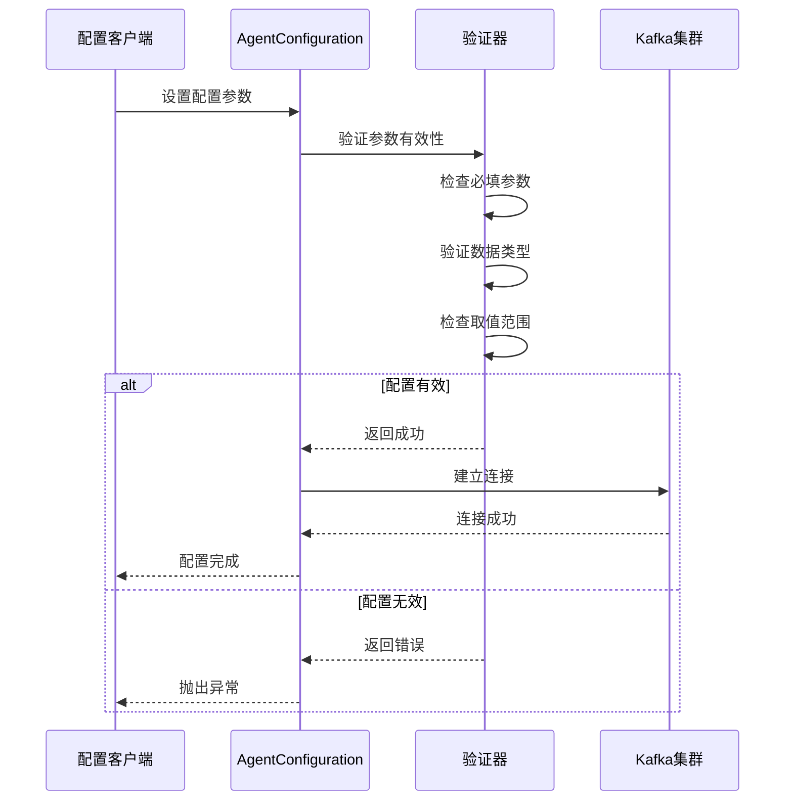

# 代理配置选项

<cite>
**本文档引用的文件**
- [AgentConfigOptions.java](file://api/src/main/java/org/apache/flink/agents/api/configuration/AgentConfigOptions.java)
- [ConfigOption.java](file://api/src/main/java/org/apache/flink/agents/api/configuration/ConfigOption.java)
- [Configuration.java](file://api/src/main/java/org/apache/flink/agents/api/configuration/Configuration.java)
- [ReadableConfiguration.java](file://api/src/main/java/org/apache/flink/agents/api/configuration/ReadableConfiguration.java)
- [WritableConfiguration.java](file://api/src/main/java/org/apache/flink/agents/api/configuration/WritableConfiguration.java)
- [AgentConfiguration.java](file://plan/src/main/java/org/apache/flink/agents/plan/AgentConfiguration.java)
- [KafkaActionStateStore.java](file://runtime/src/main/java/org/apache/flink/agents/runtime/actionstate/KafkaActionStateStore.java)
- [ActionStateStore.java](file://runtime/src/main/java/org/apache/flink/agents/runtime/actionstate/ActionStateStore.java)
- [EventLoggerConfig.java](file://api/src/main/java/org/apache/flink/agents/api/logger/EventLoggerConfig.java)
- [EventLoggerFactory.java](file://api/src/main/java/org/apache/flink/agents/api/logger/EventLoggerFactory.java)
- [AgentConfigurationTest.java](file://plan/src/test/java/org/apache/flink/agents/plan/AgentConfigurationTest.java)
- [test_configuration.py](file://python/flink_agents/plan/tests/test_configuration.py)
</cite>

## 目录
1. [简介](#简介)
2. [项目结构](#项目结构)
3. [核心组件](#核心组件)
4. [架构概览](#架构概览)
5. [详细组件分析](#详细组件分析)
6. [依赖关系分析](#依赖关系分析)
7. [性能考虑](#性能考虑)
8. [故障排除指南](#故障排除指南)
9. [结论](#结论)
10. [附录](#附录)

## 简介
本文档为 Apache Flink Agents 的代理配置选项提供详细的配置参考文档。重点介绍 AgentConfigOptions 中定义的七个关键配置参数：BASE_LOG_DIR（事件日志目录）、ACTION_STATE_STORE_BACKEND（动作状态存储后端）、KAFKA_BOOTSTRAP_SERVERS（Kafka 启动服务器）、KAFKA_ACTION_STATE_TOPIC（动作状态主题）、KAFKA_ACTION_STATE_TOPIC_NUM_PARTITIONS（Kafka 动作状态主题分区数）、KAFKA_ACTION_STATE_TOPIC_REPLICATION_FACTOR（Kafka 动作状态主题复制因子）和 JOB_IDENTIFIER（作业唯一标识符）。文档将深入解释每个配置参数的数据类型、默认值、取值范围和使用场景，阐述配置参数之间的依赖关系和约束条件，并提供最佳实践建议、性能影响分析、验证规则和错误处理机制。

## 项目结构
Flink Agents 的配置系统采用分层设计，主要由以下模块组成：
- 配置定义层：AgentConfigOptions 定义所有可用的配置参数
- 配置接口层：ConfigOption、ReadableConfiguration、WritableConfiguration 提供统一的配置访问接口
- 配置实现层：AgentConfiguration 实现具体的配置读写功能
- 运行时集成层：KafkaActionStateStore 和 EventLogger 等组件使用配置参数



**图表来源**
- [AgentConfigOptions.java](file://api/src/main/java/org/apache/flink/agents/api/configuration/AgentConfigOptions.java#L21-L50)
- [ConfigOption.java](file://api/src/main/java/org/apache/flink/agents/api/configuration/ConfigOption.java#L23-L102)
- [Configuration.java](file://api/src/main/java/org/apache/flink/agents/api/configuration/Configuration.java#L20-L24)
- [AgentConfiguration.java](file://plan/src/main/java/org/apache/flink/agents/plan/AgentConfiguration.java#L29-L179)

**章节来源**
- [AgentConfigOptions.java](file://api/src/main/java/org/apache/flink/agents/api/configuration/AgentConfigOptions.java#L1-L51)
- [ConfigOption.java](file://api/src/main/java/org/apache/flink/agents/api/configuration/ConfigOption.java#L1-L103)
- [Configuration.java](file://api/src/main/java/org/apache/flink/agents/api/configuration/Configuration.java#L1-L25)

## 核心组件
本节详细介绍 AgentConfigOptions 中定义的七个核心配置参数及其相关组件。

### 配置参数总览
| 参数名称 | 数据类型 | 默认值 | 是否必需 | 描述 |
|---------|---------|--------|----------|------|
| BASE_LOG_DIR | String | null | 否 | 事件日志文件目录路径 |
| ACTION_STATE_STORE_BACKEND | String | null | 否 | 动作状态存储后端类型 |
| KAFKA_BOOTSTRAP_SERVERS | String | localhost:9092 | 否 | Kafka 集群连接地址 |
| KAFKA_ACTION_STATE_TOPIC | String | null | 否 | 动作状态存储的主题名称 |
| KAFKA_ACTION_STATE_TOPIC_NUM_PARTITIONS | Integer | 64 | 否 | Kafka 主题分区数量 |
| KAFKA_ACTION_STATE_TOPIC_REPLICATION_FACTOR | Integer | 1 | 否 | Kafka 主题复制因子 |
| JOB_IDENTIFIER | String | null | 否 | 作业唯一标识符 |

**章节来源**
- [AgentConfigOptions.java](file://api/src/main/java/org/apache/flink/agents/api/configuration/AgentConfigOptions.java#L23-L49)

## 架构概览
配置系统的整体架构采用接口分离和实现解耦的设计原则，确保配置参数的类型安全和扩展性。



**图表来源**
- [ConfigOption.java](file://api/src/main/java/org/apache/flink/agents/api/configuration/ConfigOption.java#L23-L102)
- [AgentConfigOptions.java](file://api/src/main/java/org/apache/flink/agents/api/configuration/AgentConfigOptions.java#L21-L50)
- [Configuration.java](file://api/src/main/java/org/apache/flink/agents/api/configuration/Configuration.java#L20-L24)
- [AgentConfiguration.java](file://plan/src/main/java/org/apache/flink/agents/plan/AgentConfiguration.java#L29-L179)

## 详细组件分析

### BASE_LOG_DIR（事件日志目录）
BASE_LOG_DIR 配置参数用于指定事件日志文件的存储目录。

#### 基本信息
- **数据类型**：String
- **默认值**：null
- **必需性**：可选
- **描述**：事件日志文件的基础目录路径

#### 使用场景
- 文件事件记录器的输出目录
- 日志文件的组织和管理
- 事件审计和追踪

#### 配置验证
- 路径必须存在且可写
- 支持绝对路径和相对路径
- 目录权限需要满足写入要求

**章节来源**
- [AgentConfigOptions.java](file://api/src/main/java/org/apache/flink/agents/api/configuration/AgentConfigOptions.java#L23-L25)
- [EventLoggerConfig.java](file://api/src/main/java/org/apache/flink/agents/api/logger/EventLoggerConfig.java#L38-L43)

### ACTION_STATE_STORE_BACKEND（动作状态存储后端）
ACTION_STATE_STORE_BACKEND 指定动作状态存储的后端类型。

#### 基本信息
- **数据类型**：String
- **默认值**：null
- **必需性**：可选
- **描述**：动作状态存储的后端实现类型

#### 支持的后端类型
根据代码分析，当前支持的后端类型包括：
- kafka：基于 Kafka 的分布式状态存储

#### 使用场景
- 分布式环境下的状态持久化
- 多实例间的动作状态同步
- 流式处理中的状态管理

**章节来源**
- [AgentConfigOptions.java](file://api/src/main/java/org/apache/flink/agents/api/configuration/AgentConfigOptions.java#L27-L29)
- [ActionStateStore.java](file://runtime/src/main/java/org/apache/flink/agents/runtime/actionstate/ActionStateStore.java#L28-L40)

### KAFKA_BOOTSTRAP_SERVERS（Kafka 启动服务器）
KAFKA_BOOTSTRAP_SERVERS 配置 Kafka 集群的连接地址。

#### 基本信息
- **数据类型**：String
- **默认值**：localhost:9092
- **必需性**：可选（当使用 Kafka 作为后端时必需）
- **描述**：Kafka 集群的启动服务器地址

#### 取值范围和格式
- 支持单个或多个服务器地址
- 地址格式：host:port
- 多个地址用逗号分隔：server1:9092,server2:9092,server3:9092

#### 使用场景
- Kafka 动作状态存储
- 事件流处理
- 分布式协调服务

**章节来源**
- [AgentConfigOptions.java](file://api/src/main/java/org/apache/flink/agents/api/configuration/AgentConfigOptions.java#L31-L33)

### KAFKA_ACTION_STATE_TOPIC（动作状态主题）
KAFKA_ACTION_STATE_TOPIC 指定动作状态存储的 Kafka 主题名称。

#### 基本信息
- **数据类型**：String
- **默认值**：null
- **必需性**：当使用 Kafka 后端时必需
- **描述**：存储动作状态的 Kafka 主题名称

#### 使用场景
- 动作状态的持久化存储
- 分布式状态同步
- 事件驱动的状态更新

#### 配置验证
- 主题名称必须符合 Kafka 命名规范
- 主题必须在 Kafka 集群中存在或可自动创建
- 主题名称区分大小写

**章节来源**
- [AgentConfigOptions.java](file://api/src/main/java/org/apache/flink/agents/api/configuration/AgentConfigOptions.java#L35-L37)
- [KafkaActionStateStore.java](file://runtime/src/main/java/org/apache/flink/agents/runtime/actionstate/KafkaActionStateStore.java#L113-L118)

### KAFKA_ACTION_STATE_TOPIC_NUM_PARTITIONS（分区数）
KAFKA_ACTION_STATE_TOPIC_NUM_PARTITIONS 设置 Kafka 主题的分区数量。

#### 基本信息
- **数据类型**：Integer
- **默认值**：64
- **必需性**：可选
- **描述**：动作状态主题的分区数量

#### 取值范围和建议
- **最小值**：1
- **推荐范围**：根据吞吐量需求确定
- **性能影响**：分区数越多，吞吐量越高但资源消耗也越大

#### 性能考虑
- 分区数应与预期的并发度相匹配
- 过多的分区会增加管理开销
- 分区数影响消息的并行处理能力

**章节来源**
- [AgentConfigOptions.java](file://api/src/main/java/org/apache/flink/agents/api/configuration/AgentConfigOptions.java#L39-L41)

### KAFKA_ACTION_STATE_TOPIC_REPLICATION_FACTOR（复制因子）
KAFKA_ACTION_STATE_TOPIC_REPLICATION_FACTOR 设置 Kafka 主题的复制因子。

#### 基本信息
- **数据类型**：Integer
- **默认值**：1
- **必需性**：可选
- **描述**：动作状态主题的副本数量

#### 取值范围和建议
- **最小值**：1
- **最大值**：集群中可用 Broker 数量
- **推荐范围**：1 或 3（取决于可靠性需求）

#### 可靠性考虑
- 复制因子为 1 时，无高可用保障
- 复制因子为 3 时，可容忍单点故障
- 复制因子越高，数据安全性越好但存储成本越高

**章节来源**
- [AgentConfigOptions.java](file://api/src/main/java/org/apache/flink/agents/api/configuration/AgentConfigOptions.java#L43-L45)

### JOB_IDENTIFIER（作业唯一标识符）
JOB_IDENTIFIER 为作业提供唯一的标识符。

#### 基本信息
- **数据类型**：String
- **默认值**：null
- **必需性**：可选
- **描述**：作业的唯一标识符

#### 使用场景
- 作业实例的唯一标识
- 资源隔离和命名空间管理
- 监控和追踪

#### 最佳实践
- 使用有意义的标识符，如作业名称+时间戳
- 避免重复标识符
- 在分布式环境中确保唯一性

**章节来源**
- [AgentConfigOptions.java](file://api/src/main/java/org/apache/flink/agents/api/configuration/AgentConfigOptions.java#L47-L49)

## 依赖关系分析
配置参数之间存在复杂的依赖关系和约束条件，需要合理配置以确保系统正常运行。



**图表来源**
- [AgentConfigOptions.java](file://api/src/main/java/org/apache/flink/agents/api/configuration/AgentConfigOptions.java#L23-L49)
- [KafkaActionStateStore.java](file://runtime/src/main/java/org/apache/flink/agents/runtime/actionstate/KafkaActionStateStore.java#L109-L124)

### 关键依赖关系
1. **Kafka 后端依赖链**：ACTION_STATE_STORE_BACKEND → KAFKA_BOOTSTRAP_SERVERS → KAFKA_ACTION_STATE_TOPIC → 分区和复制配置
2. **日志依赖关系**：BASE_LOG_DIR → 事件日志记录器
3. **作业管理依赖**：JOB_IDENTIFIER → 作业标识和管理

### 约束条件
- 当 ACTION_STATE_STORE_BACKEND 设置为 "kafka" 时，必须同时配置 KAFKA_BOOTSTRAP_SERVERS 和 KAFKA_ACTION_STATE_TOPIC
- KAFKA_ACTION_STATE_TOPIC_NUM_PARTITIONS 必须大于 0
- KAFKA_ACTION_STATE_TOPIC_REPLICATION_FACTOR 必须在有效范围内
- BASE_LOG_DIR 必须是有效的可写目录路径

**章节来源**
- [KafkaActionStateStore.java](file://runtime/src/main/java/org/apache/flink/agents/runtime/actionstate/KafkaActionStateStore.java#L109-L124)
- [AgentConfiguration.java](file://plan/src/main/java/org/apache/flink/agents/plan/AgentConfiguration.java#L75-L80)

## 性能考虑
配置参数对系统性能有显著影响，需要根据实际需求进行优化配置。

### Kafka 性能优化
1. **分区数优化**
   - 建议设置为 CPU 核心数的 2-4 倍
   - 考虑峰值吞吐量需求
   - 避免过多分区导致管理开销过大

2. **复制因子权衡**
   - 生产环境建议设置为 3
   - 平衡数据安全性和存储成本
   - 考虑集群 Broker 数量限制

3. **网络配置**
   - 合理设置 Kafka 服务器地址
   - 考虑网络延迟和带宽限制
   - 使用负载均衡和故障转移

### 日志性能影响
- BASE_LOG_DIR 的磁盘 I/O 性能直接影响事件记录速度
- 建议使用高性能存储设备
- 合理配置日志轮转策略

### 内存和资源考虑
- 配置参数解析和存储占用内存较小
- 主要性能瓶颈在于 Kafka 连接和磁盘 I/O
- 建议监控系统资源使用情况

## 故障排除指南

### 常见配置错误及解决方案

#### Kafka 连接问题
**问题症状**：无法连接到 Kafka 集群
**可能原因**：
- KAFKA_BOOTSTRAP_SERVERS 地址不正确
- 网络防火墙阻断连接
- Kafka 服务未启动

**解决方案**：
1. 验证 Kafka 服务器地址格式
2. 检查网络连通性
3. 确认 Kafka 服务状态

#### 主题配置问题
**问题症状**：动作状态无法正确存储
**可能原因**：
- KAFKA_ACTION_STATE_TOPIC 不存在
- 分区数配置不当
- 复制因子超出集群限制

**解决方案**：
1. 创建缺失的主题
2. 调整分区数配置
3. 检查集群可用 Broker 数量

#### 日志目录问题
**问题症状**：事件日志无法写入
**可能原因**：
- BASE_LOG_DIR 路径不存在
- 权限不足
- 磁盘空间不足

**解决方案**：
1. 创建日志目录
2. 设置正确的文件权限
3. 清理磁盘空间

### 配置验证机制
配置系统提供了完善的验证和错误处理机制：



**图表来源**
- [AgentConfiguration.java](file://plan/src/main/java/org/apache/flink/agents/plan/AgentConfiguration.java#L75-L80)
- [KafkaActionStateStore.java](file://runtime/src/main/java/org/apache/flink/agents/runtime/actionstate/KafkaActionStateStore.java#L109-L124)

### 错误处理流程
1. **参数验证阶段**：检查必填参数和数据类型
2. **范围检查阶段**：验证取值范围和约束条件
3. **连接测试阶段**：验证外部依赖连接
4. **回滚机制**：失败时恢复到上一个有效状态

**章节来源**
- [AgentConfigurationTest.java](file://plan/src/test/java/org/apache/flink/agents/plan/AgentConfigurationTest.java#L36-L53)
- [test_configuration.py](file://python/flink_agents/plan/tests/test_configuration.py#L180-L228)

## 结论
Apache Flink Agents 的代理配置系统提供了灵活而强大的配置管理能力。通过合理的配置参数组合，可以构建高性能、可靠的智能代理系统。关键要点包括：

1. **类型安全**：所有配置参数都经过严格的类型检查和转换
2. **扩展性**：支持多种存储后端和日志记录器
3. **可靠性**：提供完善的错误处理和验证机制
4. **性能优化**：针对不同场景提供性能调优建议

建议在生产环境中：
- 仔细评估每个配置参数的影响
- 进行充分的压力测试
- 建立监控和告警机制
- 制定配置变更的审批流程

## 附录

### 配置示例模板
以下提供不同场景的配置示例模板：

#### 基础文件日志配置
```yaml
# 基础配置
baseLogDir: "/var/log/flink-agents"
jobIdentifier: "my-job-001"

# Kafka 后端配置（可选）
actionStateStoreBackend: "kafka"
kafkaBootstrapServers: "localhost:9092"
kafkaActionStateTopic: "agent-action-states"
kafkaActionStateTopicNumPartitions: 64
kafkaActionStateTopicReplicationFactor: 1
```

#### 生产环境 Kafka 配置
```yaml
# 生产环境配置
baseLogDir: "/data/flink-agents/logs"
jobIdentifier: "production-agent-job-2024"

# 高可用 Kafka 配置
actionStateStoreBackend: "kafka"
kafkaBootstrapServers: "kafka1:9092,kafka2:9092,kafka3:9092"
kafkaActionStateTopic: "agent-action-states-prod"
kafkaActionStateTopicNumPartitions: 128
kafkaActionStateTopicReplicationFactor: 3
```

### 最佳实践清单
1. **配置参数选择**
   - 根据业务需求选择合适的存储后端
   - 合理设置 Kafka 分区数和复制因子
   - 确保日志目录具有足够的磁盘空间

2. **性能优化**
   - 监控系统资源使用情况
   - 定期调整配置参数以适应负载变化
   - 建立配置变更的测试流程

3. **运维管理**
   - 建立配置备份和恢复机制
   - 制定配置变更的审批流程
   - 定期审查配置的有效性和安全性

4. **故障处理**
   - 建立完善的监控和告警机制
   - 准备应急预案和回滚方案
   - 定期进行故障演练