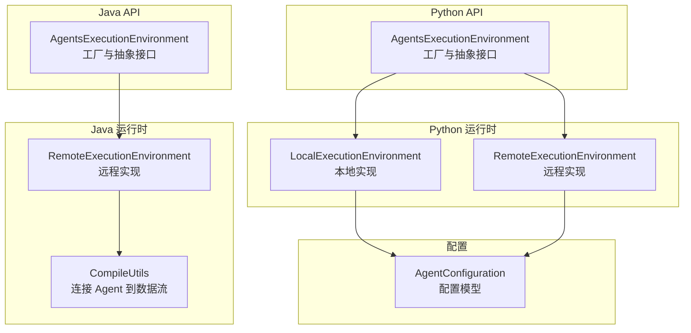
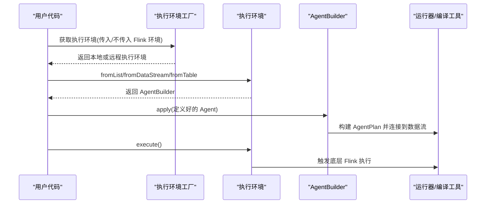
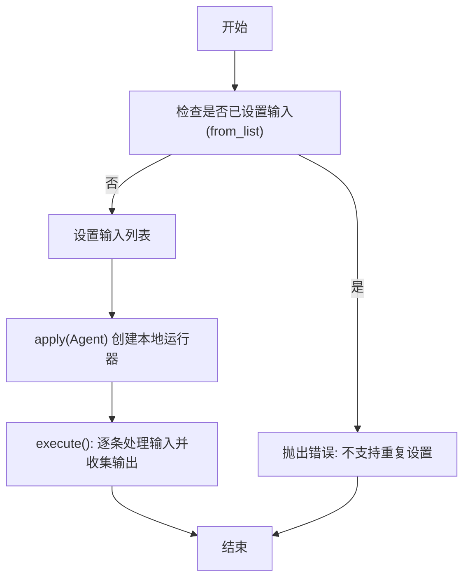
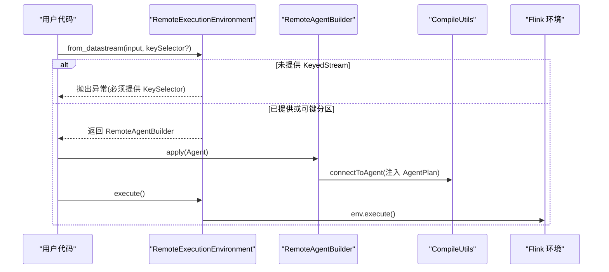
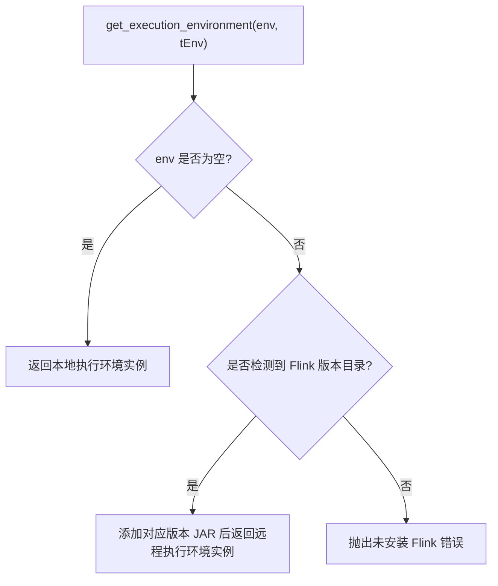
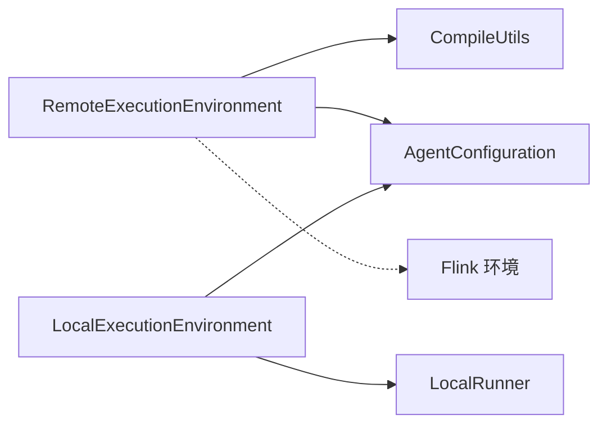

# 执行环境配置

<cite>
**本文引用的文件**
- [AgentsExecutionEnvironment.java](file://api/src/main/java/org/apache/flink/agents/api/AgentsExecutionEnvironment.java)
- [execution_environment.py](file://python/flink_agents/api/execution_environment.py)
- [RemoteExecutionEnvironment.java](file://runtime/src/main/java/org/apache/flink/agents/runtime/env/RemoteExecutionEnvironment.java)
- [local_execution_environment.py](file://python/flink_agents/runtime/local_execution_environment.py)
- [remote_execution_environment.py](file://python/flink_agents/runtime/remote_execution_environment.py)
- [local_runner.py](file://python/flink_agents/runtime/local_runner.py)
- [configuration.py](file://python/flink_agents/plan/configuration.py)
- [test_local_execution_environment.py](file://python/flink_agents/runtime/tests/test_local_execution_environment.py)
- [test_remote_execution_environment.py](file://python/flink_agents/runtime/tests/test_remote_execution_environment.py)
- [CompileUtils.java](file://runtime/src/main/java/org/apache/flink/agents/runtime/CompileUtils.java)
- [RemoteExecutionEnvironmentTest.java](file://runtime/src/test/java/org/apache/flink/agents/runtime/env/RemoteExecutionEnvironmentTest.java)
</cite>

## 目录
1. [简介](#简介)
2. [项目结构](#项目结构)
3. [核心组件](#核心组件)
4. [架构总览](#架构总览)
5. [详细组件分析](#详细组件分析)
6. [依赖关系分析](#依赖关系分析)
7. [性能考量](#性能考量)
8. [故障排查指南](#故障排查指南)
9. [结论](#结论)
10. [附录](#附录)

## 简介
本文件聚焦于 Apache Flink Agents 的执行环境配置，系统性阐述本地执行环境（LocalExecutionEnvironment）与远程执行环境（RemoteExecutionEnvironment）的初始化流程、资源配置、启动参数与适用场景。文档同时对比两类环境在功能边界、性能特征与限制条件上的差异，提供配置模板、最佳实践、动态配置与热重载策略、监控与性能调优建议，以及常见问题的诊断与解决路径。目标读者为系统管理员与开发者。

## 项目结构
围绕执行环境的关键代码分布在以下模块：
- Java API 层：定义抽象执行环境与工厂方法，负责根据传入的 Flink 环境选择本地或远程实现。
- Python 运行时层：提供本地与远程执行环境的具体实现，负责与 PyFlink 集成、加载配置、桥接数据流与表。
- 运行时编译工具：负责将 Agent 计划连接到 Flink 数据流算子链路。
- 测试用例：验证本地/远程环境的行为、配置加载与异常处理。

**图表来源**
- [AgentsExecutionEnvironment.java](file://api/src/main/java/org/apache/flink/agents/api/AgentsExecutionEnvironment.java#L68-L121)
- [RemoteExecutionEnvironment.java](file://runtime/src/main/java/org/apache/flink/agents/runtime/env/RemoteExecutionEnvironment.java#L44-L117)
- [execution_environment.py](file://python/flink_agents/api/execution_environment.py#L108-L154)
- [local_execution_environment.py](file://python/flink_agents/runtime/local_execution_environment.py#L92-L178)
- [remote_execution_environment.py](file://python/flink_agents/runtime/remote_execution_environment.py#L160-L334)
- [configuration.py](file://python/flink_agents/plan/configuration.py#L58-L174)

**章节来源**
- [AgentsExecutionEnvironment.java](file://api/src/main/java/org/apache/flink/agents/api/AgentsExecutionEnvironment.java#L37-L121)
- [execution_environment.py](file://python/flink_agents/api/execution_environment.py#L91-L154)

## 核心组件
- 抽象执行环境与工厂
  - Java 侧通过静态工厂方法根据是否传入 StreamExecutionEnvironment 决定返回本地或远程环境实例。
  - Python 侧通过相同语义的工厂函数，按需导入本地或远程实现，并在远程模式下自动加载版本化依赖。
- 本地执行环境
  - 仅支持 fromList 输入；不支持 DataStream/Table 输入；提供同步执行与基础事件队列驱动的本地运行器。
- 远程执行环境
  - 支持 DataStream/Table 输入；可从 FLINK_CONF_DIR 加载配置；通过编译工具将 Agent 计划接入 Flink 算子链路。
- 配置模型
  - 统一的 AgentConfiguration 提供扁平化键值访问、类型安全读取与 YAML 文件加载能力。

**章节来源**
- [AgentsExecutionEnvironment.java](file://api/src/main/java/org/apache/flink/agents/api/AgentsExecutionEnvironment.java#L68-L121)
- [execution_environment.py](file://python/flink_agents/api/execution_environment.py#L108-L154)
- [local_execution_environment.py](file://python/flink_agents/runtime/local_execution_environment.py#L92-L178)
- [remote_execution_environment.py](file://python/flink_agents/runtime/remote_execution_environment.py#L160-L334)
- [configuration.py](file://python/flink_agents/plan/configuration.py#L58-L174)

## 架构总览
本地与远程执行环境在“输入源”“数据桥接”“配置加载”“输出形态”等方面存在显著差异。远程环境进一步通过编译工具将 Agent 计划转换为 Flink 算子，实现端到端的流式处理。

**图表来源**
- [AgentsExecutionEnvironment.java](file://api/src/main/java/org/apache/flink/agents/api/AgentsExecutionEnvironment.java#L68-L121)
- [RemoteExecutionEnvironment.java](file://runtime/src/main/java/org/apache/flink/agents/runtime/env/RemoteExecutionEnvironment.java#L85-L99)
- [CompileUtils.java](file://runtime/src/main/java/org/apache/flink/agents/runtime/CompileUtils.java#L34-L84)

## 详细组件分析

### 本地执行环境（LocalExecutionEnvironment）
- 能力范围
  - 仅支持 fromList 输入；不支持 fromDataStream/fromTable。
  - 执行采用本地运行器顺序处理输入列表，生成输出列表。
- 关键行为
  - 单次 from_list 调用后不可再次调用；多次 execute 调用会抛出异常。
  - 不支持 to_datastream/to_table 输出；不支持持久化执行与度量指标。
- 适用场景
  - 开发调试、单元测试、小规模批式输入验证。

**图表来源**
- [local_execution_environment.py](file://python/flink_agents/runtime/local_execution_environment.py#L107-L156)
- [local_runner.py](file://python/flink_agents/runtime/local_runner.py#L286-L355)

**章节来源**
- [local_execution_environment.py](file://python/flink_agents/runtime/local_execution_environment.py#L92-L178)
- [local_runner.py](file://python/flink_agents/runtime/local_runner.py#L252-L355)

### 远程执行环境（RemoteExecutionEnvironment）
- 能力范围
  - 支持 DataStream/Table 输入；可选 KeySelector；支持从 FLINK_CONF_DIR 加载配置。
  - 输出支持 to_datastream/to_table；不支持 to_list。
- 关键行为
  - 若未提供 KeyedStream，必须显式提供 KeySelector；否则抛出异常。
  - 从 FLINK_CONF_DIR 优先加载新命名配置文件，回退到旧命名文件；加载成功后合并到 AgentConfiguration。
  - 通过编译工具将 AgentPlan 注入到 Flink 算子链路，保持与 Java 实现一致的连接方式。
- 适用场景
  - 生产级流式处理、与 Flink 集群集成、需要状态管理与弹性扩展。

**图表来源**
- [remote_execution_environment.py](file://python/flink_agents/runtime/remote_execution_environment.py#L211-L270)
- [CompileUtils.java](file://runtime/src/main/java/org/apache/flink/agents/runtime/CompileUtils.java#L44-L84)

**章节来源**
- [remote_execution_environment.py](file://python/flink_agents/runtime/remote_execution_environment.py#L160-L334)
- [RemoteExecutionEnvironment.java](file://runtime/src/main/java/org/apache/flink/agents/runtime/env/RemoteExecutionEnvironment.java#L44-L117)
- [CompileUtils.java](file://runtime/src/main/java/org/apache/flink/agents/runtime/CompileUtils.java#L34-L84)

### 执行环境工厂与选择逻辑
- Java 工厂
  - 无 env 参数：返回本地实现类实例。
  - 有 env 参数：返回远程实现类实例，并传递 StreamTableEnvironment。
- Python 工厂
  - 无 env 参数：导入本地实现并创建实例。
  - 有 env 参数：根据 Flink 主版本号查找对应版本的分发 JAR 并添加到环境，再导入远程实现。

**图表来源**
- [AgentsExecutionEnvironment.java](file://api/src/main/java/org/apache/flink/agents/api/AgentsExecutionEnvironment.java#L68-L97)
- [execution_environment.py](file://python/flink_agents/api/execution_environment.py#L108-L154)

**章节来源**
- [AgentsExecutionEnvironment.java](file://api/src/main/java/org/apache/flink/agents/api/AgentsExecutionEnvironment.java#L68-L121)
- [execution_environment.py](file://python/flink_agents/api/execution_environment.py#L108-L154)

## 依赖关系分析
- 本地环境
  - 依赖本地运行器与事件队列，不依赖 Flink 环境。
- 远程环境
  - 依赖 Flink 环境（StreamExecutionEnvironment/StreamTableEnvironment），通过编译工具将 AgentPlan 注入算子链路。
  - 可从 FLINK_CONF_DIR 加载配置文件，支持新旧两种命名约定。
- 配置加载
  - Java 侧：从系统环境变量指定目录加载 YAML 并解析为 AgentConfiguration。
  - Python 侧：同样从 FLINK_CONF_DIR 加载，优先新命名文件，回退旧命名文件。

**图表来源**
- [RemoteExecutionEnvironment.java](file://runtime/src/main/java/org/apache/flink/agents/runtime/env/RemoteExecutionEnvironment.java#L44-L117)
- [remote_execution_environment.py](file://python/flink_agents/runtime/remote_execution_environment.py#L160-L334)
- [local_execution_environment.py](file://python/flink_agents/runtime/local_execution_environment.py#L92-L178)
- [local_runner.py](file://python/flink_agents/runtime/local_runner.py#L252-L355)

**章节来源**
- [RemoteExecutionEnvironment.java](file://runtime/src/main/java/org/apache/flink/agents/runtime/env/RemoteExecutionEnvironment.java#L44-L117)
- [remote_execution_environment.py](file://python/flink_agents/runtime/remote_execution_environment.py#L160-L334)
- [local_execution_environment.py](file://python/flink_agents/runtime/local_execution_environment.py#L92-L178)

## 性能考量
- 并行度与键分区
  - 远程环境要求输入为 KeyedStream 或提供 KeySelector；合理键分区有助于提升吞吐与状态一致性。
- 序列化与传输
  - Python 端对输出进行序列化后再反序列化，注意序列化开销与对象大小控制。
- 内存与缓冲
  - 运行时包含内存段池等内存管理组件，应结合作业内存配置与背压监控进行调优。
- 配置加载
  - 远程环境优先加载新命名配置文件，确保配置变更生效；避免频繁重载带来的抖动。

[本节为通用性能建议，无需特定文件引用]

## 故障排查指南
- 常见问题与定位
  - 本地环境重复设置输入/多次执行：抛出运行时错误，检查调用顺序。
  - 远程环境未提供 KeySelector：抛出运行时错误，确保输入为 KeyedStream 或提供 KeySelector。
  - 远程环境未找到配置文件：检查 FLINK_CONF_DIR 环境变量与文件命名；新命名优先，旧命名回退。
  - Python 版本不匹配：工厂会尝试按 Flink 主版本号加载对应 JAR，若缺失则报错。
- 定位手段
  - 查看工厂选择分支与异常消息。
  - 检查配置加载逻辑与文件存在性。
  - 使用测试用例中的断言与日志提示定位问题。

**章节来源**
- [test_local_execution_environment.py](file://python/flink_agents/runtime/tests/test_local_execution_environment.py#L92-L127)
- [test_remote_execution_environment.py](file://python/flink_agents/runtime/tests/test_remote_execution_environment.py#L42-L182)
- [remote_execution_environment.py](file://python/flink_agents/runtime/remote_execution_environment.py#L272-L312)
- [RemoteExecutionEnvironmentTest.java](file://runtime/src/test/java/org/apache/flink/agents/runtime/env/RemoteExecutionEnvironmentTest.java#L33-L77)

## 结论
- 本地环境适合开发调试与小规模批式输入；远程环境适合生产级流式处理与集群集成。
- 远程环境具备更强的功能边界与配置能力，但对输入类型与环境准备有更高要求。
- 建议在生产中优先使用远程环境，并结合合理的键分区、配置加载与监控策略进行优化。

[本节为总结性内容，无需特定文件引用]

## 附录

### 配置模板与最佳实践
- 配置文件位置与命名
  - 远程环境从 FLINK_CONF_DIR 目录加载配置；优先新命名文件，回退旧命名文件。
- 内存与并行度
  - 根据数据规模与 CPU/内存资源设定并行度；对长尾任务考虑键分区均匀性。
- 资源与依赖
  - 远程模式下确保正确加载对应版本的分发 JAR；资源注册遵循唯一性约束。
- 动态配置与热重载
  - 远程环境支持从配置目录动态加载配置；建议在重启作业前完成配置更新以避免运行时切换。

**章节来源**
- [remote_execution_environment.py](file://python/flink_agents/runtime/remote_execution_environment.py#L272-L312)
- [configuration.py](file://python/flink_agents/plan/configuration.py#L58-L174)

### 监控指标与性能调优
- 指标建议
  - 关注背压、算子吞吐、水位线滞后、内存使用与 GC 行为。
- 调优建议
  - 合理设置并行度与缓冲区大小；优化键分区策略；减少序列化成本；启用检查点与状态后端压缩。

[本节为通用指导，无需特定文件引用]