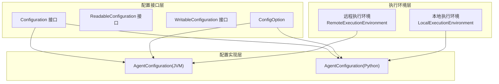
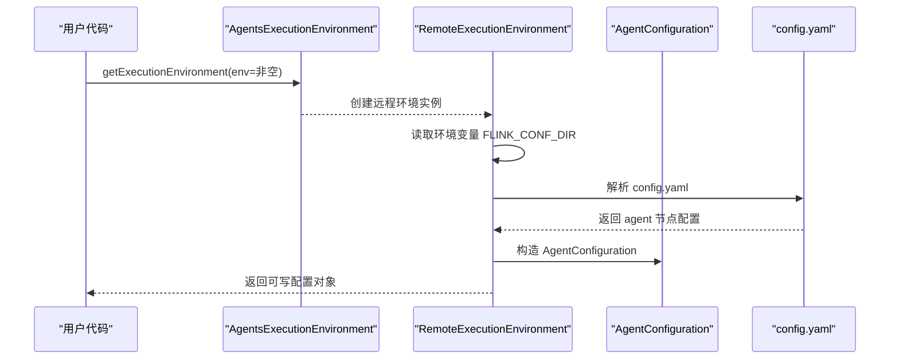
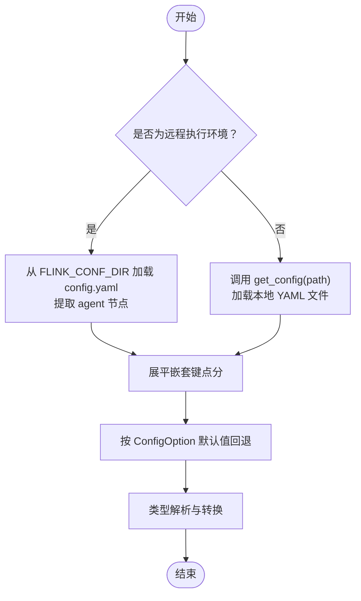
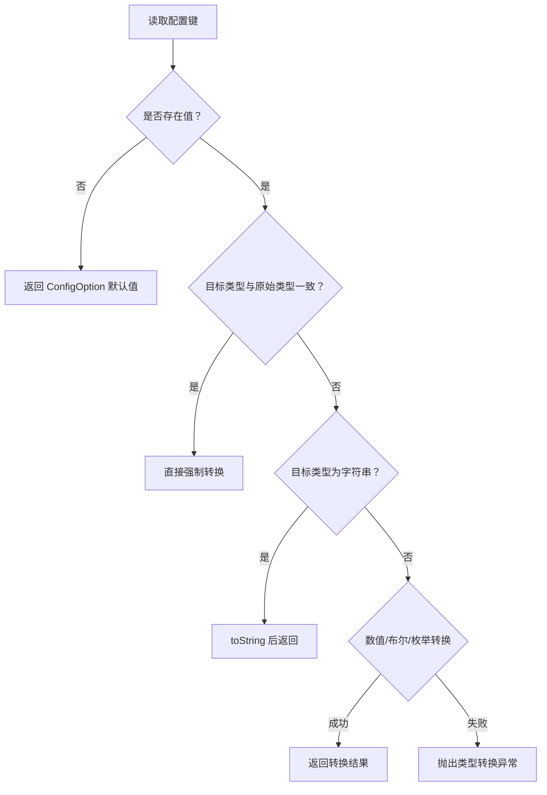
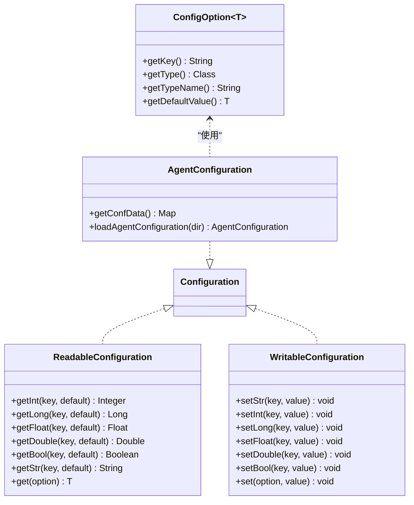
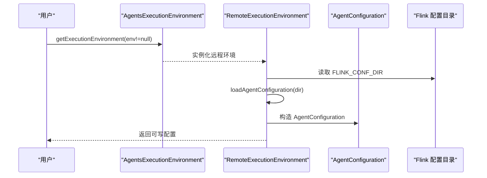

# 配置选项

<cite>
**本文引用的文件**
- [AgentConfigOptions.java](file://api/src/main/java/org/apache/flink/agents/api/configuration/AgentConfigOptions.java)
- [ConfigOption.java](file://api/src/main/java/org/apache/flink/agents/api/configuration/ConfigOption.java)
- [Configuration.java](file://api/src/main/java/org/apache/flink/agents/api/configuration/Configuration.java)
- [ReadableConfiguration.java](file://api/src/main/java/org/apache/flink/agents/api/configuration/ReadableConfiguration.java)
- [WritableConfiguration.java](file://api/src/main/java/org/apache/flink/agents/api/configuration/WritableConfiguration.java)
- [AgentConfiguration.java（Java 实现）](file://plan/src/main/java/org/apache/flink/agents/plan/AgentConfiguration.java)
- [AgentConfigurationTest.java](file://plan/src/test/java/org/apache/flink/agents/plan/AgentConfigurationTest.java)
- [AgentsExecutionEnvironment.java](file://api/src/main/java/org/apache/flink/agents/api/AgentsExecutionEnvironment.java)
- [RemoteExecutionEnvironment.java](file://runtime/src/main/java/org/apache/flink/agents/runtime/env/RemoteExecutionEnvironment.java)
- [local_execution_environment.py](file://python/flink_agents/runtime/local_execution_environment.py)
- [execution_environment.py](file://python/flink_agents/api/execution_environment.py)
- [configuration.py（Python 接口）](file://python/flink_agents/api/configuration.py)
- [core_options.py](file://python/flink_agents/api/core_options.py)
- [configuration.py（Python 实现）](file://python/flink_agents/plan/configuration.py)
- [test_configuration.py](file://python/flink_agents/plan/tests/test_configuration.py)
</cite>

## 目录
1. [简介](#简介)
2. [项目结构与配置体系概览](#项目结构与配置体系概览)
3. [核心配置参数与默认值](#核心配置参数与默认值)
4. [执行环境配置：本地与远程](#执行环境配置本地与远程)
5. [配置优先级与继承关系](#配置优先级与继承关系)
6. [配置模板与最佳实践](#配置模板与最佳实践)
7. [动态配置更新与热重载支持](#动态配置更新与热重载支持)
8. [配置验证与错误处理](#配置验证与错误处理)
9. [常见问题诊断与排错](#常见问题诊断与排错)
10. [架构与数据流图](#架构与数据流图)
11. [结论](#结论)

## 简介
本文件面向系统管理员与 DevOps 工程师，系统性梳理 Apache Flink Agents 的配置体系，覆盖以下要点：
- AgentConfigOptions 中定义的全部配置参数、默认值与取值范围
- 执行环境配置：本地与远程环境的差异、适用场景与配置方法
- 配置来源的优先级与继承关系（系统属性、环境变量、配置文件）
- 动态配置更新与热重载能力现状与限制
- 配置验证与错误处理机制
- 常见配置问题的诊断与解决方案
- 提供可直接套用的配置模板与最佳实践建议

## 项目结构与配置体系概览
Flink Agents 的配置体系由“配置接口层”“配置实现层”“执行环境层”三部分组成：
- 配置接口层：定义 ConfigOption、ReadableConfiguration、WritableConfiguration、Configuration 等抽象
- 配置实现层：提供 Java 与 Python 双栈的 AgentConfiguration 实现，支持从 YAML 文件加载与类型转换
- 执行环境层：本地与远程执行环境分别通过各自的配置加载策略注入 AgentConfiguration

**图表来源**
- [Configuration.java](file://api/src/main/java/org/apache/flink/agents/api/configuration/Configuration.java#L20-L24)
- [ConfigOption.java](file://api/src/main/java/org/apache/flink/agents/api/configuration/ConfigOption.java#L22-L39)
- [AgentConfiguration.java（Java 实现）](file://plan/src/main/java/org/apache/flink/agents/plan/AgentConfiguration.java#L28-L38)
- [configuration.py（Python 实现）](file://python/flink_agents/plan/configuration.py#L137-L173)
- [AgentsExecutionEnvironment.java](file://api/src/main/java/org/apache/flink/agents/api/AgentsExecutionEnvironment.java#L68-L97)
- [RemoteExecutionEnvironment.java](file://runtime/src/main/java/org/apache/flink/agents/runtime/env/RemoteExecutionEnvironment.java#L57-L65)

**章节来源**
- [Configuration.java](file://api/src/main/java/org/apache/flink/agents/api/configuration/Configuration.java#L20-L24)
- [ConfigOption.java](file://api/src/main/java/org/apache/flink/agents/api/configuration/ConfigOption.java#L22-L39)
- [AgentConfiguration.java（Java 实现）](file://plan/src/main/java/org/apache/flink/agents/plan/AgentConfiguration.java#L28-L38)
- [configuration.py（Python 实现）](file://python/flink_agents/plan/configuration.py#L137-L173)
- [AgentsExecutionEnvironment.java](file://api/src/main/java/org/apache/flink/agents/api/AgentsExecutionEnvironment.java#L68-L97)
- [RemoteExecutionEnvironment.java](file://runtime/src/main/java/org/apache/flink/agents/runtime/env/RemoteExecutionEnvironment.java#L57-L65)

## 核心配置参数与默认值
AgentConfigOptions 定义了 Agent 运行所需的关键配置项，Java 侧与 Python 侧均提供对应映射。

- 基础日志目录
  - 键名：baseLogDir
  - 类型：字符串
  - 默认值：未设置（null）
  - 用途：指定事件日志文件的基础目录
  - 取值范围：任意有效文件路径字符串

- 行动状态存储后端
  - 键名：actionStateStoreBackend
  - 类型：字符串
  - 默认值：未设置（null）
  - 用途：指定行动状态存储的后端实现
  - 取值范围：具体实现取决于运行时集成

- Kafka 引导服务器
  - 键名：kafkaBootstrapServers
  - 类型：字符串
  - 默认值：localhost:9092
  - 用途：Kafka 集群连接地址
  - 取值范围：合法的主机:端口列表（逗号分隔）

- Kafka 行动状态主题
  - 键名：kafkaActionStateTopic
  - 类型：字符串
  - 默认值：未设置（null）
  - 用途：行动状态在 Kafka 中的主题名称
  - 取值范围：有效的 Kafka 主题名

- Kafka 行动状态主题分区数
  - 键名：kafkaActionStateTopicNumPartitions
  - 类型：整数
  - 默认值：64
  - 用途：行动状态主题的分区数量
  - 取值范围：正整数

- Kafka 行动状态主题副本因子
  - 键名：kafkaActionStateTopicReplicationFactor
  - 类型：整数
  - 默认值：1
  - 用途：行动状态主题的副本因子
  - 取值范围：正整数

- 作业唯一标识
  - 键名：job-identifier
  - 类型：字符串
  - 默认值：未设置（null）
  - 用途：区分不同作业实例的唯一标识
  - 取值范围：任意字符串

- Python 侧执行相关参数（非 AgentConfigOptions.java 内容，但与执行环境强相关）
  - 键名：error-handling-strategy
  - 类型：枚举（retry/fail/ignore）
  - 默认值：fail
  - 用途：聊天动作的错误处理策略

  - 键名：max-retries
  - 类型：整数
  - 默认值：3
  - 用途：最大重试次数

  - 键名：num-async-threads
  - 类型：整数
  - 默认值：CPU 核数 × 2
  - 用途：异步线程池大小

  - 键名：chat.async、tool-call.async、rag.async
  - 类型：布尔
  - 默认值：均为 true
  - 用途：控制聊天、工具调用、检索增强生成的异步行为

**章节来源**
- [AgentConfigOptions.java](file://api/src/main/java/org/apache/flink/agents/api/configuration/AgentConfigOptions.java#L23-L49)
- [core_options.py](file://python/flink_agents/api/core_options.py#L74-L132)

## 执行环境配置：本地与远程
- 本地执行环境（LocalExecutionEnvironment）
  - 场景：开发与测试，无需 Flink 集群
  - 输入：List<字典> 或 Python 端的 from_list
  - 输出：仅支持 to_list；不支持 to_datastream/to_table
  - 配置来源：可通过 get_config(path) 加载本地 YAML 文件
  - 特点：无状态持久化，适合快速迭代

- 远程执行环境（RemoteExecutionEnvironment）
  - 场景：生产或集群化运行，集成 Flink DataStream/Table
  - 输入：DataStream/Table，可选 KeySelector
  - 输出：toDataStream/toTable
  - 配置来源：从 Flink 配置目录下的 config.yaml 加载 agent 节点
  - 特点：依赖 Flink 集群，具备状态管理与高可用能力

**图表来源**
- [AgentsExecutionEnvironment.java](file://api/src/main/java/org/apache/flink/agents/api/AgentsExecutionEnvironment.java#L68-L97)
- [RemoteExecutionEnvironment.java](file://runtime/src/main/java/org/apache/flink/agents/runtime/env/RemoteExecutionEnvironment.java#L57-L65)
- [RemoteExecutionEnvironment.java](file://runtime/src/main/java/org/apache/flink/agents/runtime/env/RemoteExecutionEnvironment.java#L102-L117)

**章节来源**
- [AgentsExecutionEnvironment.java](file://api/src/main/java/org/apache/flink/agents/api/AgentsExecutionEnvironment.java#L68-L121)
- [RemoteExecutionEnvironment.java](file://runtime/src/main/java/org/apache/flink/agents/runtime/env/RemoteExecutionEnvironment.java#L57-L99)
- [local_execution_environment.py](file://python/flink_agents/runtime/local_execution_environment.py#L92-L157)
- [execution_environment.py](file://python/flink_agents/api/execution_environment.py#L108-L155)

## 配置优先级与继承关系
- 远程执行环境（Java）：从 Flink 配置目录加载 config.yaml 的 agent 节点作为基础配置
- 本地执行环境（Python）：通过 get_config(path) 指定 YAML 文件路径，加载 agent 节点
- Java 侧：AgentConfiguration 支持按 ConfigOption 获取值，若未显式设置则回退到 ConfigOption 的默认值
- 类型转换：AgentConfiguration 对整数、长整型、浮点、双精度、布尔、字符串等类型提供解析与转换
- 继承关系：AgentConfiguration 将嵌套 YAML 展平为“点分键”，便于统一访问

**图表来源**
- [RemoteExecutionEnvironment.java](file://runtime/src/main/java/org/apache/flink/agents/runtime/env/RemoteExecutionEnvironment.java#L102-L117)
- [AgentConfiguration.java（Java 实现）](file://plan/src/main/java/org/apache/flink/agents/plan/AgentConfiguration.java#L162-L178)
- [AgentConfiguration.java（Java 实现）](file://plan/src/main/java/org/apache/flink/agents/plan/AgentConfiguration.java#L127-L159)
- [AgentConfigurationTest.java](file://plan/src/test/java/org/apache/flink/agents/plan/AgentConfigurationTest.java#L35-L168)

**章节来源**
- [RemoteExecutionEnvironment.java](file://runtime/src/main/java/org/apache/flink/agents/runtime/env/RemoteExecutionEnvironment.java#L102-L117)
- [AgentConfiguration.java（Java 实现）](file://plan/src/main/java/org/apache/flink/agents/plan/AgentConfiguration.java#L162-L178)
- [AgentConfiguration.java（Java 实现）](file://plan/src/main/java/org/apache/flink/agents/plan/AgentConfiguration.java#L127-L159)
- [AgentConfigurationTest.java](file://plan/src/test/java/org/apache/flink/agents/plan/AgentConfigurationTest.java#L35-L168)

## 配置模板与最佳实践
- 远程执行环境（推荐）模板（YAML）
  - 文件位置：$FLINK_CONF_DIR/config.yaml
  - 结构要点：顶层包含 agent 节点，内部按“点分键”组织
  - 示例字段（按需选择）：
    - baseLogDir
    - actionStateStoreBackend
    - kafkaBootstrapServers
    - kafkaActionStateTopic
    - kafkaActionStateTopicNumPartitions
    - kafkaActionStateTopicReplicationFactor
    - job-identifier

- 本地执行环境模板（YAML）
  - 通过 get_config(path) 指定文件路径
  - 结构与远程一致，但仅在本地生效

- 最佳实践
  - 生产环境优先使用远程执行环境，并将 Kafka 相关参数与分区/副本因子按业务吞吐量调优
  - 为每个作业设置唯一的 job-identifier，便于追踪与隔离
  - 将敏感配置放入受控的配置文件中，避免硬编码
  - 使用点分键命名法，保持层级清晰，便于展平与查询

**章节来源**
- [RemoteExecutionEnvironment.java](file://runtime/src/main/java/org/apache/flink/agents/runtime/env/RemoteExecutionEnvironment.java#L57-L65)
- [AgentConfigOptions.java](file://api/src/main/java/org/apache/flink/agents/api/configuration/AgentConfigOptions.java#L23-L49)
- [configuration.py（Python 实现）](file://python/flink_agents/plan/configuration.py#L137-L173)

## 动态配置更新与热重载支持
- 当前实现
  - Java 侧：AgentConfiguration 为只读视图的补充实现，提供 set 方法用于写入，但未暴露对外的“热重载”入口
  - Python 侧：LocalExecutionEnvironment.get_config(path) 支持在运行前加载外部 YAML；未发现运行时动态刷新机制
  - 远程执行环境：从 config.yaml 初始化一次，未提供运行时热重载逻辑
- 建议
  - 若需热重载，可在应用层监听配置文件变更并重建 AgentConfiguration，随后重新构建 AgentPlan 并重启相关算子（受限于 Flink 生命周期）
  - 对于 Kafka 参数等，建议在部署阶段完成调整，避免运行时波动

**章节来源**
- [AgentConfiguration.java（Java 实现）](file://plan/src/main/java/org/apache/flink/agents/plan/AgentConfiguration.java#L44-L80)
- [local_execution_environment.py](file://python/flink_agents/runtime/local_execution_environment.py#L101-L105)
- [RemoteExecutionEnvironment.java](file://runtime/src/main/java/org/apache/flink/agents/runtime/env/RemoteExecutionEnvironment.java#L102-L117)

## 配置验证与错误处理
- 类型转换与异常
  - AgentConfiguration 在解析整数、长整型、浮点、双精度、布尔、字符串时，若输入无法转换将抛出相应异常
  - 对于枚举类型，通过通用工具进行转换，失败时抛出类型转换异常
- 缺省值与空值
  - 若未设置某键且 ConfigOption 提供默认值，则返回默认值
  - 显式设置为 null 时，若默认值非空则不会覆盖默认值
- 远程环境加载失败
  - RemoteExecutionEnvironment 在加载 config.yaml 失败时抛出运行时异常，提示具体错误位置

**图表来源**
- [AgentConfiguration.java（Java 实现）](file://plan/src/main/java/org/apache/flink/agents/plan/AgentConfiguration.java#L127-L159)
- [AgentConfigurationTest.java](file://plan/src/test/java/org/apache/flink/agents/plan/AgentConfigurationTest.java#L35-L168)

**章节来源**
- [AgentConfiguration.java（Java 实现）](file://plan/src/main/java/org/apache/flink/agents/plan/AgentConfiguration.java#L127-L159)
- [AgentConfigurationTest.java](file://plan/src/test/java/org/apache/flink/agents/plan/AgentConfigurationTest.java#L35-L168)
- [RemoteExecutionEnvironment.java](file://runtime/src/main/java/org/apache/flink/agents/runtime/env/RemoteExecutionEnvironment.java#L112-L117)

## 常见问题诊断与排错
- 远程环境无法加载配置
  - 症状：启动时报“Failed to load Flink Agents configuration from …”
  - 排查：确认 FLINK_CONF_DIR 环境变量是否正确；检查 config.yaml 是否存在且包含 agent 节点
- 键不存在或类型不匹配
  - 症状：读取某键时报空或类型转换异常
  - 排查：确认 YAML 中键名与点分命名一致；确保值类型与期望一致；必要时提供默认值
- 重复资源注册
  - 症状：添加同名资源时报冲突
  - 排查：确保资源名在相同类型下唯一
- 本地环境不支持某些输出
  - 症状：调用 to_datastream/to_table 抛出不支持异常
  - 排查：本地环境仅支持 to_list，应切换到远程环境或使用本地列表输出

**章节来源**
- [RemoteExecutionEnvironment.java](file://runtime/src/main/java/org/apache/flink/agents/runtime/env/RemoteExecutionEnvironment.java#L112-L117)
- [local_execution_environment.py](file://python/flink_agents/runtime/local_execution_environment.py#L75-L89)
- [AgentsExecutionEnvironment.java](file://api/src/main/java/org/apache/flink/agents/api/AgentsExecutionEnvironment.java#L207-L221)

## 架构与数据流图
- 配置类关系图（Java）

**图表来源**
- [ConfigOption.java](file://api/src/main/java/org/apache/flink/agents/api/configuration/ConfigOption.java#L22-L101)
- [ReadableConfiguration.java](file://api/src/main/java/org/apache/flink/agents/api/configuration/ReadableConfiguration.java#L31-L65)
- [WritableConfiguration.java](file://api/src/main/java/org/apache/flink/agents/api/configuration/WritableConfiguration.java)
- [Configuration.java](file://api/src/main/java/org/apache/flink/agents/api/configuration/Configuration.java#L20-L24)
- [AgentConfiguration.java（Java 实现）](file://plan/src/main/java/org/apache/flink/agents/plan/AgentConfiguration.java#L28-L178)

- 执行环境序列图（远程）

**图表来源**
- [AgentsExecutionEnvironment.java](file://api/src/main/java/org/apache/flink/agents/api/AgentsExecutionEnvironment.java#L68-L97)
- [RemoteExecutionEnvironment.java](file://runtime/src/main/java/org/apache/flink/agents/runtime/env/RemoteExecutionEnvironment.java#L57-L65)
- [RemoteExecutionEnvironment.java](file://runtime/src/main/java/org/apache/flink/agents/runtime/env/RemoteExecutionEnvironment.java#L102-L117)

## 结论
- AgentConfigOptions 提供了运行时所需的最小必要配置集，结合 RemoteExecutionEnvironment 的 YAML 加载机制，可满足生产级部署需求
- Java 与 Python 侧在配置抽象上保持一致，但在实现细节（如类型转换、默认值回退）上略有差异，使用时需注意
- 动态热重载尚未内置支持，建议通过外部机制在受控条件下进行配置更新
- 建议在生产环境中固定 Kafka 分区与副本、明确作业标识，并采用严格的配置模板与校验流程