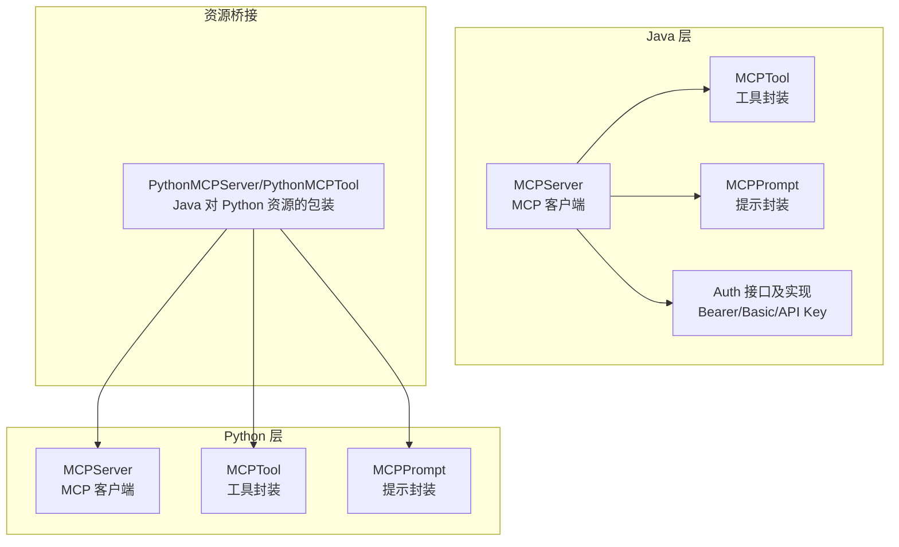
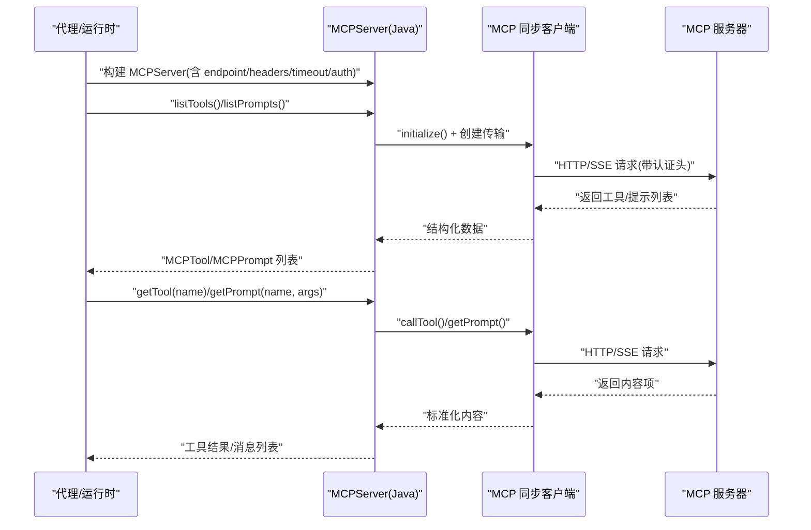
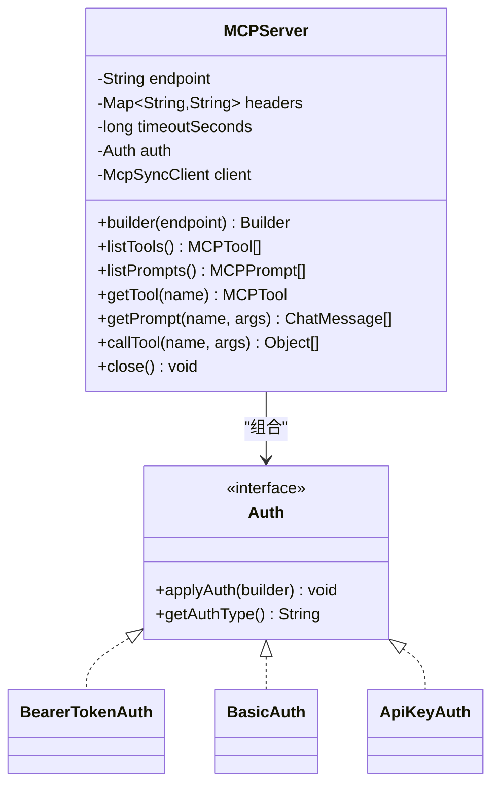
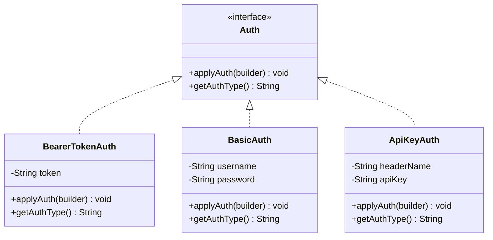
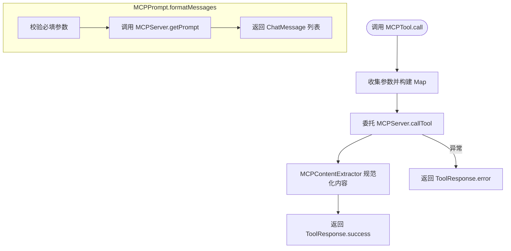
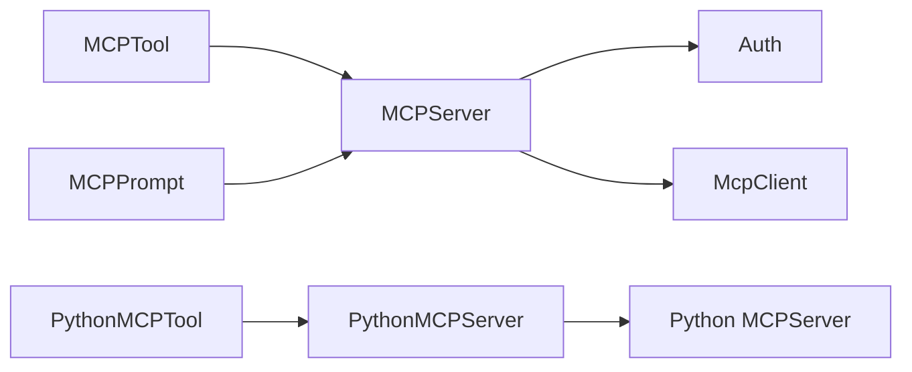

# MCP 协议集成

<cite>
**本文引用的文件**
- [MCPServer.java](file://integrations/mcp/src/main/java/org/apache/flink/agents/integrations/mcp/MCPServer.java)
- [Auth.java](file://integrations/mcp/src/main/java/org/apache/flink/agents/integrations/mcp/auth/Auth.java)
- [ApiKeyAuth.java](file://integrations/mcp/src/main/java/org/apache/flink/agents/integrations/mcp/auth/ApiKeyAuth.java)
- [BasicAuth.java](file://integrations/mcp/src/main/java/org/apache/flink/agents/integrations/mcp/auth/BasicAuth.java)
- [BearerTokenAuth.java](file://integrations/mcp/src/main/java/org/apache/flink/agents/integrations/mcp/auth/BearerTokenAuth.java)
- [MCPTool.java](file://integrations/mcp/src/main/java/org/apache/flink/agents/integrations/mcp/MCPTool.java)
- [MCPPrompt.java](file://integrations/mcp/src/main/java/org/apache/flink/agents/integrations/mcp/MCPPrompt.java)
- [MCPContentExtractor.java](file://integrations/mcp/src/main/java/org/apache/flink/agents/integrations/mcp/MCPContentExtractor.java)
- [MCPServerTest.java](file://integrations/mcp/src/test/java/org/apache/flink/agents/integrations/mcp/MCPServerTest.java)
- [mcp_server.py](file://python/flink_agents/e2e_tests/e2e_tests_integration/e2e_tests_mcp/mcp_server.py)
- [mcp.py](file://python/flink_agents/integrations/mcp/mcp.py)
- [PythonMCPServer.java](file://plan/src/main/java/org/apache/flink/agents/plan/resource/python/PythonMCPServer.java)
- [PythonMCPTool.java](file://plan/src/main/java/org/apache/flink/agents/plan/resource/python/PythonMCPTool.java)
</cite>

## 目录
1. [简介](#简介)
2. [项目结构](#项目结构)
3. [核心组件](#核心组件)
4. [架构总览](#架构总览)
5. [组件详解](#组件详解)
6. [依赖关系分析](#依赖关系分析)
7. [性能与可扩展性](#性能与可扩展性)
8. [安全与合规](#安全与合规)
9. [调试与测试](#调试与测试)
10. [结论](#结论)
11. [附录：使用示例与最佳实践](#附录使用示例与最佳实践)

## 简介
本文件面向需要在 Apache Flink Agents 中集成 MCP（Model Context Protocol）协议的开发者，系统性阐述 MCP 协议在代理系统中的工作原理、消息格式与通信机制；详细说明 MCP 服务器实现（协议解析、消息路由、响应生成）、认证机制（API Key、Basic、Bearer Token）以及在工具发现、提示管理与资源访问控制方面的应用价值；同时给出安全考虑（传输加密、身份验证、权限控制）、调试与测试方法，以及跨语言资源提供（Java/Python）的实现要点。

## 项目结构
MCP 集成主要分布在以下模块：
- Java 实现：integrations/mcp（MCP 客户端、认证、工具与提示封装）
- Python 实现：python/flink_agents/integrations/mcp（同步/异步 MCP 客户端、工具与提示封装）
- 资源桥接：plan/src/main/java/.../python（Java 侧对 Python MCP 资源的包装）
- 测试与端到端：e2e-test 与 integrations/mcp/src/test（覆盖认证、序列化、工具/提示获取等）

图表来源
- [MCPServer.java](file://integrations/mcp/src/main/java/org/apache/flink/agents/integrations/mcp/MCPServer.java#L78-L438)
- [MCPTool.java](file://integrations/mcp/src/main/java/org/apache/flink/agents/integrations/mcp/MCPTool.java#L41-L134)
- [MCPPrompt.java](file://integrations/mcp/src/main/java/org/apache/flink/agents/integrations/mcp/MCPPrompt.java#L40-L236)
- [Auth.java](file://integrations/mcp/src/main/java/org/apache/flink/agents/integrations/mcp/auth/Auth.java#L37-L60)
- [mcp.py](file://python/flink_agents/integrations/mcp/mcp.py#L136-L330)
- [PythonMCPServer.java](file://plan/src/main/java/org/apache/flink/agents/plan/resource/python/PythonMCPServer.java#L32-L92)
- [PythonMCPTool.java](file://plan/src/main/java/org/apache/flink/agents/plan/resource/python/PythonMCPTool.java#L32-L83)

章节来源
- [MCPServer.java](file://integrations/mcp/src/main/java/org/apache/flink/agents/integrations/mcp/MCPServer.java#L50-L78)
- [mcp.py](file://python/flink_agents/integrations/mcp/mcp.py#L136-L172)

## 核心组件
- MCPServer（Java）：封装 MCP 客户端，负责与远端 MCP 服务器建立连接、执行 listTools/listPrompts/getPrompt/callTool 等操作，支持超时、自定义头与认证插件。
- MCPTool：将 MCP 工具映射为 Flink Agents 的 Tool，调用时委托给 MCPServer 执行并返回标准化结果。
- MCPPrompt：将 MCP 提示动态拉取为 ChatMessage 列表，支持参数校验与格式化。
- 认证体系（Auth 接口及其实现）：统一抽象 BearerTokenAuth、BasicAuth、ApiKeyAuth，通过 HttpRequest.Builder 应用到请求中。
- 内容提取器（MCPContentExtractor）：将 MCP 返回的文本/图片/嵌入资源内容规范化为 Java 友好对象。

章节来源
- [MCPServer.java](file://integrations/mcp/src/main/java/org/apache/flink/agents/integrations/mcp/MCPServer.java#L148-L390)
- [MCPTool.java](file://integrations/mcp/src/main/java/org/apache/flink/agents/integrations/mcp/MCPTool.java#L74-L97)
- [MCPPrompt.java](file://integrations/mcp/src/main/java/org/apache/flink/agents/integrations/mcp/MCPPrompt.java#L170-L183)
- [Auth.java](file://integrations/mcp/src/main/java/org/apache/flink/agents/integrations/mcp/auth/Auth.java#L37-L60)
- [MCPContentExtractor.java](file://integrations/mcp/src/main/java/org/apache/flink/agents/integrations/mcp/MCPContentExtractor.java#L40-L51)

## 架构总览
下图展示了 Java 侧 MCP 客户端与远端 MCP 服务器之间的交互流程，包括认证、工具发现、提示获取与工具调用。

图表来源
- [MCPServer.java](file://integrations/mcp/src/main/java/org/apache/flink/agents/integrations/mcp/MCPServer.java#L213-L240)
- [MCPServer.java](file://integrations/mcp/src/main/java/org/apache/flink/agents/integrations/mcp/MCPServer.java#L265-L390)
- [Auth.java](file://integrations/mcp/src/main/java/org/apache/flink/agents/integrations/mcp/auth/Auth.java#L43-L50)

## 组件详解

### MCPServer（Java）
- 职责：封装 MCP 客户端生命周期、认证注入、工具与提示的发现与获取、内容提取与异常处理。
- 关键点：
  - Builder 模式支持 endpoint、headers、timeout、auth 参数设置。
  - 使用官方 MCP Java SDK 的 Http/SSE 传输，初始化后进行协议握手。
  - listTools/listPrompts/getPrompt/callTool 均基于同步客户端封装。
  - 支持自定义 HTTP 头与认证策略；对无效 URL 进行校验。
  - 结果内容通过 MCPContentExtractor 规范化为字符串或结构化对象。

图表来源
- [MCPServer.java](file://integrations/mcp/src/main/java/org/apache/flink/agents/integrations/mcp/MCPServer.java#L78-L194)
- [Auth.java](file://integrations/mcp/src/main/java/org/apache/flink/agents/integrations/mcp/auth/Auth.java#L37-L60)
- [BearerTokenAuth.java](file://integrations/mcp/src/main/java/org/apache/flink/agents/integrations/mcp/auth/BearerTokenAuth.java#L40-L66)
- [BasicAuth.java](file://integrations/mcp/src/main/java/org/apache/flink/agents/integrations/mcp/auth/BasicAuth.java#L43-L78)
- [ApiKeyAuth.java](file://integrations/mcp/src/main/java/org/apache/flink/agents/integrations/mcp/auth/ApiKeyAuth.java#L41-L75)

章节来源
- [MCPServer.java](file://integrations/mcp/src/main/java/org/apache/flink/agents/integrations/mcp/MCPServer.java#L195-L258)
- [MCPServer.java](file://integrations/mcp/src/main/java/org/apache/flink/agents/integrations/mcp/MCPServer.java#L265-L390)

### 认证机制（Auth 接口与实现）
- Auth 接口：统一抽象认证行为，支持序列化类型标识（Jackson 注解），便于跨语言资源描述。
- BearerTokenAuth：添加 Authorization: Bearer {token}。
- BasicAuth：添加 Authorization: Basic {base64(username:password)}。
- ApiKeyAuth：添加自定义头部（如 X-API-Key），常用于服务端自定义鉴权。

图表来源
- [Auth.java](file://integrations/mcp/src/main/java/org/apache/flink/agents/integrations/mcp/auth/Auth.java#L37-L60)
- [BearerTokenAuth.java](file://integrations/mcp/src/main/java/org/apache/flink/agents/integrations/mcp/auth/BearerTokenAuth.java#L40-L66)
- [BasicAuth.java](file://integrations/mcp/src/main/java/org/apache/flink/agents/integrations/mcp/auth/BasicAuth.java#L43-L78)
- [ApiKeyAuth.java](file://integrations/mcp/src/main/java/org/apache/flink/agents/integrations/mcp/auth/ApiKeyAuth.java#L41-L75)

章节来源
- [Auth.java](file://integrations/mcp/src/main/java/org/apache/flink/agents/integrations/mcp/auth/Auth.java#L37-L60)
- [MCPServer.java](file://integrations/mcp/src/main/java/org/apache/flink/agents/integrations/mcp/MCPServer.java#L222-L224)

### MCPTool 与 MCPPrompt
- MCPTool：将 MCP 工具元数据包装为 Tool，调用时将参数转为 Map 并委托 MCPServer 执行，捕获异常并返回 ToolResponse。
- MCPPrompt：将 MCP 提示动态拉取为 ChatMessage 列表，支持必填参数校验与参数准备。

图表来源
- [MCPTool.java](file://integrations/mcp/src/main/java/org/apache/flink/agents/integrations/mcp/MCPTool.java#L74-L97)
- [MCPPrompt.java](file://integrations/mcp/src/main/java/org/apache/flink/agents/integrations/mcp/MCPPrompt.java#L192-L208)
- [MCPServer.java](file://integrations/mcp/src/main/java/org/apache/flink/agents/integrations/mcp/MCPServer.java#L322-L335)

章节来源
- [MCPTool.java](file://integrations/mcp/src/main/java/org/apache/flink/agents/integrations/mcp/MCPTool.java#L74-L97)
- [MCPPrompt.java](file://integrations/mcp/src/main/java/org/apache/flink/agents/integrations/mcp/MCPPrompt.java#L170-L208)

### 内容提取与多类型支持
- 文本：直接提取为字符串。
- 图片：提取为包含类型、数据与 MIME 的结构化对象。
- 嵌入资源：根据资源类型（文本/二进制）提取 URI 与内容字段。

章节来源
- [MCPContentExtractor.java](file://integrations/mcp/src/main/java/org/apache/flink/agents/integrations/mcp/MCPContentExtractor.java#L40-L100)

### Python 侧 MCP 客户端与资源桥接
- Python 侧 MCPServer：基于官方 MCP SDK 的异步会话，支持 streamable-http 传输、认证、工具/提示列举与调用。
- Python 侧 MCPTool/MCPPrompt：与 Java 侧对应，支持参数校验与内容提取。
- Java 对 Python 资源的桥接：通过 PythonMCPServer/PythonMCPTool 将 Python 对象暴露为 Java 资源，实现跨语言工具与提示的统一调度。

章节来源
- [mcp.py](file://python/flink_agents/integrations/mcp/mcp.py#L136-L330)
- [PythonMCPServer.java](file://plan/src/main/java/org/apache/flink/agents/plan/resource/python/PythonMCPServer.java#L32-L92)
- [PythonMCPTool.java](file://plan/src/main/java/org/apache/flink/agents/plan/resource/python/PythonMCPTool.java#L32-L83)

## 依赖关系分析
- 组件耦合：
  - MCPServer 依赖 Auth 接口与 MCP 同步客户端 SDK。
  - MCPTool/MCPPrompt 依赖 MCPServer 作为后端执行器。
  - Java 与 Python 侧的 MCPServer 通过资源桥接实现互通。
- 外部依赖：
  - MCP Java SDK（McpClient、McpSyncClient、HttpClientStreamableHttpTransport）。
  - Jackson（序列化/反序列化认证类型与资源）。
  - httpx（Python 侧认证与会话管理）。

图表来源
- [MCPServer.java](file://integrations/mcp/src/main/java/org/apache/flink/agents/integrations/mcp/MCPServer.java#L213-L240)
- [mcp.py](file://python/flink_agents/integrations/mcp/mcp.py#L181-L202)
- [PythonMCPServer.java](file://plan/src/main/java/org/apache/flink/agents/plan/resource/python/PythonMCPServer.java#L32-L92)

## 性能与可扩展性
- 连接复用：MCPServer 内部缓存同步客户端实例，避免重复握手开销。
- 超时控制：支持全局请求超时与 SSE 读取超时，防止阻塞。
- 异步能力：Python 侧提供异步会话与工具调用，适合高并发场景。
- 内容提取：按需提取与类型判断，减少不必要的转换成本。
- 扩展建议：
  - 引入连接池与重试策略。
  - 对工具输入模式进行缓存以减少序列化/反序列化。
  - 在 Python 侧引入异步批处理工具调用。

[本节为通用性能讨论，不直接分析具体文件]

## 安全与合规
- 传输加密：MCPServer 支持 https 端点，确保传输层安全。
- 身份验证：
  - Bearer Token：适用于 OAuth/JWT 场景。
  - Basic：用户名/密码基础认证。
  - API Key：通过自定义头部传递密钥。
- 权限控制：由远端 MCP 服务器在 listTools/listPrompts/getPrompt/callTool 等 RPC 中实施细粒度权限校验。
- 最佳实践：
  - 优先使用 https 与 Bearer Token。
  - 将密钥存储在受控环境变量或密钥管理服务中。
  - 对敏感参数进行最小化暴露与审计日志记录。

章节来源
- [MCPServer.java](file://integrations/mcp/src/main/java/org/apache/flink/agents/integrations/mcp/MCPServer.java#L243-L258)
- [Auth.java](file://integrations/mcp/src/main/java/org/apache/flink/agents/integrations/mcp/auth/Auth.java#L37-L60)

## 调试与测试
- 单元测试覆盖：
  - Builder 创建、构造函数、多头设置、认证类型、端点校验、资源类型、equals/hashCode、toString、JSON 序列化/反序列化、headers 不可变性、关闭资源等。
- 端到端测试：
  - 提供一个基于 FastMCP 的简单 MCP 服务器示例，包含计算类提示与工具，便于本地联调。
- 调试建议：
  - 开启 MCP SDK 日志（Java/Python）以观察握手与请求细节。
  - 使用抓包工具检查 HTTP/SSE 请求头与认证字段。
  - 对工具调用结果进行内容提取验证（文本/图片/资源）。

章节来源
- [MCPServerTest.java](file://integrations/mcp/src/test/java/org/apache/flink/agents/integrations/mcp/MCPServerTest.java#L44-L246)
- [mcp_server.py](file://python/flink_agents/e2e_tests/e2e_tests_integration/e2e_tests_mcp/mcp_server.py#L25-L62)

## 结论
Apache Flink Agents 的 MCP 集成提供了标准化的工具与提示管理能力，通过统一的认证抽象与内容提取机制，实现了跨语言（Java/Python）的资源互通。借助官方 MCP SDK，系统具备良好的协议兼容性与可扩展性，适合在复杂代理场景中进行工具发现、提示管理与资源访问控制。

[本节为总结性内容，不直接分析具体文件]

## 附录：使用示例与最佳实践
- 示例一：使用 Bearer Token 认证连接 MCP 服务器并列出工具
  - 步骤：构建 MCPServer（指定 endpoint、auth 为 BearerTokenAuth、timeout），调用 listTools 获取 MCPTool 列表。
  - 参考路径：[MCPServer.java](file://integrations/mcp/src/main/java/org/apache/flink/agents/integrations/mcp/MCPServer.java#L169-L171)，[BearerTokenAuth.java](file://integrations/mcp/src/main/java/org/apache/flink/agents/integrations/mcp/auth/BearerTokenAuth.java#L54-L61)
- 示例二：使用 Basic 认证与自定义头
  - 步骤：通过 Builder.header/header/headers 设置自定义头，auth 为 BasicAuth。
  - 参考路径：[MCPServer.java](file://integrations/mcp/src/main/java/org/apache/flink/agents/integrations/mcp/MCPServer.java#L106-L124)，[BasicAuth.java](file://integrations/mcp/src/main/java/org/apache/flink/agents/integrations/mcp/auth/BasicAuth.java#L62-L67)
- 示例三：使用 API Key 认证
  - 步骤：auth 为 ApiKeyAuth（指定 headerName 与 apiKey）。
  - 参考路径：[ApiKeyAuth.java](file://integrations/mcp/src/main/java/org/apache/flink/agents/integrations/mcp/auth/ApiKeyAuth.java#L60-L65)
- 示例四：调用工具与获取提示
  - 步骤：通过 MCPServer.getTool(name).call(parameters) 或 getPrompt(name, args) 获取消息列表。
  - 参考路径：[MCPTool.java](file://integrations/mcp/src/main/java/org/apache/flink/agents/integrations/mcp/MCPTool.java#L75-L97)，[MCPServer.java](file://integrations/mcp/src/main/java/org/apache/flink/agents/integrations/mcp/MCPServer.java#L373-L390)
- 示例五：跨语言资源桥接
  - 步骤：通过 PythonMCPServer/PythonMCPTool 包装 Python 端 MCP 资源，Java 侧统一调度。
  - 参考路径：[PythonMCPServer.java](file://plan/src/main/java/org/apache/flink/agents/plan/resource/python/PythonMCPServer.java#L32-L92)，[PythonMCPTool.java](file://plan/src/main/java/org/apache/flink/agents/plan/resource/python/PythonMCPTool.java#L32-L83)

章节来源
- [MCPServer.java](file://integrations/mcp/src/main/java/org/apache/flink/agents/integrations/mcp/MCPServer.java#L169-L171)
- [BearerTokenAuth.java](file://integrations/mcp/src/main/java/org/apache/flink/agents/integrations/mcp/auth/BearerTokenAuth.java#L54-L61)
- [BasicAuth.java](file://integrations/mcp/src/main/java/org/apache/flink/agents/integrations/mcp/auth/BasicAuth.java#L62-L67)
- [ApiKeyAuth.java](file://integrations/mcp/src/main/java/org/apache/flink/agents/integrations/mcp/auth/ApiKeyAuth.java#L60-L65)
- [MCPTool.java](file://integrations/mcp/src/main/java/org/apache/flink/agents/integrations/mcp/MCPTool.java#L75-L97)
- [MCPServer.java](file://integrations/mcp/src/main/java/org/apache/flink/agents/integrations/mcp/MCPServer.java#L373-L390)
- [PythonMCPServer.java](file://plan/src/main/java/org/apache/flink/agents/plan/resource/python/PythonMCPServer.java#L32-L92)
- [PythonMCPTool.java](file://plan/src/main/java/org/apache/flink/agents/plan/resource/python/PythonMCPTool.java#L32-L83)