# 向量存储集成

<cite>
**本文档引用的文件**
- [ElasticsearchVectorStore.java](file://integrations/vector-stores/elasticsearch/src/main/java/org/apache/flink/agents/integrations/vectorstores/elasticsearch/ElasticsearchVectorStore.java)
- [BaseVectorStore.java](file://api/src/main/java/org/apache/flink/agents/api/vectorstores/BaseVectorStore.java)
- [CollectionManageableVectorStore.java](file://api/src/main/java/org/apache/flink/agents/api/vectorstores/CollectionManageableVectorStore.java)
- [Document.java](file://api/src/main/java/org/apache/flink/agents/api/vectorstores/Document.java)
- [VectorStoreQuery.java](file://api/src/main/java/org/apache/flink/agents/api/vectorstores/VectorStoreQuery.java)
- [VectorStoreQueryResult.java](file://api/src/main/java/org/apache/flink/agents/api/vectorstores/VectorStoreQueryResult.java)
- [ElasticsearchVectorStoreTest.java](file://integrations/vector-stores/elasticsearch/src/test/java/org/apache/flink/agents/integrations/vectorstores/elasticsearch/ElasticsearchVectorStoreTest.java)
- [VectorStoreIntegrationTest.java](file://e2e-test/flink-agents-end-to-end-tests-integration/src/test/java/org/apache/flink/agents/integration/test/VectorStoreIntegrationTest.java)
- [VectorStoreIntegrationAgent.java](file://e2e-test/flink-agents-end-to-end-tests-integration/src/test/java/org/apache/flink/agents/integration/test/VectorStoreIntegrationAgent.java)
- [VectorStoreLongTermMemory.java](file://runtime/src/main/java/org/apache/flink/agents/runtime/memory/VectorStoreLongTermMemory.java)
- [java_vector_store.py](file://python/flink_agents/runtime/java/java_vector_store.py)
</cite>

## 目录
1. [简介](#简介)
2. [项目结构](#项目结构)
3. [核心组件](#核心组件)
4. [架构概览](#架构概览)
5. [详细组件分析](#详细组件分析)
6. [配置指南](#配置指南)
7. [向量索引管理](#向量索引管理)
8. [数据导入与查询](#数据导入与查询)
9. [性能优化策略](#性能优化策略)
10. [监控与故障排除](#监控与故障排除)
11. [最佳实践](#最佳实践)
12. [结论](#结论)

## 简介

Apache Flink Agents 的向量存储集成为代理系统提供了强大的语义搜索和相似度匹配能力。该集成基于 Elasticsearch 实现，支持高效的近似最近邻（ANN）搜索，使代理能够理解文档的语义含义而非简单的关键词匹配。

本系统通过将文本内容转换为高维向量表示，并在 Elasticsearch 中存储这些向量，实现了快速的语义相似度搜索。这对于构建智能问答系统、文档检索和上下文感知的代理应用至关重要。

## 项目结构

向量存储集成主要分布在以下模块中：

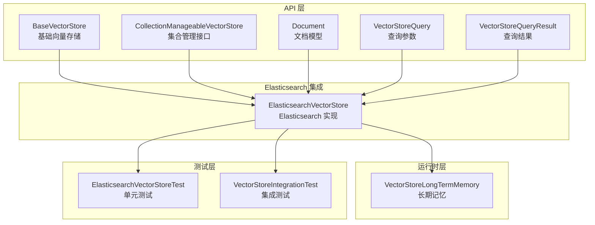

**图表来源**
- [BaseVectorStore.java](file://api/src/main/java/org/apache/flink/agents/api/vectorstores/BaseVectorStore.java#L38-L174)
- [ElasticsearchVectorStore.java](file://integrations/vector-stores/elasticsearch/src/main/java/org/apache/flink/agents/integrations/vectorstores/elasticsearch/ElasticsearchVectorStore.java#L118-L250)
- [VectorStoreLongTermMemory.java](file://runtime/src/main/java/org/apache/flink/agents/runtime/memory/VectorStoreLongTermMemory.java#L70-L135)

**章节来源**
- [BaseVectorStore.java](file://api/src/main/java/org/apache/flink/agents/api/vectorstores/BaseVectorStore.java#L38-L174)
- [CollectionManageableVectorStore.java](file://api/src/main/java/org/apache/flink/agents/api/vectorstores/CollectionManageableVectorStore.java#L23-L68)

## 核心组件

### 基础架构设计

向量存储系统采用分层架构设计，确保了良好的可扩展性和可维护性：

```mermaid
classDiagram
class BaseVectorStore {
-String embeddingModel
+add(documents, collection, extraArgs) String[]
+query(query) VectorStoreQueryResult
+size(collection) long
+get(ids, collection, extraArgs) Document[]
+delete(ids, collection, extraArgs) void
#queryEmbedding(embedding, limit, collection, args) Document[]
#addEmbedding(documents, collection, extraArgs) String[]
}
class CollectionManageableVectorStore {
<<interface>>
class Collection {
-String name
-Map~String,Object~ metadata
+getName() String
+getMetadata() Map~String,Object~
}
+getOrCreateCollection(name, metadata) Collection
+getCollection(name) Collection
+deleteCollection(name) Collection
}
class ElasticsearchVectorStore {
-ElasticsearchClient client
-String index
-String contentField
-String metadataField
-String vectorField
-int dims
-Integer k
-Integer numCandidates
-String filterQuery
+createIndex(indexName, metadata) void
+storeCollectionMetadata(indexName, metadata) void
+queryEmbedding(embedding, limit, collection, args) Document[]
+addEmbedding(documents, collection, extraArgs) String[]
}
class Document {
-String id
-String content
-Map~String,Object~ metadata
-float[] embedding
+getContent() String
+getMetadata() Map~String,Object~
+getId() String
+getEmbedding() float[]
+setEmbedding(embedding) void
}
BaseVectorStore <|-- ElasticsearchVectorStore
CollectionManageableVectorStore <|.. ElasticsearchVectorStore
Document --> ElasticsearchVectorStore : "存储"
```

**图表来源**
- [BaseVectorStore.java](file://api/src/main/java/org/apache/flink/agents/api/vectorstores/BaseVectorStore.java#L38-L174)
- [CollectionManageableVectorStore.java](file://api/src/main/java/org/apache/flink/agents/api/vectorstores/CollectionManageableVectorStore.java#L23-L68)
- [ElasticsearchVectorStore.java](file://integrations/vector-stores/elasticsearch/src/main/java/org/apache/flink/agents/integrations/vectorstores/elasticsearch/ElasticsearchVectorStore.java#L118-L250)
- [Document.java](file://api/src/main/java/org/apache/flink/agents/api/vectorstores/Document.java#L34-L111)

### 关键特性

1. **语义搜索**: 基于嵌入模型的语义相似度搜索
2. **集合管理**: 支持多索引隔离的集合概念
3. **批量操作**: 高效的批量文档添加和删除
4. **过滤查询**: 支持复杂的 Elasticsearch 查询 DSL
5. **跨语言支持**: Java 和 Python 双语言环境兼容

**章节来源**
- [ElasticsearchVectorStore.java](file://integrations/vector-stores/elasticsearch/src/main/java/org/apache/flink/agents/integrations/vectorstores/elasticsearch/ElasticsearchVectorStore.java#L74-L117)
- [BaseVectorStore.java](file://api/src/main/java/org/apache/flink/agents/api/vectorstores/BaseVectorStore.java#L33-L60)

## 架构概览

向量存储系统的工作流程如下：

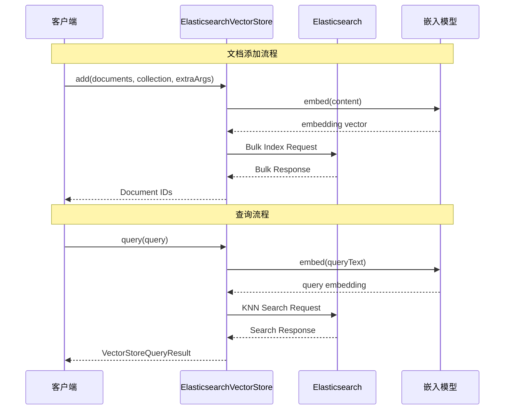

**图表来源**
- [BaseVectorStore.java](file://api/src/main/java/org/apache/flink/agents/api/vectorstores/BaseVectorStore.java#L71-L112)
- [ElasticsearchVectorStore.java](file://integrations/vector-stores/elasticsearch/src/main/java/org/apache/flink/agents/integrations/vectorstores/elasticsearch/ElasticsearchVectorStore.java#L704-L741)

## 详细组件分析

### ElasticsearchVectorStore 实现

ElasticsearchVectorStore 是整个系统的核心实现类，负责与 Elasticsearch 进行交互：

#### 连接配置

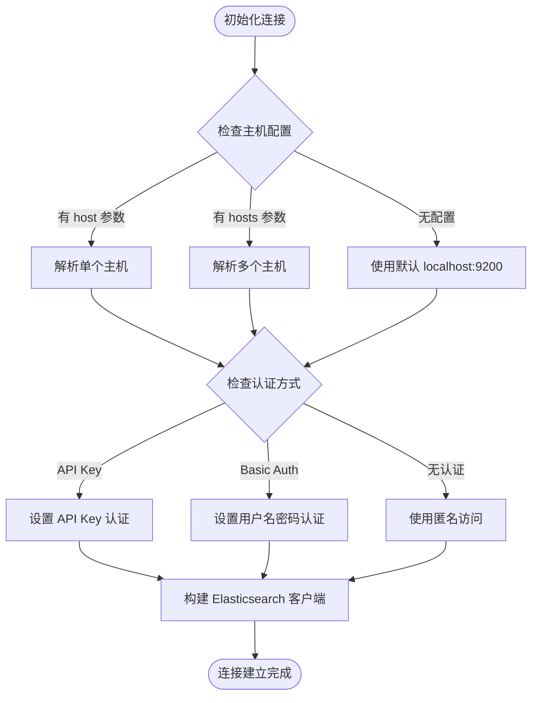

**图表来源**
- [ElasticsearchVectorStore.java](file://integrations/vector-stores/elasticsearch/src/main/java/org/apache/flink/agents/integrations/vectorstores/elasticsearch/ElasticsearchVectorStore.java#L201-L249)

#### 向量字段映射

系统支持灵活的字段映射配置：

| 字段名称 | 默认值 | 描述 | 类型 |
|---------|--------|------|------|
| index | 必需 | Elasticsearch 索引名称 | String |
| vector_field | `_vector` | 向量字段名称 | String |
| content_field | `_content` | 内容字段名称 | String |
| metadata_field | `_metadata` | 元数据字段名称 | String |
| dims | 768 | 向量维度 | Integer |
| k | null | 返回结果数量 | Integer |
| num_candidates | null | 候选集大小 | Integer |
| filter_query | null | 过滤查询条件 | String |

**章节来源**
- [ElasticsearchVectorStore.java](file://integrations/vector-stores/elasticsearch/src/main/java/org/apache/flink/agents/integrations/vectorstores/elasticsearch/ElasticsearchVectorStore.java#L121-L131)
- [ElasticsearchVectorStore.java](file://integrations/vector-stores/elasticsearch/src/main/java/org/apache/flink/agents/integrations/vectorstores/elasticsearch/ElasticsearchVectorStore.java#L176-L189)

### 集合管理机制

系统实现了完整的集合管理功能，支持多索引隔离：

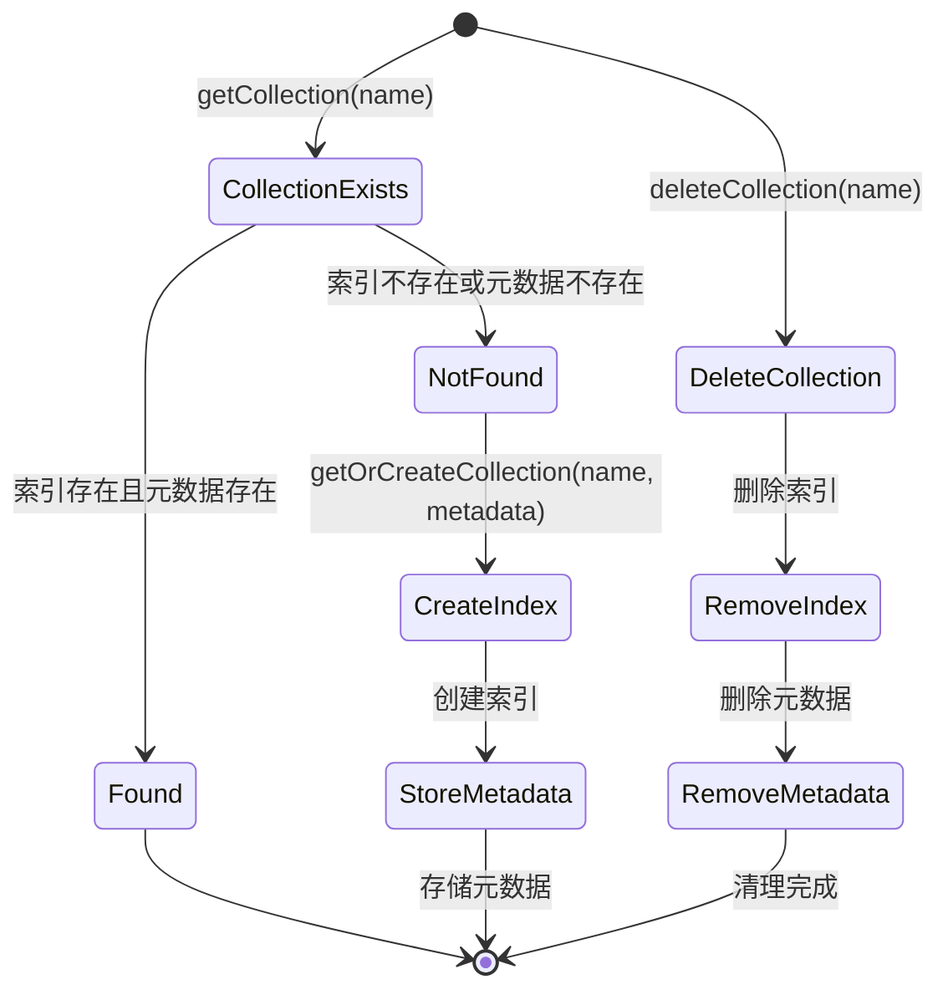

**图表来源**
- [ElasticsearchVectorStore.java](file://integrations/vector-stores/elasticsearch/src/main/java/org/apache/flink/agents/integrations/vectorstores/elasticsearch/ElasticsearchVectorStore.java#L257-L448)

**章节来源**
- [CollectionManageableVectorStore.java](file://api/src/main/java/org/apache/flink/agents/api/vectorstores/CollectionManageableVectorStore.java#L25-L41)
- [ElasticsearchVectorStore.java](file://integrations/vector-stores/elasticsearch/src/main/java/org/apache/flink/agents/integrations/vectorstores/elasticsearch/ElasticsearchVectorStore.java#L257-L448)

### 查询执行流程

查询执行采用两阶段模式：嵌入生成和向量搜索：

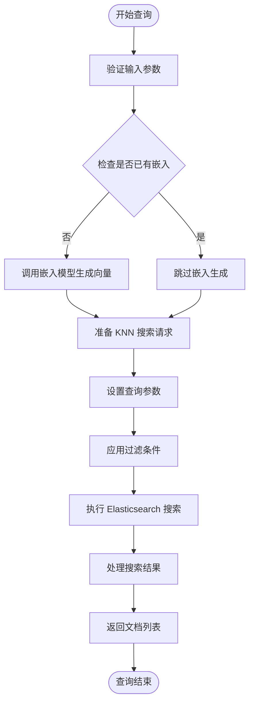

**图表来源**
- [BaseVectorStore.java](file://api/src/main/java/org/apache/flink/agents/api/vectorstores/BaseVectorStore.java#L97-L112)
- [ElasticsearchVectorStore.java](file://integrations/vector-stores/elasticsearch/src/main/java/org/apache/flink/agents/integrations/vectorstores/elasticsearch/ElasticsearchVectorStore.java#L704-L741)

**章节来源**
- [VectorStoreQuery.java](file://api/src/main/java/org/apache/flink/agents/api/vectorstores/VectorStoreQuery.java#L33-L83)
- [VectorStoreQueryResult.java](file://api/src/main/java/org/apache/flink/agents/api/vectorstores/VectorStoreQueryResult.java#L29-L46)

## 配置指南

### Elasticsearch 集群设置

#### 基础连接配置

```yaml
# 基本连接配置
embedding_model: "textEmbedder"  # 嵌入模型资源名称
index: "my_documents"           # 目标索引名称
host: "http://localhost:9200"   # Elasticsearch 主机地址
```

#### 认证配置选项

```yaml
# API Key 认证
api_key_base64: "<BASE64_ID_COLON_SECRET>"
# 或者
api_key_id: "<API_KEY_ID>"
api_key_secret: "<API_KEY_SECRET>"

# 基本认证
username: "elastic"
password: "your_password"
```

#### 高级配置参数

```yaml
# 向量搜索参数
vector_field: "content_vector"  # 向量字段名称
dims: 768                       # 向量维度
k: 10                          # 返回结果数量
num_candidates: 100            # 候选集大小

# 查询过滤
filter_query: '{"term": {"status": "published"}}'

# 字段映射
content_field: "content"
metadata_field: "metadata"
```

**章节来源**
- [ElasticsearchVectorStore.java](file://integrations/vector-stores/elasticsearch/src/main/java/org/apache/flink/agents/integrations/vectorstores/elasticsearch/ElasticsearchVectorStore.java#L84-L99)
- [ElasticsearchVectorStore.java](file://integrations/vector-stores/elasticsearch/src/main/java/org/apache/flink/agents/integrations/vectorstores/elasticsearch/ElasticsearchVectorStore.java#L218-L243)

### 索引模板配置

#### 向量字段映射

Elasticsearch 索引需要特定的向量字段映射：

```json
{
  "mappings": {
    "properties": {
      "content_vector": {
        "type": "dense_vector",
        "dims": 768,
        "index": true
      },
      "_content": {
        "type": "text"
      },
      "_metadata": {
        "type": "object"
      }
    }
  }
}
```

#### 动态映射配置

系统支持动态映射以适应不同的文档结构：

```json
{
  "mappings": {
    "dynamic": true,
    "properties": {
      "content_vector": {
        "type": "dense_vector",
        "dims": 768,
        "index": true
      }
    }
  }
}
```

**章节来源**
- [ElasticsearchVectorStore.java](file://integrations/vector-stores/elasticsearch/src/main/java/org/apache/flink/agents/integrations/vectorstores/elasticsearch/ElasticsearchVectorStore.java#L287-L312)
- [ElasticsearchVectorStore.java](file://integrations/vector-stores/elasticsearch/src/main/java/org/apache/flink/agents/integrations/vectorstores/elasticsearch/ElasticsearchVectorStore.java#L332-L353)

## 向量索引管理

### 索引创建流程

系统自动管理索引的创建和配置：

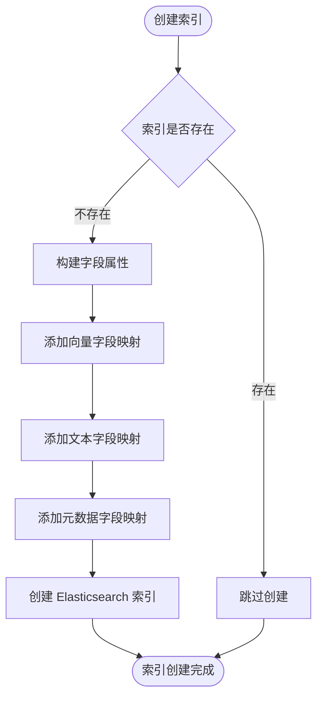

**图表来源**
- [ElasticsearchVectorStore.java](file://integrations/vector-stores/elasticsearch/src/main/java/org/apache/flink/agents/integrations/vectorstores/elasticsearch/ElasticsearchVectorStore.java#L284-L312)

### 集合元数据管理

系统使用专门的元数据索引来跟踪集合信息：

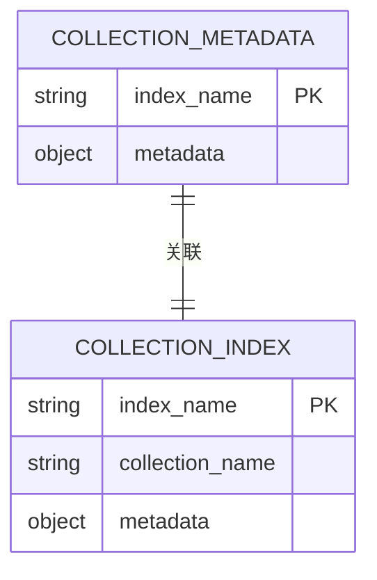

**图表来源**
- [ElasticsearchVectorStore.java](file://integrations/vector-stores/elasticsearch/src/main/java/org/apache/flink/agents/integrations/vectorstores/elasticsearch/ElasticsearchVectorStore.java#L324-L365)

**章节来源**
- [ElasticsearchVectorStore.java](file://integrations/vector-stores/elasticsearch/src/main/java/org/apache/flink/agents/integrations/vectorstores/elasticsearch/ElasticsearchVectorStore.java#L277-L365)

## 数据导入与查询

### 批量数据导入

系统支持高效的批量文档导入：

#### 批量添加流程

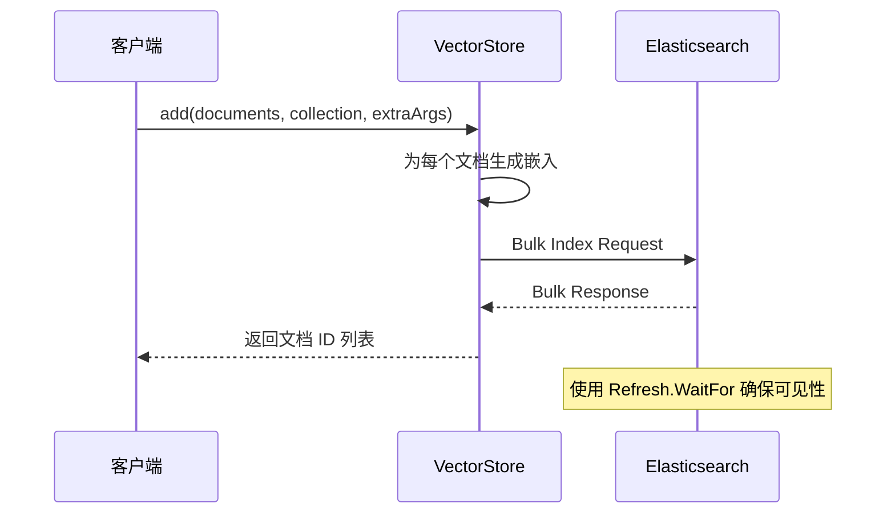

**图表来源**
- [BaseVectorStore.java](file://api/src/main/java/org/apache/flink/agents/api/vectorstores/BaseVectorStore.java#L71-L88)
- [ElasticsearchVectorStore.java](file://integrations/vector-stores/elasticsearch/src/main/java/org/apache/flink/agents/integrations/vectorstores/elasticsearch/ElasticsearchVectorStore.java#L749-L800)

#### 批量删除流程

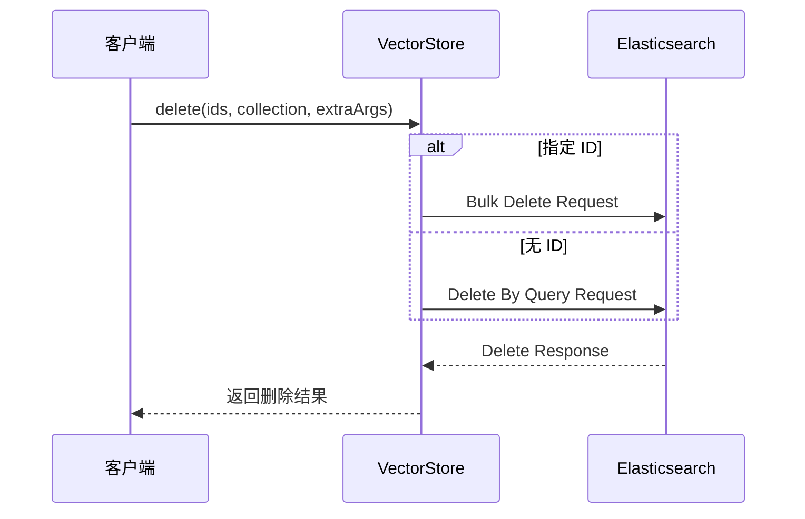

**图表来源**
- [ElasticsearchVectorStore.java](file://integrations/vector-stores/elasticsearch/src/main/java/org/apache/flink/agents/integrations/vectorstores/elasticsearch/ElasticsearchVectorStore.java#L530-L543)
- [ElasticsearchVectorStore.java](file://integrations/vector-stores/elasticsearch/src/main/java/org/apache/flink/agents/integrations/vectorstores/elasticsearch/ElasticsearchVectorStore.java#L624-L684)

### 查询优化策略

#### KNN 搜索参数

| 参数 | 默认值 | 说明 | 性能影响 |
|------|--------|------|----------|
| k | 10 | 返回结果数量 | 正比增加响应时间 |
| num_candidates | max(100, k*2) | 候选集大小 | 影响召回率和性能 |
| filter_query | null | 过滤条件 | 减少候选集大小 |

#### 查询执行优化

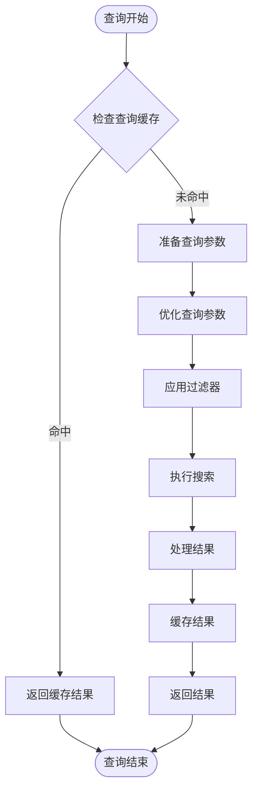

**图表来源**
- [ElasticsearchVectorStore.java](file://integrations/vector-stores/elasticsearch/src/main/java/org/apache/flink/agents/integrations/vectorstores/elasticsearch/ElasticsearchVectorStore.java#L704-L741)

**章节来源**
- [ElasticsearchVectorStore.java](file://integrations/vector-stores/elasticsearch/src/main/java/org/apache/flink/agents/integrations/vectorstores/elasticsearch/ElasticsearchVectorStore.java#L698-L741)

## 性能优化策略

### 索引刷新策略

系统采用智能的索引刷新策略以平衡性能和一致性：

#### 刷新配置

```java
// 批量操作使用 WaitFor 刷新
BulkRequest.of(br -> br.operations(bulkOperations).refresh(Refresh.WaitFor));

// 单文档操作使用手动刷新控制
IndexRequest.of(i -> i.index(index).id(docId).document(source).refresh(true));
```

#### 刷新策略选择

| 场景 | 刷新策略 | 说明 |
|------|----------|------|
| 批量导入 | Refresh.WaitFor | 确保批量导入后立即可见 |
| 单文档操作 | 默认 | 平衡性能和一致性 |
| 大规模导入 | 手动控制 | 分批处理避免过度刷新 |

### 查询缓存机制

系统支持查询结果缓存以提高重复查询的性能：

#### 缓存策略

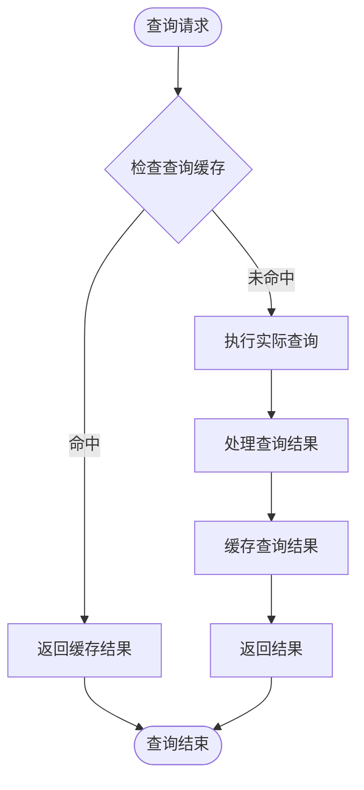

**图表来源**
- [ElasticsearchVectorStore.java](file://integrations/vector-stores/elasticsearch/src/main/java/org/apache/flink/agents/integrations/vectorstores/elasticsearch/ElasticsearchVectorStore.java#L704-L741)

### 分片配置优化

#### 最佳实践

```yaml
# 建议的分片配置
index:
  number_of_shards: 3
  number_of_replicas: 1
  refresh_interval: 30s
  
# 向量搜索优化
knn_engine: nmslib
knn_space_type: innerproduct
```

#### 性能调优参数

| 参数 | 建议值 | 说明 |
|------|--------|------|
| number_of_shards | 3-5 | 根据数据量调整 |
| refresh_interval | 30s-60s | 减少刷新频率 |
| replicas | 1 | 平衡可用性和性能 |

**章节来源**
- [ElasticsearchVectorStore.java](file://integrations/vector-stores/elasticsearch/src/main/java/org/apache/flink/agents/integrations/vectorstores/elasticsearch/ElasticsearchVectorStore.java#L797-L800)

## 监控与故障排除

### 监控指标

系统提供多种监控指标用于性能分析：

#### 关键指标

| 指标类型 | 指标名称 | 描述 | 用途 |
|----------|----------|------|------|
| 计数器 | vector_store_add_count | 文档添加次数 | 监控写入负载 |
| 计数器 | vector_store_query_count | 查询次数 | 监控读取负载 |
| 计时器 | vector_store_search_duration | 搜索耗时 | 性能分析 |
| 计数器 | vector_store_error_count | 错误次数 | 故障诊断 |

#### 性能指标

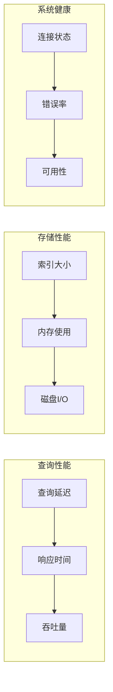

### 故障排除指南

#### 常见问题及解决方案

| 问题类型 | 症状 | 可能原因 | 解决方案 |
|----------|------|----------|----------|
| 连接失败 | Elasticsearch 连接超时 | 网络配置错误 | 检查 host 和端口配置 |
| 认证失败 | 401/403 错误 | 凭据配置错误 | 验证 API Key 或用户名密码 |
| 索引创建失败 | 映射错误 | 字段类型不匹配 | 检查向量维度和字段映射 |
| 查询无结果 | 返回空列表 | 嵌入向量为空 | 确认嵌入模型正常工作 |
| 性能问题 | 查询响应慢 | 参数配置不当 | 调整 k 和 num_candidates |

#### 调试步骤

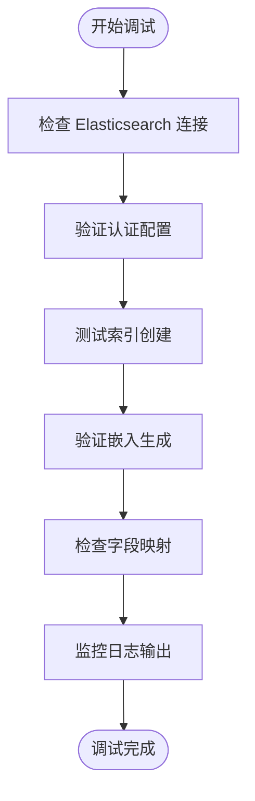

**章节来源**
- [ElasticsearchVectorStoreTest.java](file://integrations/vector-stores/elasticsearch/src/test/java/org/apache/flink/agents/integrations/vectorstores/elasticsearch/ElasticsearchVectorStoreTest.java#L40-L50)

### 日志记录

系统提供详细的日志记录用于问题诊断：

#### 日志级别

| 日志级别 | 用途 | 示例消息 |
|----------|------|----------|
| INFO | 操作确认 | "Vector store retrieval PASSED" |
| WARN | 警告信息 | "Collection not found" |
| ERROR | 错误详情 | "Error performing KNN search" |
| DEBUG | 详细调试 | "Search request parameters" |

**章节来源**
- [VectorStoreIntegrationAgent.java](file://e2e-test/flink-agents-end-to-end-tests-integration/src/test/java/org/apache/flink/agents/integration/test/VectorStoreIntegrationAgent.java#L147-L153)

## 最佳实践

### 设计原则

#### 1. 向量维度选择

- **小规模应用**: 128-256 维，平衡精度和性能
- **中等规模应用**: 384-512 维，推荐的折中方案
- **大规模应用**: 768+ 维，追求最高精度

#### 2. 索引命名策略

```java
// 推荐的命名模式
String collectionName = "user_" + userId + "_documents";
String indexName = "app_" + appName + "_" + collectionName;
```

#### 3. 元数据组织

```java
Map<String, Object> metadata = new HashMap<>();
metadata.put("source", "web_scraping");
metadata.put("created_at", System.currentTimeMillis());
metadata.put("version", "1.0");
metadata.put("tags", Arrays.asList("important", "review"));
```

### 性能优化建议

#### 1. 批量操作优化

```java
// 推荐的批量大小
int batchSize = 1000;  // Elasticsearch 默认批量大小
int maxBatchSize = 10000;  // 避免过大的批量
```

#### 2. 查询参数调优

```java
// 基于数据量的参数设置
int dataSize = store.size(collection);
int k = Math.min(10, Math.max(1, dataSize / 1000));
int numCandidates = Math.max(100, k * 10);
```

#### 3. 缓存策略

```java
// 针对不同场景的缓存策略
if (queryText.length() < 50) {
    // 短查询使用缓存
    cacheQuery(queryText, k, numCandidates);
} else {
    // 长查询禁用缓存
    executeDirectQuery(queryText, k, numCandidates);
}
```

### 安全考虑

#### 1. 认证最佳实践

```yaml
# 生产环境推荐配置
embedding_model: "secureEmbeddingModel"
index: "production_${environment}"
host: "${ES_HOST}"
username: "${ES_USERNAME}"
password: "${ES_PASSWORD}"  # 使用环境变量
```

#### 2. 权限控制

```java
// 最小权限原则
// 仅授予必要的索引操作权限
// 使用只读用户进行查询
// 使用专用用户进行管理操作
```

## 结论

Apache Flink Agents 的向量存储集成为构建智能代理应用提供了强大而灵活的基础设施。通过 Elasticsearch 的高性能向量搜索能力和系统的完整生命周期管理，开发者可以轻松实现语义搜索、相似度匹配和上下文检索等功能。

### 主要优势

1. **高性能**: 基于 Elasticsearch 的 ANN 搜索，支持大规模向量数据
2. **易用性**: 简洁的 API 设计，支持批量操作和集合管理
3. **可扩展性**: 支持多索引隔离和动态映射
4. **可靠性**: 完善的错误处理和监控机制
5. **跨语言**: Java 和 Python 双语言环境支持

### 适用场景

- 智能问答系统
- 文档检索和推荐
- 上下文感知的代理应用
- 大规模语义搜索
- 实时相似度匹配

### 发展方向

随着向量搜索技术的不断发展，系统将继续优化性能、增强功能，并扩展对更多向量存储后端的支持。开发者可以根据具体需求选择最适合的配置和优化策略，构建高效可靠的智能代理应用。