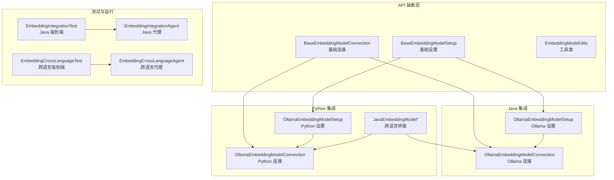
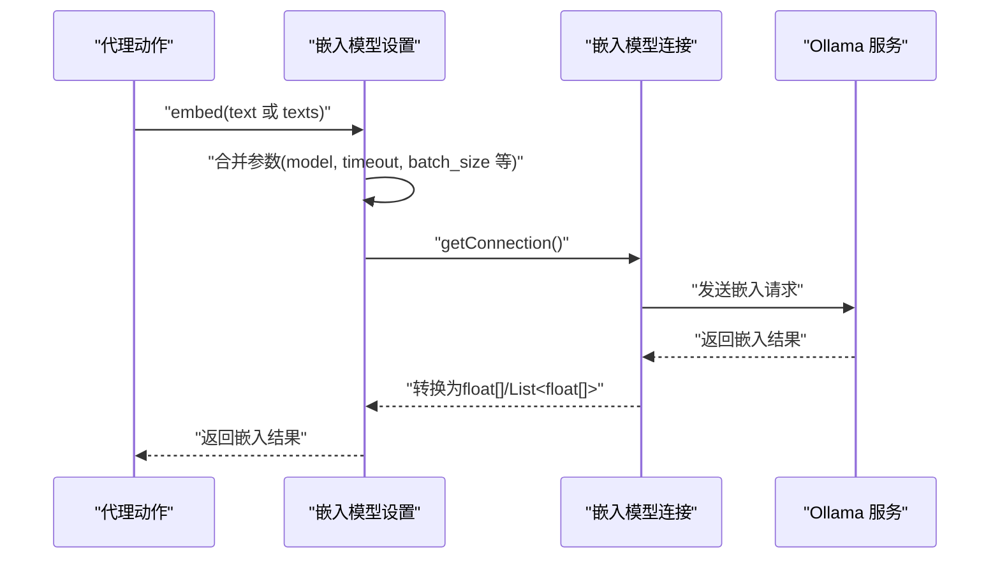
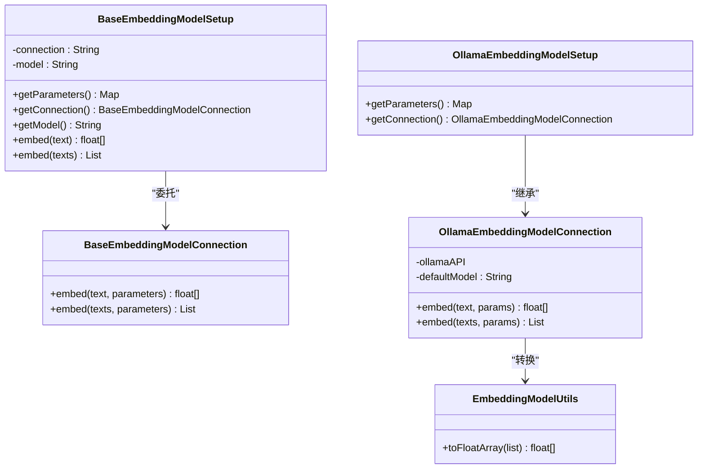
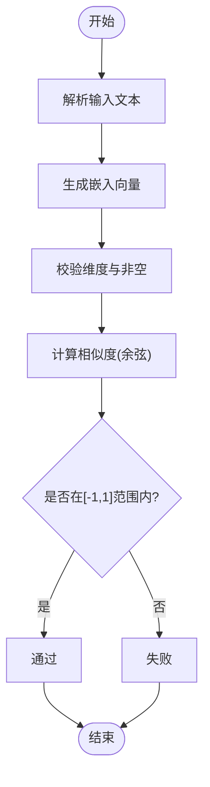
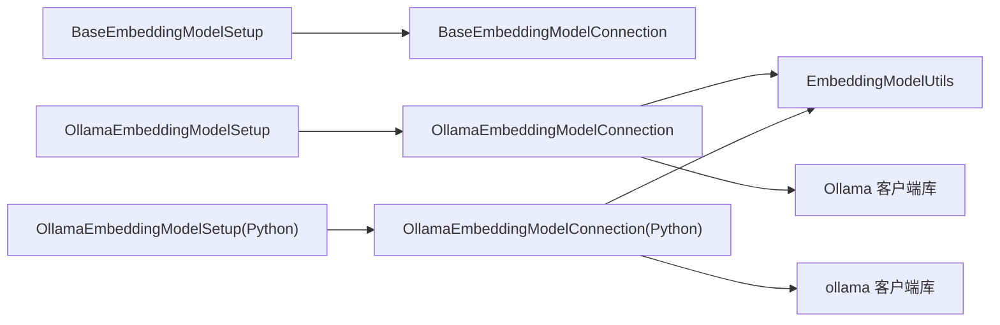

# 嵌入模型集成

<cite>
**本文引用的文件**
- [BaseEmbeddingModelConnection.java](file://api/src/main/java/org/apache/flink/agents/api/embedding/model/BaseEmbeddingModelConnection.java)
- [BaseEmbeddingModelSetup.java](file://api/src/main/java/org/apache/flink/agents/api/embedding/model/BaseEmbeddingModelSetup.java)
- [EmbeddingModelUtils.java](file://api/src/main/java/org/apache/flink/agents/api/embedding/model/EmbeddingModelUtils.java)
- [OllamaEmbeddingModelConnection.java](file://integrations/embedding-models/ollama/src/main/java/org/apache/flink/agents/integrations/embeddingmodels/ollama/OllamaEmbeddingModelConnection.java)
- [OllamaEmbeddingModelSetup.java](file://integrations/embedding-models/ollama/src/main/java/org/apache/flink/agents/integrations/embeddingmodels/ollama/OllamaEmbeddingModelSetup.java)
- [ollama_embedding_model.py](file://python/flink_agents/integrations/embedding_models/local/ollama_embedding_model.py)
- [java_embedding_model.py](file://python/flink_agents/api/embedding_models/java_embedding_model.py)
- [EmbeddingIntegrationTest.java](file://e2e-test/flink-agents-end-to-end-tests-integration/src/test/java/org/apache/flink/agents/integration/test/EmbeddingIntegrationTest.java)
- [EmbeddingIntegrationAgent.java](file://e2e-test/flink-agents-end-to-end-tests-integration/src/test/java/org/apache/flink/agents/integration/test/EmbeddingIntegrationAgent.java)
- [EmbeddingCrossLanguageTest.java](file://e2e-test/flink-agents-end-to-end-tests-resource-cross-language/src/test/java/org/apache/flink/agents/resource/test/EmbeddingCrossLanguageTest.java)
- [EmbeddingCrossLanguageAgent.java](file://e2e-test/flink-agents-end-to-end-tests-resource-cross-language/src/test/java/org/apache/flink/agents/resource/test/EmbeddingCrossLanguageAgent.java)
- [ollama_pull_model.sh（Java 测试）](file://e2e-test/flink-agents-end-to-end-tests-integration/src/test/resources/ollama_pull_model.sh)
- [ollama_pull_model.sh（Python 测试）](file://python/flink_agents/e2e_tests/scripts/ollama_pull_model.sh)
- [start_ollama_server.sh（Python 测试）](file://python/flink_agents/integrations/embedding_models/local/tests/start_ollama_server.sh)
</cite>

## 目录
1. [简介](#简介)
2. [项目结构](#项目结构)
3. [核心组件](#核心组件)
4. [架构总览](#架构总览)
5. [组件详解](#组件详解)
6. [依赖关系分析](#依赖关系分析)
7. [性能考量](#性能考量)
8. [故障排查指南](#故障排查指南)
9. [结论](#结论)
10. [附录：配置与使用指南](#附录配置与使用指南)

## 简介
本文件聚焦于 Apache Flink Agents 中嵌入模型（Embedding）的集成实现，特别是基于 Ollama 的嵌入模型集成。内容涵盖嵌入模型工作原理、向量化流程、相似度计算方法；提供从 Ollama 服务安装、模型下载到连接配置的完整指南；阐述嵌入模型在向量检索中的作用（文档分片、向量生成、查询优化）；给出性能与内存管理建议，并通过端到端测试用例展示如何在代理中使用嵌入模型进行语义搜索与上下文检索。

## 项目结构
围绕嵌入模型的实现，主要涉及以下层次：
- API 抽象层：定义通用的嵌入模型连接与设置接口，统一参数传递与资源类型。
- Java 集成层：Ollama 客户端封装，负责与本地或远程 Ollama 服务交互。
- Python 集成层：提供 Python 版本的 Ollama 嵌入模型连接与设置，支持跨语言资源桥接。
- 端到端测试：验证嵌入生成、相似度计算与跨语言资源调用。

图表来源
- [BaseEmbeddingModelSetup.java](file://api/src/main/java/org/apache/flink/agents/api/embedding/model/BaseEmbeddingModelSetup.java#L36-L114)
- [BaseEmbeddingModelConnection.java](file://api/src/main/java/org/apache/flink/agents/api/embedding/model/BaseEmbeddingModelConnection.java#L45-L84)
- [EmbeddingModelUtils.java](file://api/src/main/java/org/apache/flink/agents/api/embedding/model/EmbeddingModelUtils.java#L22-L38)
- [OllamaEmbeddingModelSetup.java](file://integrations/embedding-models/ollama/src/main/java/org/apache/flink/agents/integrations/embeddingmodels/ollama/OllamaEmbeddingModelSetup.java#L31-L55)
- [OllamaEmbeddingModelConnection.java](file://integrations/embedding-models/ollama/src/main/java/org/apache/flink/agents/integrations/embeddingmodels/ollama/OllamaEmbeddingModelConnection.java#L35-L119)
- [ollama_embedding_model.py](file://python/flink_agents/integrations/embedding_models/local/ollama_embedding_model.py#L31-L168)
- [java_embedding_model.py](file://python/flink_agents/api/embedding_models/java_embedding_model.py#L25-L48)
- [EmbeddingIntegrationTest.java](file://e2e-test/flink-agents-end-to-end-tests-integration/src/test/java/org/apache/flink/agents/integration/test/EmbeddingIntegrationTest.java#L40-L110)
- [EmbeddingIntegrationAgent.java](file://e2e-test/flink-agents-end-to-end-tests-integration/src/test/java/org/apache/flink/agents/integration/test/EmbeddingIntegrationAgent.java#L47-L229)
- [EmbeddingCrossLanguageTest.java](file://e2e-test/flink-agents-end-to-end-tests-resource-cross-language/src/test/java/org/apache/flink/agents/resource/test/EmbeddingCrossLanguageTest.java#L37-L98)
- [EmbeddingCrossLanguageAgent.java](file://e2e-test/flink-agents-end-to-end-tests-resource-cross-language/src/test/java/org/apache/flink/agents/resource/test/EmbeddingCrossLanguageAgent.java#L46-L171)

章节来源
- [BaseEmbeddingModelConnection.java](file://api/src/main/java/org/apache/flink/agents/api/embedding/model/BaseEmbeddingModelConnection.java#L29-L84)
- [BaseEmbeddingModelSetup.java](file://api/src/main/java/org/apache/flink/agents/api/embedding/model/BaseEmbeddingModelSetup.java#L30-L114)
- [OllamaEmbeddingModelConnection.java](file://integrations/embedding-models/ollama/src/main/java/org/apache/flink/agents/integrations/embeddingmodels/ollama/OllamaEmbeddingModelConnection.java#L34-L119)
- [OllamaEmbeddingModelSetup.java](file://integrations/embedding-models/ollama/src/main/java/org/apache/flink/agents/integrations/embeddingmodels/ollama/OllamaEmbeddingModelSetup.java#L30-L55)
- [ollama_embedding_model.py](file://python/flink_agents/integrations/embedding_models/local/ollama_embedding_model.py#L31-L168)
- [java_embedding_model.py](file://python/flink_agents/api/embedding_models/java_embedding_model.py#L25-L48)

## 核心组件
- 基础抽象
  - BaseEmbeddingModelConnection：定义嵌入模型连接的抽象，提供单文本与批量文本的嵌入生成接口，参数通过 Map 传递，支持超时、批大小等配置。
  - BaseEmbeddingModelSetup：定义嵌入模型设置的抽象，负责解析连接名与模型名，合并参数后委托给连接对象执行。
  - EmbeddingModelUtils：提供将数值列表转换为浮点数组的工具方法，确保返回值格式一致。
- Java Ollama 实现
  - OllamaEmbeddingModelSetup：将模型名注入参数，继承基础设置能力。
  - OllamaEmbeddingModelConnection：封装 Ollama 客户端，负责拉取模型、构造请求、解析响应并转换为浮点数组。
- Python Ollama 实现
  - OllamaEmbeddingModelSetup/Connection：提供 Python 版本的连接与设置，支持 keep_alive、truncate、额外模型参数等。
  - JavaEmbeddingModel*：Python 侧的 Java 资源桥接，用于跨语言场景下复用 Java 实现。
- 测试与示例
  - EmbeddingIntegrationAgent/EmbeddingIntegrationTest：演示如何声明连接与设置、生成嵌入、校验维度与相似度。
  - EmbeddingCrossLanguageAgent/EmbeddingCrossLanguageTest：演示跨语言资源桥接下的嵌入生成与批量处理。

章节来源
- [BaseEmbeddingModelConnection.java](file://api/src/main/java/org/apache/flink/agents/api/embedding/model/BaseEmbeddingModelConnection.java#L47-L82)
- [BaseEmbeddingModelSetup.java](file://api/src/main/java/org/apache/flink/agents/api/embedding/model/BaseEmbeddingModelSetup.java#L59-L112)
- [EmbeddingModelUtils.java](file://api/src/main/java/org/apache/flink/agents/api/embedding/model/EmbeddingModelUtils.java#L22-L38)
- [OllamaEmbeddingModelConnection.java](file://integrations/embedding-models/ollama/src/main/java/org/apache/flink/agents/integrations/embeddingmodels/ollama/OllamaEmbeddingModelConnection.java#L55-L117)
- [OllamaEmbeddingModelSetup.java](file://integrations/embedding-models/ollama/src/main/java/org/apache/flink/agents/integrations/embeddingmodels/ollama/OllamaEmbeddingModelSetup.java#L38-L53)
- [ollama_embedding_model.py](file://python/flink_agents/integrations/embedding_models/local/ollama_embedding_model.py#L31-L168)
- [java_embedding_model.py](file://python/flink_agents/api/embedding_models/java_embedding_model.py#L25-L48)
- [EmbeddingIntegrationAgent.java](file://e2e-test/flink-agents-end-to-end-tests-integration/src/test/java/org/apache/flink/agents/integration/test/EmbeddingIntegrationAgent.java#L51-L76)
- [EmbeddingCrossLanguageAgent.java](file://e2e-test/flink-agents-end-to-end-tests-resource-cross-language/src/test/java/org/apache/flink/agents/resource/test/EmbeddingCrossLanguageAgent.java#L50-L67)

## 架构总览
下图展示了从代理到嵌入模型连接与设置的整体调用链路，以及 Java 与 Python 两种实现路径：

图表来源
- [BaseEmbeddingModelSetup.java](file://api/src/main/java/org/apache/flink/agents/api/embedding/model/BaseEmbeddingModelSetup.java#L83-L112)
- [BaseEmbeddingModelConnection.java](file://api/src/main/java/org/apache/flink/agents/api/embedding/model/BaseEmbeddingModelConnection.java#L68-L82)
- [OllamaEmbeddingModelConnection.java](file://integrations/embedding-models/ollama/src/main/java/org/apache/flink/agents/integrations/embeddingmodels/ollama/OllamaEmbeddingModelConnection.java#L55-L117)
- [ollama_embedding_model.py](file://python/flink_agents/integrations/embedding_models/local/ollama_embedding_model.py#L80-L98)

## 组件详解

### 类关系图（Java）

图表来源
- [BaseEmbeddingModelConnection.java](file://api/src/main/java/org/apache/flink/agents/api/embedding/model/BaseEmbeddingModelConnection.java#L45-L84)
- [BaseEmbeddingModelSetup.java](file://api/src/main/java/org/apache/flink/agents/api/embedding/model/BaseEmbeddingModelSetup.java#L36-L114)
- [OllamaEmbeddingModelConnection.java](file://integrations/embedding-models/ollama/src/main/java/org/apache/flink/agents/integrations/embeddingmodels/ollama/OllamaEmbeddingModelConnection.java#L35-L119)
- [OllamaEmbeddingModelSetup.java](file://integrations/embedding-models/ollama/src/main/java/org/apache/flink/agents/integrations/embeddingmodels/ollama/OllamaEmbeddingModelSetup.java#L31-L55)
- [EmbeddingModelUtils.java](file://api/src/main/java/org/apache/flink/agents/api/embedding/model/EmbeddingModelUtils.java#L22-L38)

### 向量化流程与相似度计算
- 向量化流程
  - 输入文本（单个或多个）经设置对象合并参数后，由连接对象发起请求至 Ollama 服务。
  - 服务返回嵌入向量，连接对象将其转换为浮点数组并返回。
- 相似度计算
  - 在测试代理中演示了余弦相似度的计算逻辑：先计算点积与范数，再归一化得到相似度值，范围应在 [-1, 1]。
  - 自相似性（与自身比较）应接近 1.0，用于验证嵌入质量与一致性。

图表来源
- [EmbeddingIntegrationAgent.java](file://e2e-test/flink-agents-end-to-end-tests-integration/src/test/java/org/apache/flink/agents/integration/test/EmbeddingIntegrationAgent.java#L95-L129)

章节来源
- [EmbeddingIntegrationAgent.java](file://e2e-test/flink-agents-end-to-end-tests-integration/src/test/java/org/apache/flink/agents/integration/test/EmbeddingIntegrationAgent.java#L95-L129)

### Java Ollama 嵌入模型连接
- 默认主机与模型：若未指定，使用本地默认地址与默认模型名称。
- 模型拉取：每次生成嵌入前会尝试拉取所需模型，确保可用。
- 批量处理：支持一次传入多个文本，返回对应数量的向量。
- 错误处理：捕获客户端异常并抛出运行时异常，便于上层感知。

章节来源
- [OllamaEmbeddingModelConnection.java](file://integrations/embedding-models/ollama/src/main/java/org/apache/flink/agents/integrations/embeddingmodels/ollama/OllamaEmbeddingModelConnection.java#L40-L117)

### Python Ollama 嵌入模型连接
- 参数控制：支持 base_url、request_timeout、model、keep_alive、truncate、additional_kwargs 等。
- 单/批量接口：统一返回 float 或 List[List[float]]，便于后续处理。
- 客户端延迟初始化：首次使用时创建 Ollama 客户端实例。

章节来源
- [ollama_embedding_model.py](file://python/flink_agents/integrations/embedding_models/local/ollama_embedding_model.py#L31-L168)

### 跨语言资源桥接
- Python 通过 Java 资源装饰器桥接到 Java 实现，避免重复开发，同时保持一致的 API 表面。
- 在跨语言测试中，代理直接使用 Python 设置与连接，内部仍可委托到 Java 实现。

章节来源
- [java_embedding_model.py](file://python/flink_agents/api/embedding_models/java_embedding_model.py#L25-L48)
- [EmbeddingCrossLanguageAgent.java](file://e2e-test/flink-agents-end-to-end-tests-resource-cross-language/src/test/java/org/apache/flink/agents/resource/test/EmbeddingCrossLanguageAgent.java#L50-L67)

## 依赖关系分析
- 耦合与内聚
  - BaseEmbeddingModelSetup 与 BaseEmbeddingModelConnection 通过资源类型解耦，具体实现（如 Ollama）仅在集成模块中可见。
  - 工具类 EmbeddingModelUtils 提供纯函数式转换，降低连接实现的复杂度。
- 外部依赖
  - Java 实现依赖 Ollama 客户端库；Python 实现依赖 ollama 客户端库。
- 循环依赖
  - 当前结构清晰，无循环依赖迹象。

图表来源
- [BaseEmbeddingModelSetup.java](file://api/src/main/java/org/apache/flink/agents/api/embedding/model/BaseEmbeddingModelSetup.java#L36-L114)
- [BaseEmbeddingModelConnection.java](file://api/src/main/java/org/apache/flink/agents/api/embedding/model/BaseEmbeddingModelConnection.java#L45-L84)
- [OllamaEmbeddingModelConnection.java](file://integrations/embedding-models/ollama/src/main/java/org/apache/flink/agents/integrations/embeddingmodels/ollama/OllamaEmbeddingModelConnection.java#L35-L119)
- [EmbeddingModelUtils.java](file://api/src/main/java/org/apache/flink/agents/api/embedding/model/EmbeddingModelUtils.java#L22-L38)
- [ollama_embedding_model.py](file://python/flink_agents/integrations/embedding_models/local/ollama_embedding_model.py#L31-L168)

## 性能考量
- 向量维度
  - 不同模型输出不同维度，需在存储与检索时保持一致；测试中通过校验维度确保正确性。
- 批量处理
  - Java 连接支持批量嵌入生成，减少网络往返次数；可通过参数控制批大小以平衡吞吐与延迟。
- 内存管理
  - keep_alive 控制模型常驻内存时间，合理设置可降低重复加载开销；truncate 控制超长文本截断策略。
- 超时与重试
  - 建议根据网络状况设置合理的请求超时；在高并发场景下考虑引入重试与限流策略。

章节来源
- [OllamaEmbeddingModelConnection.java](file://integrations/embedding-models/ollama/src/main/java/org/apache/flink/agents/integrations/embeddingmodels/ollama/OllamaEmbeddingModelConnection.java#L86-L117)
- [ollama_embedding_model.py](file://python/flink_agents/integrations/embedding_models/local/ollama_embedding_model.py#L80-L98)
- [EmbeddingIntegrationAgent.java](file://e2e-test/flink-agents-end-to-end-tests-integration/src/test/java/org/apache/flink/agents/integration/test/EmbeddingIntegrationAgent.java#L95-L129)

## 故障排查指南
- Ollama 服务不可达
  - 确认本地服务地址与端口；Java 测试提供了模型拉取脚本，可用于预热模型。
- 模型未下载
  - Java 连接会在生成嵌入前尝试拉取模型；若失败，检查网络与镜像源。
- 返回向量为空或数量不匹配
  - 校验输入文本数量与返回向量数量是否一致；关注异常抛出位置以便定位问题。
- 相似度异常
  - 若相似度不在 [-1,1] 范围，检查向量归一化与点积计算逻辑；自相似性应接近 1.0。

章节来源
- [OllamaEmbeddingModelConnection.java](file://integrations/embedding-models/ollama/src/main/java/org/apache/flink/agents/integrations/embeddingmodels/ollama/OllamaEmbeddingModelConnection.java#L72-L103)
- [EmbeddingIntegrationAgent.java](file://e2e-test/flink-agents-end-to-end-tests-integration/src/test/java/org/apache/flink/agents/integration/test/EmbeddingIntegrationAgent.java#L101-L129)

## 结论
本集成在 API 层抽象与 Java/Python 双实现之间建立了清晰的边界，既保证了统一的编程体验，又充分利用了 Ollama 的本地化优势。通过端到端测试覆盖了嵌入生成、批量处理与相似度计算等关键环节，为在 Flink 流式场景中实现语义搜索与智能检索提供了可靠基础。

## 附录：配置与使用指南

### Ollama 服务器安装与模型准备
- Linux 环境一键安装与启动（Python 测试脚本）
  - 使用安装脚本自动安装并启动 Ollama 服务，随后拉取常用模型。
- Java 端测试模型拉取
  - 提供独立脚本用于拉取指定模型，便于 CI/本地环境准备。

章节来源
- [start_ollama_server.sh（Python 测试）](file://python/flink_agents/integrations/embedding_models/local/tests/start_ollama_server.sh#L22-L40)
- [ollama_pull_model.sh（Java 测试）](file://e2e-test/flink-agents-end-to-end-tests-integration/src/test/resources/ollama_pull_model.sh#L19-L20)
- [ollama_pull_model.sh（Python 测试）](file://python/flink_agents/e2e_tests/scripts/ollama_pull_model.sh#L20-L21)

### Java 声明嵌入模型连接与设置
- 连接声明
  - 指定 Ollama 主机地址与超时参数。
- 设置声明
  - 指定连接名与模型名，框架将参数合并后交由连接对象执行。
- 代理中使用
  - 通过 RunnerContext 获取资源并调用 embed 接口生成向量。

章节来源
- [EmbeddingIntegrationAgent.java](file://e2e-test/flink-agents-end-to-end-tests-integration/src/test/java/org/apache/flink/agents/integration/test/EmbeddingIntegrationAgent.java#L51-L76)
- [BaseEmbeddingModelSetup.java](file://api/src/main/java/org/apache/flink/agents/api/embedding/model/BaseEmbeddingModelSetup.java#L59-L112)

### Python 声明嵌入模型连接与设置
- 连接声明
  - 通过 Python 包装连接类声明 base_url、request_timeout 等参数。
- 设置声明
  - 指定连接名、模型名与 keep_alive、truncate、additional_kwargs 等。
- 代理中使用
  - 与 Java 场景一致，通过资源系统获取设置并生成嵌入。

章节来源
- [EmbeddingCrossLanguageAgent.java](file://e2e-test/flink-agents-end-to-end-tests-resource-cross-language/src/test/java/org/apache/flink/agents/resource/test/EmbeddingCrossLanguageAgent.java#L50-L67)
- [ollama_embedding_model.py](file://python/flink_agents/integrations/embedding_models/local/ollama_embedding_model.py#L100-L168)

### 向量检索与查询优化要点
- 文档分片
  - 将长文档按语义切分为适配模型最大长度的片段，确保每个片段都能生成有效向量。
- 向量生成
  - 使用批量接口提升吞吐；对超长文本启用 truncate 并结合 keep_alive 减少重复加载。
- 查询优化
  - 对查询文本生成向量后，采用近似最近邻（ANN）索引加速检索；在存储层保持向量维度一致。

章节来源
- [EmbeddingIntegrationAgent.java](file://e2e-test/flink-agents-end-to-end-tests-integration/src/test/java/org/apache/flink/agents/integration/test/EmbeddingIntegrationAgent.java#L95-L129)
- [ollama_embedding_model.py](file://python/flink_agents/integrations/embedding_models/local/ollama_embedding_model.py#L80-L98)

### 端到端示例（Java）
- 流水线构建
  - 创建数据流，应用代理，将提示作为键，收集输出结果。
- 断言与校验
  - 校验嵌入维度、相似度范围与自相似性，确保生成质量。

章节来源
- [EmbeddingIntegrationTest.java](file://e2e-test/flink-agents-end-to-end-tests-integration/src/test/java/org/apache/flink/agents/integration/test/EmbeddingIntegrationTest.java#L61-L97)
- [EmbeddingIntegrationAgent.java](file://e2e-test/flink-agents-end-to-end-tests-integration/src/test/java/org/apache/flink/agents/integration/test/EmbeddingIntegrationAgent.java#L132-L198)

### 端到端示例（跨语言）
- 资源桥接
  - 使用 Python 包装类声明连接与设置，内部委托到 Java 实现。
- 批量与单条对比
  - 同时验证单条与批量嵌入生成，确保一致性。

章节来源
- [EmbeddingCrossLanguageTest.java](file://e2e-test/flink-agents-end-to-end-tests-resource-cross-language/src/test/java/org/apache/flink/agents/resource/test/EmbeddingCrossLanguageTest.java#L45-L85)
- [EmbeddingCrossLanguageAgent.java](file://e2e-test/flink-agents-end-to-end-tests-resource-cross-language/src/test/java/org/apache/flink/agents/resource/test/EmbeddingCrossLanguageAgent.java#L97-L136)