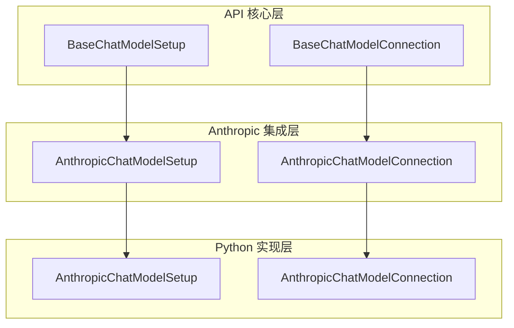
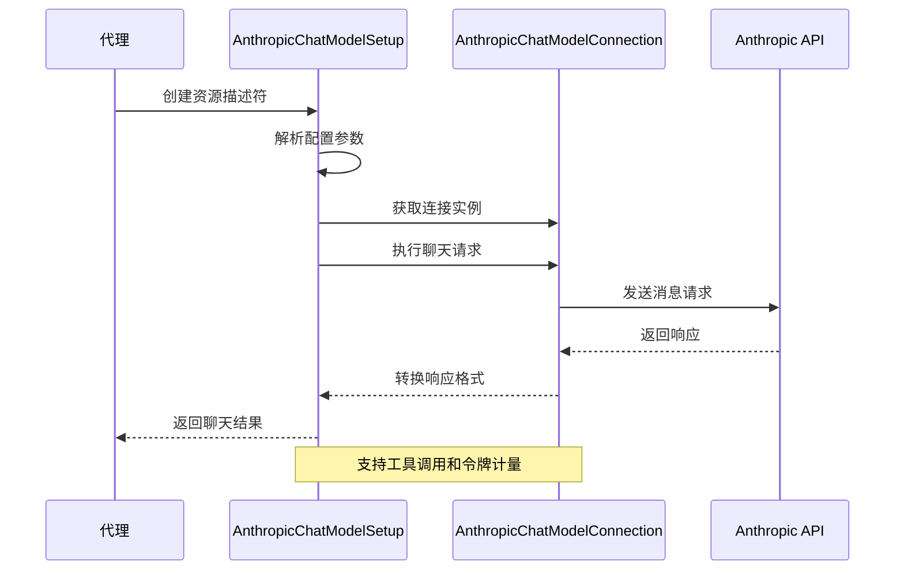
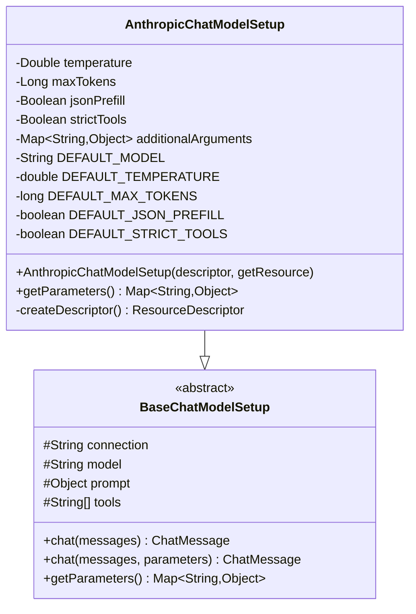
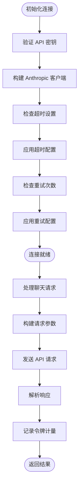
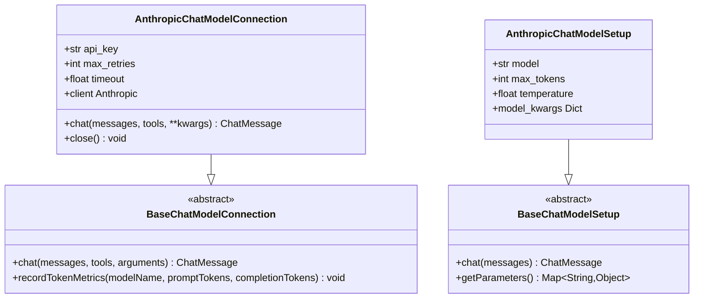
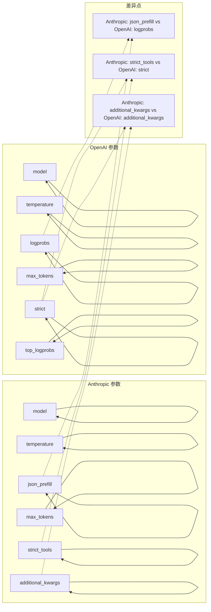
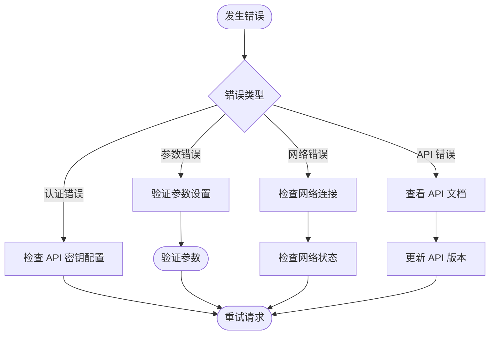

# Anthropic Claude 聊天模型集成

<cite>
**本文档引用的文件**
- [AnthropicChatModelSetup.java](file://integrations/chat-models/anthropic/src/main/java/org/apache/flink/agents/integrations/chatmodels/anthropic/AnthropicChatModelSetup.java)
- [AnthropicChatModelConnection.java](file://integrations/chat-models/anthropic/src/main/java/org/apache/flink/agents/integrations/chatmodels/anthropic/AnthropicChatModelConnection.java)
- [BaseChatModelSetup.java](file://api/src/main/java/org/apache/flink/agents/api/chat/model/BaseChatModelSetup.java)
- [BaseChatModelConnection.java](file://api/src/main/java/org/apache/flink/agents/api/chat/model/BaseChatModelConnection.java)
- [anthropic_chat_model.py](file://python/flink_agents/integrations/chat_models/anthropic/anthropic_chat_model.py)
- [OpenAIChatModelSetup.java](file://integrations/chat-models/openai/src/main/java/org/apache/flink/agents/integrations/chatmodels/openai/OpenAIChatModelSetup.java)
- [OpenAIChatModelConnection.java](file://integrations/chat-models/openai/src/main/java/org/apache/flink/agents/integrations/chatmodels/openai/OpenAIChatModelConnection.java)
- [test_anthropic_chat_model.py](file://python/flink_agents/integrations/chat_models/anthropic/tests/test_anthropic_chat_model.py)
</cite>

## 目录
1. [简介](#简介)
2. [项目结构](#项目结构)
3. [核心组件](#核心组件)
4. [架构概览](#架构概览)
5. [详细组件分析](#详细组件分析)
6. [依赖关系分析](#依赖关系分析)
7. [性能考虑](#性能考虑)
8. [故障排除指南](#故障排除指南)
9. [结论](#结论)
10. [附录](#附录)

## 简介
本文件为 Apache Flink Agents 项目中 Anthropic Claude 聊天模型集成的详细技术文档。该集成提供了对 Anthropic Messages API 的完整支持，包括认证管理、连接配置、模型参数设置以及工具调用功能。文档重点介绍 AnthropicChatModelSetup 类的配置和使用方法，详细说明 Claude 模型特有的参数（如系统提示、消息格式、响应控制）以及与 OpenAI 参数的差异和兼容性处理。

## 项目结构
Flink Agents 项目采用模块化设计，Anthropic 集成位于独立的集成模块中，与 API 核心框架分离，便于维护和扩展。



**图表来源**
- [BaseChatModelSetup.java](file://api/src/main/java/org/apache/flink/agents/api/chat/model/BaseChatModelSetup.java#L37-L127)
- [BaseChatModelConnection.java](file://api/src/main/java/org/apache/flink/agents/api/chat/model/BaseChatModelConnection.java#L32-L78)
- [AnthropicChatModelSetup.java](file://integrations/chat-models/anthropic/src/main/java/org/apache/flink/agents/integrations/chatmodels/anthropic/AnthropicChatModelSetup.java#L74-L175)
- [AnthropicChatModelConnection.java](file://integrations/chat-models/anthropic/src/main/java/org/apache/flink/agents/integrations/chatmodels/anthropic/AnthropicChatModelConnection.java#L81-L529)

**章节来源**
- [AnthropicChatModelSetup.java](file://integrations/chat-models/anthropic/src/main/java/org/apache/flink/agents/integrations/chatmodels/anthropic/AnthropicChatModelSetup.java#L1-L176)
- [AnthropicChatModelConnection.java](file://integrations/chat-models/anthropic/src/main/java/org/apache/flink/agents/integrations/chatmodels/anthropic/AnthropicChatModelConnection.java#L1-L530)

## 核心组件
Anthropic 集成由两个核心组件构成：AnthropicChatModelSetup（配置层）和 AnthropicChatModelConnection（连接层），它们遵循统一的抽象接口设计。

### AnthropicChatModelSetup 组件
负责提供每次聊天会话的配置参数，包括模型选择、温度设置、最大令牌数等 Anthropic 特有参数。

### AnthropicChatModelConnection 组件  
负责实际的 API 调用，包括请求构建、响应解析、工具调用处理以及令牌计量。

**章节来源**
- [AnthropicChatModelSetup.java](file://integrations/chat-models/anthropic/src/main/java/org/apache/flink/agents/integrations/chatmodels/anthropic/AnthropicChatModelSetup.java#L74-L175)
- [AnthropicChatModelConnection.java](file://integrations/chat-models/anthropic/src/main/java/org/apache/flink/agents/integrations/chatmodels/anthropic/AnthropicChatModelConnection.java#L81-L529)

## 架构概览
Anthropic 集成采用分层架构设计，通过抽象基类实现统一的接口规范。



**图表来源**
- [BaseChatModelSetup.java](file://api/src/main/java/org/apache/flink/agents/api/chat/model/BaseChatModelSetup.java#L54-L101)
- [AnthropicChatModelConnection.java](file://integrations/chat-models/anthropic/src/main/java/org/apache/flink/agents/integrations/chatmodels/anthropic/AnthropicChatModelConnection.java#L120-L155)

## 详细组件分析

### AnthropicChatModelSetup 类分析

#### 配置参数详解
AnthropicChatModelSetup 提供了丰富的配置选项，所有参数都经过严格的验证和默认值处理。



**图表来源**
- [AnthropicChatModelSetup.java](file://integrations/chat-models/anthropic/src/main/java/org/apache/flink/agents/integrations/chatmodels/anthropic/AnthropicChatModelSetup.java#L74-L175)
- [BaseChatModelSetup.java](file://api/src/main/java/org/apache/flink/agents/api/chat/model/BaseChatModelSetup.java#L37-L127)

#### 关键配置参数
- **模型选择**：默认使用 `claude-sonnet-4-20250514`
- **温度控制**：范围 0.0-1.0，默认 0.1
- **最大令牌数**：必须大于 0，默认 1024
- **JSON 预填充**：启用时自动预填 `{` 以强制 JSON 输出
- **严格工具模式**：启用时工具调用严格遵循 JSON 模式
- **附加参数**：支持 top_k、top_p、stop_sequences 等

**章节来源**
- [AnthropicChatModelSetup.java](file://integrations/chat-models/anthropic/src/main/java/org/apache/flink/agents/integrations/chatmodels/anthropic/AnthropicChatModelSetup.java#L38-L51)
- [AnthropicChatModelSetup.java](file://integrations/chat-models/anthropic/src/main/java/org/apache/flink/agents/integrations/chatmodels/anthropic/AnthropicChatModelSetup.java#L88-L124)

### AnthropicChatModelConnection 类分析

#### 连接配置
连接层负责处理 Anthropic API 的认证和连接参数。



**图表来源**
- [AnthropicChatModelConnection.java](file://integrations/chat-models/anthropic/src/main/java/org/apache/flink/agents/integrations/chatmodels/anthropic/AnthropicChatModelConnection.java#L89-L112)
- [AnthropicChatModelConnection.java](file://integrations/chat-models/anthropic/src/main/java/org/apache/flink/agents/integrations/chatmodels/anthropic/AnthropicChatModelConnection.java#L157-L233)

#### 消息格式转换
连接层实现了复杂的消息格式转换逻辑，支持系统提示、工具调用和内容块处理。

**章节来源**
- [AnthropicChatModelConnection.java](file://integrations/chat-models/anthropic/src/main/java/org/apache/flink/agents/integrations/chatmodels/anthropic/AnthropicChatModelConnection.java#L242-L290)
- [AnthropicChatModelConnection.java](file://integrations/chat-models/anthropic/src/main/java/org/apache/flink/agents/integrations/chatmodels/anthropic/AnthropicChatModelConnection.java#L366-L421)

### Python 实现对比分析

#### Python 与 Java 实现差异
Python 版本提供了更简洁的实现方式，使用官方 Anthropic SDK。



**图表来源**
- [anthropic_chat_model.py](file://python/flink_agents/integrations/chat_models/anthropic/anthropic_chat_model.py#L113-L235)
- [anthropic_chat_model.py](file://python/flink_agents/integrations/chat_models/anthropic/anthropic_chat_model.py#L242-L302)

**章节来源**
- [anthropic_chat_model.py](file://python/flink_agents/integrations/chat_models/anthropic/anthropic_chat_model.py#L1-L303)

## 依赖关系分析

### 参数兼容性矩阵
Anthropic 与 OpenAI 在参数设置上存在显著差异：



**图表来源**
- [AnthropicChatModelSetup.java](file://integrations/chat-models/anthropic/src/main/java/org/apache/flink/agents/integrations/chatmodels/anthropic/AnthropicChatModelSetup.java#L38-L51)
- [OpenAIChatModelSetup.java](file://integrations/chat-models/openai/src/main/java/org/apache/flink/agents/integrations/chatmodels/openai/OpenAIChatModelSetup.java#L154-L178)

### 工具调用处理差异
- **Anthropic**：支持原生工具调用，使用 `tool_use` 内容块
- **OpenAI**：使用函数调用规范，支持严格模式
- **Python 实现**：两种模式都支持，提供更灵活的工具定义

**章节来源**
- [AnthropicChatModelConnection.java](file://integrations/chat-models/anthropic/src/main/java/org/apache/flink/agents/integrations/chatmodels/anthropic/AnthropicChatModelConnection.java#L292-L343)
- [anthropic_chat_model.py](file://python/flink_agents/integrations/chat_models/anthropic/anthropic_chat_model.py#L35-L49)

## 性能考虑
Anthropic 集成在性能方面具有以下特点：

### 令牌计量
- 自动记录输入和输出令牌使用量
- 支持按模型名称分组统计
- 提供精确的使用成本估算

### 连接优化
- 支持可配置的超时设置
- 可配置的最大重试次数
- 连接池管理（Java 实现）

### 响应处理
- JSON 预填充优化，减少不必要的 API 调用
- 工具调用缓存机制
- 异步处理支持

## 故障排除指南

### 认证问题
1. **API 密钥无效**
   - 确认 API 密钥格式正确
   - 检查密钥权限是否足够
   - 验证密钥未过期

2. **环境变量配置**
   ```bash
   export ANTHROPIC_API_KEY="your_api_key_here"
   ```

### API 限制问题
1. **速率限制**
   - 实现指数退避策略
   - 监控 API 使用配额
   - 分批处理大量请求

2. **超时问题**
   - 调整超时时间设置
   - 检查网络连接稳定性
   - 实现重试机制

### 常见错误处理


**图表来源**
- [AnthropicChatModelConnection.java](file://integrations/chat-models/anthropic/src/main/java/org/apache/flink/agents/integrations/chatmodels/anthropic/AnthropicChatModelConnection.java#L93-L96)
- [AnthropicChatModelConnection.java](file://integrations/chat-models/anthropic/src/main/java/org/apache/flink/agents/integrations/chatmodels/anthropic/AnthropicChatModelConnection.java#L152-L154)

### 调试技巧
1. **启用详细日志**
   - 启用 API 请求/响应日志
   - 记录令牌使用情况
   - 监控错误率和延迟

2. **参数验证**
   - 验证所有必需参数
   - 检查参数范围限制
   - 确认工具定义完整性

**章节来源**
- [test_anthropic_chat_model.py](file://python/flink_agents/integrations/chat_models/anthropic/tests/test_anthropic_chat_model.py#L34-L51)

## 结论
Anthropic Claude 聊天模型集成为 Flink Agents 提供了企业级的 AI 模型集成能力。通过清晰的分层架构设计、完善的参数配置支持以及健壮的错误处理机制，开发者可以轻松地在代理中集成和使用 Claude 模型。

主要优势包括：
- **完整的参数支持**：覆盖 Anthropic 的所有关键参数
- **工具调用集成**：原生支持工具调用和严格模式
- **性能优化**：令牌计量、连接池和异步处理
- **跨语言支持**：同时提供 Java 和 Python 实现
- **易于使用**：简洁的配置接口和丰富的示例

## 附录

### 配置示例
以下是一个完整的配置示例，展示了如何在代理中使用 Anthropic 模型：

```java
// 连接配置
@ChatModelConnection
public static ResourceDesc anthropicConnection() {
    return ResourceDescriptor.Builder.newBuilder(AnthropicChatModelConnection.class.getName())
            .addInitialArgument("api_key", System.getenv("ANTHROPIC_API_KEY"))
            .addInitialArgument("timeout", 120)
            .addInitialArgument("max_retries", 3)
            .build();
}

// 模型配置
@ChatModelSetup
public static ResourceDesc anthropicSetup() {
    return ResourceDescriptor.Builder.newBuilder(AnthropicChatModelSetup.class.getName())
            .addInitialArgument("connection", "anthropicConnection")
            .addInitialArgument("model", "claude-sonnet-4-20250514")
            .addInitialArgument("temperature", 0.3d)
            .addInitialArgument("max_tokens", 2048)
            .addInitialArgument("strict_tools", true)
            .addInitialArgument("tools", List.of("convertTemperature", "calculateBMI"))
            .addInitialArgument("additional_kwargs", Map.of("top_k", 40, "top_p", 0.9))
            .build();
}
```

### 最佳实践
1. **参数设置**
   - 温度值建议保持在 0.1-0.3 之间以获得稳定输出
   - 合理设置 max_tokens 防止响应过长
   - 使用 strict_tools 确保工具调用的准确性

2. **错误处理**
   - 实现重试机制处理临时性错误
   - 监控 API 使用限额避免被限制
   - 记录详细的错误日志便于调试

3. **性能优化**
   - 合理配置超时时间和重试次数
   - 利用工具调用减少往返次数
   - 实施适当的缓存策略

**章节来源**
- [AnthropicChatModelSetup.java](file://integrations/chat-models/anthropic/src/main/java/org/apache/flink/agents/integrations/chatmodels/anthropic/AnthropicChatModelSetup.java#L53-L72)
- [AnthropicChatModelConnection.java](file://integrations/chat-models/anthropic/src/main/java/org/apache/flink/agents/integrations/chatmodels/anthropic/AnthropicChatModelConnection.java#L66-L79)