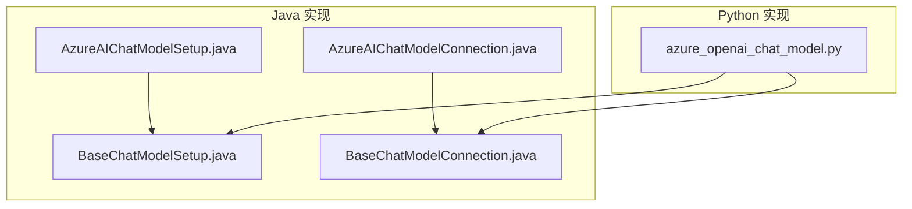
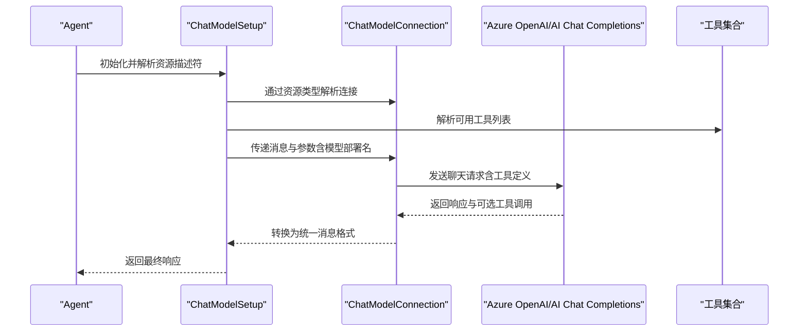
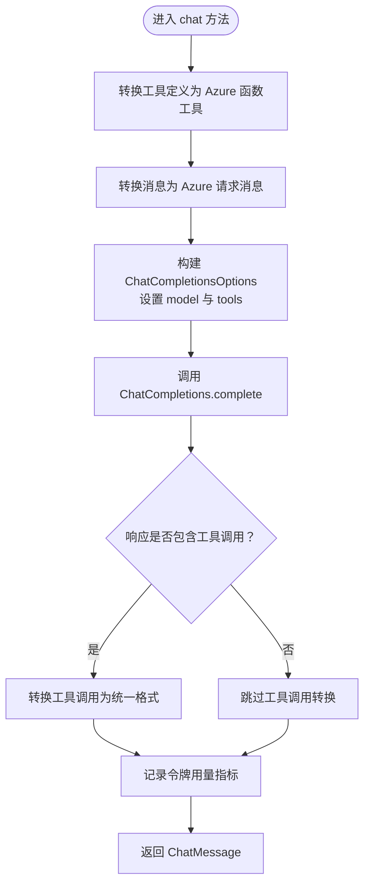
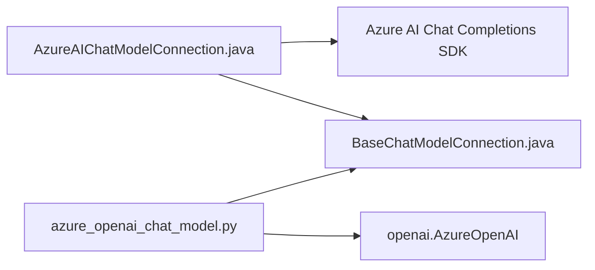

# Azure AI 聊天模型集成

<cite>
**本文档引用的文件**
- [AzureAIChatModelSetup.java](file://integrations/chat-models/azureai/src/main/java/org/apache/flink/agents/integrations/chatmodels/azureai/AzureAIChatModelSetup.java)
- [AzureAIChatModelConnection.java](file://integrations/chat-models/azureai/src/main/java/org/apache/flink/agents/integrations/chatmodels/azureai/AzureAIChatModelConnection.java)
- [BaseChatModelSetup.java](file://api/src/main/java/org/apache/flink/agents/api/chat/model/BaseChatModelSetup.java)
- [BaseChatModelConnection.java](file://api/src/main/java/org/apache/flink/agents/api/chat/model/BaseChatModelConnection.java)
- [azure_openai_chat_model.py](file://python/flink_agents/integrations/chat_models/azure/azure_openai_chat_model.py)
- [test_azure_openai_chat_model.py](file://python/flink_agents/integrations/chat_models/azure/tests/test_azure_openai_chat_model.py)
- [README.md](file://README.md)
</cite>

## 目录
1. [简介](#简介)
2. [项目结构](#项目结构)
3. [核心组件](#核心组件)
4. [架构总览](#架构总览)
5. [详细组件分析](#详细组件分析)
6. [依赖关系分析](#依赖关系分析)
7. [性能考虑](#性能考虑)
8. [故障排除指南](#故障排除指南)
9. [结论](#结论)
10. [附录：完整配置与使用示例](#附录完整配置与使用示例)

## 简介
本文件面向企业用户与云原生开发者，系统性介绍 Apache Flink Agents 中的 Azure AI 聊天模型集成方案。文档聚焦于 Azure OpenAI Service 的两种实现路径：
- Java 原生实现（Azure AI Chat Completions 客户端）
- Python 实现（Azure OpenAI SDK）

内容涵盖认证机制（API Key）、Azure 特有配置参数（部署名称、API 版本、端点）、工具调用映射、令牌用量度量与成本追踪、以及在企业环境中的安全与网络配置建议。同时提供可直接参考的代码片段路径与配置示例，帮助快速落地。

## 项目结构
Azure AI 集成位于独立模块中，分别提供 Java 与 Python 两套实现，均遵循统一的资源抽象与生命周期管理。

图表来源
- [AzureAIChatModelSetup.java](file://integrations/chat-models/azureai/src/main/java/org/apache/flink/agents/integrations/chatmodels/azureai/AzureAIChatModelSetup.java#L51-L66)
- [AzureAIChatModelConnection.java](file://integrations/chat-models/azureai/src/main/java/org/apache/flink/agents/integrations/chatmodels/azureai/AzureAIChatModelConnection.java#L63-L90)
- [BaseChatModelSetup.java](file://api/src/main/java/org/apache/flink/agents/api/chat/model/BaseChatModelSetup.java#L37-L101)
- [BaseChatModelConnection.java](file://api/src/main/java/org/apache/flink/agents/api/chat/model/BaseChatModelConnection.java#L38-L78)
- [azure_openai_chat_model.py](file://python/flink_agents/integrations/chat_models/azure/azure_openai_chat_model.py#L36-L156)

章节来源
- [README.md](file://README.md#L1-L44)

## 核心组件
- AzureAIChatModelSetup（Java）：负责从资源描述符读取模型参数（如部署名），并将其注入到聊天请求参数中。
- AzureAIChatModelConnection（Java）：负责建立 Azure AI Chat Completions 客户端连接、消息格式转换、工具函数定义与调用结果回传。
- BaseChatModelSetup/Connection（Java API 抽象）：统一资源生命周期、提示模板拼接、工具解析与连接分发。
- AzureOpenAIChatModelConnection/Setup（Python）：提供与 Azure OpenAI 兼容的 Python 实现，支持 API 版本、超时重试、令牌用量记录等。

章节来源
- [AzureAIChatModelSetup.java](file://integrations/chat-models/azureai/src/main/java/org/apache/flink/agents/integrations/chatmodels/azureai/AzureAIChatModelSetup.java#L51-L66)
- [AzureAIChatModelConnection.java](file://integrations/chat-models/azureai/src/main/java/org/apache/flink/agents/integrations/chatmodels/azureai/AzureAIChatModelConnection.java#L63-L90)
- [BaseChatModelSetup.java](file://api/src/main/java/org/apache/flink/agents/api/chat/model/BaseChatModelSetup.java#L37-L101)
- [BaseChatModelConnection.java](file://api/src/main/java/org/apache/flink/agents/api/chat/model/BaseChatModelConnection.java#L38-L78)
- [azure_openai_chat_model.py](file://python/flink_agents/integrations/chat_models/azure/azure_openai_chat_model.py#L36-L156)

## 架构总览
下图展示了 Java 与 Python 两条路径在 Flink Agents 中的交互关系与数据流。

图表来源
- [BaseChatModelSetup.java](file://api/src/main/java/org/apache/flink/agents/api/chat/model/BaseChatModelSetup.java#L54-L101)
- [BaseChatModelConnection.java](file://api/src/main/java/org/apache/flink/agents/api/chat/model/BaseChatModelConnection.java#L58-L78)
- [AzureAIChatModelConnection.java](file://integrations/chat-models/azureai/src/main/java/org/apache/flink/agents/integrations/chatmodels/azureai/AzureAIChatModelConnection.java#L164-L205)
- [azure_openai_chat_model.py](file://python/flink_agents/integrations/chat_models/azure/azure_openai_chat_model.py#L109-L156)

## 详细组件分析

### Java：AzureAIChatModelConnection
- 连接建立
  - 从资源描述符读取 endpoint 与 apiKey，校验 endpoint 非空后构建 ChatCompletionsClient。
- 消息与工具映射
  - 将框架内的 ChatMessage 映射为 Azure 的 ChatRequestMessage；将工具元数据转换为 Azure Function 工具定义。
  - 支持 assistant/tool 角色的消息与工具调用回传。
- 请求与响应处理
  - 使用 ChatCompletionsOptions 设置模型名与工具列表，发起 complete 调用。
  - 若响应包含工具调用，转换为统一格式并写入消息的 tool_calls 字段。
- 令牌用量与指标
  - 当模型名可用时，读取 CompletionsUsage 并通过 BaseChatModelConnection.recordTokenMetrics 写入指标组。

图表来源
- [AzureAIChatModelConnection.java](file://integrations/chat-models/azureai/src/main/java/org/apache/flink/agents/integrations/chatmodels/azureai/AzureAIChatModelConnection.java#L164-L205)

章节来源
- [AzureAIChatModelConnection.java](file://integrations/chat-models/azureai/src/main/java/org/apache/flink/agents/integrations/chatmodels/azureai/AzureAIChatModelConnection.java#L63-L90)
- [AzureAIChatModelConnection.java](file://integrations/chat-models/azureai/src/main/java/org/apache/flink/agents/integrations/chatmodels/azureai/AzureAIChatModelConnection.java#L164-L205)

### Java：AzureAIChatModelSetup
- 参数注入
  - 从资源描述符读取 model，并在 getParameters 中返回包含模型名的参数映射。
- 与 BaseChatModelSetup 协作
  - 继承通用资源生命周期与提示模板拼接逻辑，最终将参数传递给连接层。

章节来源
- [AzureAIChatModelSetup.java](file://integrations/chat-models/azureai/src/main/java/org/apache/flink/agents/integrations/chatmodels/azureai/AzureAIChatModelSetup.java#L51-L66)
- [BaseChatModelSetup.java](file://api/src/main/java/org/apache/flink/agents/api/chat/model/BaseChatModelSetup.java#L37-L101)

### Python：AzureOpenAIChatModelConnection/Setup
- 连接与配置
  - 支持 api_key、api_version、azure_endpoint、timeout、max_retries 等参数。
  - 通过 AzureOpenAI 客户端封装调用，使用部署名作为 model 参数。
- 工具与消息映射
  - 将工具元数据转换为 OpenAI 兼容的工具规范；消息序列转换为 OpenAI 格式。
- 令牌用量与成本追踪
  - 当提供 model_of_azure_deployment 且响应包含 usage 时，记录 promptTokens 与 completionTokens，便于后续成本计算。

章节来源
- [azure_openai_chat_model.py](file://python/flink_agents/integrations/chat_models/azure/azure_openai_chat_model.py#L36-L156)
- [azure_openai_chat_model.py](file://python/flink_agents/integrations/chat_models/azure/azure_openai_chat_model.py#L158-L261)

## 依赖关系分析
- Java 侧
  - AzureAIChatModelConnection 依赖 Azure AI Chat Completions 客户端库与 AzureKeyCredential。
  - 通过 BaseChatModelConnection 提供统一的令牌用量记录能力。
- Python 侧
  - 依赖 openai.AzureOpenAI 与工具转换辅助函数，消息格式转换由 openai 工具链完成。

图表来源
- [AzureAIChatModelConnection.java](file://integrations/chat-models/azureai/src/main/java/org/apache/flink/agents/integrations/chatmodels/azureai/AzureAIChatModelConnection.java#L20-L38)
- [BaseChatModelConnection.java](file://api/src/main/java/org/apache/flink/agents/api/chat/model/BaseChatModelConnection.java#L38-L78)
- [azure_openai_chat_model.py](file://python/flink_agents/integrations/chat_models/azure/azure_openai_chat_model.py#L20-L33)

## 性能考虑
- 超时与重试
  - Java 实现通过客户端构建器默认行为进行连接与请求处理；建议结合业务场景评估超时与重试策略。
  - Python 实现提供 timeout 与 max_retries 参数，便于在高并发或不稳定网络环境下提升稳定性。
- 工具调用开销
  - 工具定义转换与 JSON 序列化/反序列化会带来额外开销，建议在工具数量较多时优化工具元数据结构。
- 指标记录
  - 通过 recordTokenMetrics 将 promptTokens 与 completionTokens 写入指标组，便于成本归集与容量规划。

章节来源
- [BaseChatModelConnection.java](file://api/src/main/java/org/apache/flink/agents/api/chat/model/BaseChatModelConnection.java#L68-L78)
- [azure_openai_chat_model.py](file://python/flink_agents/integrations/chat_models/azure/azure_openai_chat_model.py#L63-L72)

## 故障排除指南
- endpoint 为空
  - Java 连接在构造阶段校验 endpoint 非空，若为空将抛出非法参数异常。请检查资源描述符初始化参数。
- 缺少模型部署名
  - Java：参数映射中需包含 model；Python：chat 调用时必须提供 model（部署名）。
- 工具调用失败
  - 确认工具元数据的输入模式与 JSON Schema 正确；Java 侧通过 Jackson ObjectMapper 与 Gson 进行转换，异常会以运行时异常形式抛出。
- 令牌用量未记录
  - Java：确保模型名可用且响应包含 CompletionsUsage；Python：确保提供 model_of_azure_deployment 且响应包含 usage。

章节来源
- [AzureAIChatModelConnection.java](file://integrations/chat-models/azureai/src/main/java/org/apache/flink/agents/integrations/chatmodels/azureai/AzureAIChatModelConnection.java#L80-L89)
- [AzureAIChatModelConnection.java](file://integrations/chat-models/azureai/src/main/java/org/apache/flink/agents/integrations/chatmodels/azureai/AzureAIChatModelConnection.java#L174-L178)
- [azure_openai_chat_model.py](file://python/flink_agents/integrations/chat_models/azure/azure_openai_chat_model.py#L131-L136)
- [azure_openai_chat_model.py](file://python/flink_agents/integrations/chat_models/azure/azure_openai_chat_model.py#L146-L152)

## 结论
本集成方案提供了与 Azure OpenAI Service 对齐的统一接口，既支持 Java 原生客户端，也提供 Python SDK 实现，满足企业级开发与运维需求。通过资源抽象与工具映射，开发者可以快速在 Flink Agents 中启用 Azure AI 聊天模型，并借助令牌用量指标实现成本控制与配额管理。

## 附录：完整配置与使用示例

### Azure 认证机制
- Java（API Key）
  - 在资源描述符中提供 endpoint 与 apiKey，连接建立时使用 AzureKeyCredential。
  - 参考路径：[AzureAIChatModelConnection.java](file://integrations/chat-models/azureai/src/main/java/org/apache/flink/agents/integrations/chatmodels/azureai/AzureAIChatModelConnection.java#L80-L89)
- Python（API Key）
  - 通过 api_key、azure_endpoint、api_version 等参数初始化 AzureOpenAI 客户端。
  - 参考路径：[azure_openai_chat_model.py](file://python/flink_agents/integrations/chat_models/azure/azure_openai_chat_model.py#L74-L107)

### Azure 特有配置参数
- Java
  - endpoint：Azure AI Chat Completions 端点
  - apiKey：用于身份验证的密钥
  - model：部署名称（在 getParameters 中注入）
  - 参考路径：
    - [AzureAIChatModelConnection.java](file://integrations/chat-models/azureai/src/main/java/org/apache/flink/agents/integrations/chatmodels/azureai/AzureAIChatModelConnection.java#L80-L89)
    - [AzureAIChatModelSetup.java](file://integrations/chat-models/azureai/src/main/java/org/apache/flink/agents/integrations/chatmodels/azureai/AzureAIChatModelSetup.java#L61-L65)
- Python
  - api_key、api_version、azure_endpoint、timeout、max_retries
  - model：Azure 部署名；model_of_azure_deployment：底层模型名，用于令牌用量与成本统计
  - 参考路径：
    - [azure_openai_chat_model.py](file://python/flink_agents/integrations/chat_models/azure/azure_openai_chat_model.py#L54-L72)
    - [azure_openai_chat_model.py](file://python/flink_agents/integrations/chat_models/azure/azure_openai_chat_model.py#L131-L152)

### 工具调用与消息映射
- Java
  - 工具定义转换为 Azure Function 工具；消息角色映射为系统/用户/助手/工具消息；助手消息支持工具调用回传。
  - 参考路径：
    - [AzureAIChatModelConnection.java](file://integrations/chat-models/azureai/src/main/java/org/apache/flink/agents/integrations/chatmodels/azureai/AzureAIChatModelConnection.java#L92-L112)
    - [AzureAIChatModelConnection.java](file://integrations/chat-models/azureai/src/main/java/org/apache/flink/agents/integrations/chatmodels/azureai/AzureAIChatModelConnection.java#L114-L139)
    - [AzureAIChatModelConnection.java](file://integrations/chat-models/azureai/src/main/java/org/apache/flink/agents/integrations/chatmodels/azureai/AzureAIChatModelConnection.java#L142-L162)
- Python
  - 工具转换与消息格式转换由 openai 工具链完成；支持在响应中记录 promptTokens 与 completionTokens。
  - 参考路径：
    - [azure_openai_chat_model.py](file://python/flink_agents/integrations/chat_models/azure/azure_openai_chat_model.py#L127-L155)

### 令牌用量与成本控制
- Java
  - 当模型名可用时，读取 CompletionsUsage 并记录 promptTokens 与 completionTokens。
  - 参考路径：[AzureAIChatModelConnection.java](file://integrations/chat-models/azureai/src/main/java/org/apache/flink/agents/integrations/chatmodels/azureai/AzureAIChatModelConnection.java#L192-L199)
- Python
  - 当提供 model_of_azure_deployment 且响应包含 usage 时，记录令牌用量指标。
  - 参考路径：[azure_openai_chat_model.py](file://python/flink_agents/integrations/chat_models/azure/azure_openai_chat_model.py#L146-L152)

### 企业环境配置示例（路径参考）
- Java 示例（资源注册与使用）
  - 连接资源：[AzureAIChatModelConnection.java](file://integrations/chat-models/azureai/src/main/java/org/apache/flink/agents/integrations/chatmodels/azureai/AzureAIChatModelConnection.java#L50-L61)
  - 设置资源：[AzureAIChatModelSetup.java](file://integrations/chat-models/azureai/src/main/java/org/apache/flink/agents/integrations/chatmodels/azureai/AzureAIChatModelSetup.java#L33-L49)
- Python 示例（端到端测试）
  - 连接与设置：[test_azure_openai_chat_model.py](file://python/flink_agents/integrations/chat_models/azure/tests/test_azure_openai_chat_model.py#L36-L59)
  - 工具调用测试：[test_azure_openai_chat_model.py](file://python/flink_agents/integrations/chat_models/azure/tests/test_azure_openai_chat_model.py#L80-L109)

### 安全最佳实践
- 密钥管理
  - 使用受控的密钥存储服务（如平台机密管理器）注入 api_key，避免硬编码。
- 网络与访问控制
  - 仅允许从可信 VNET 或私有链接访问 Azure OpenAI 端点；限制出站流量与超时时间。
- 最小权限原则
  - 为 API Key 分配最小必要权限，定期轮换密钥并审计访问日志。
- 指标与告警
  - 启用令牌用量指标与成本阈值告警，结合限流策略防止超额使用。