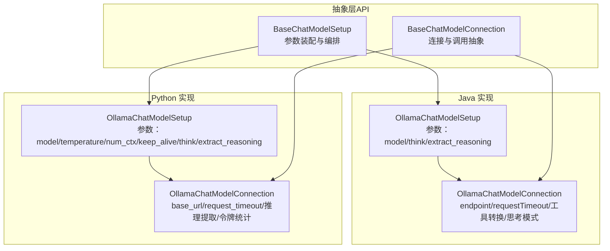
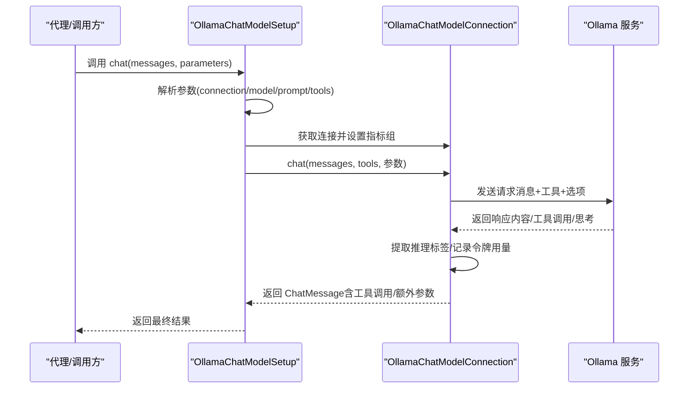
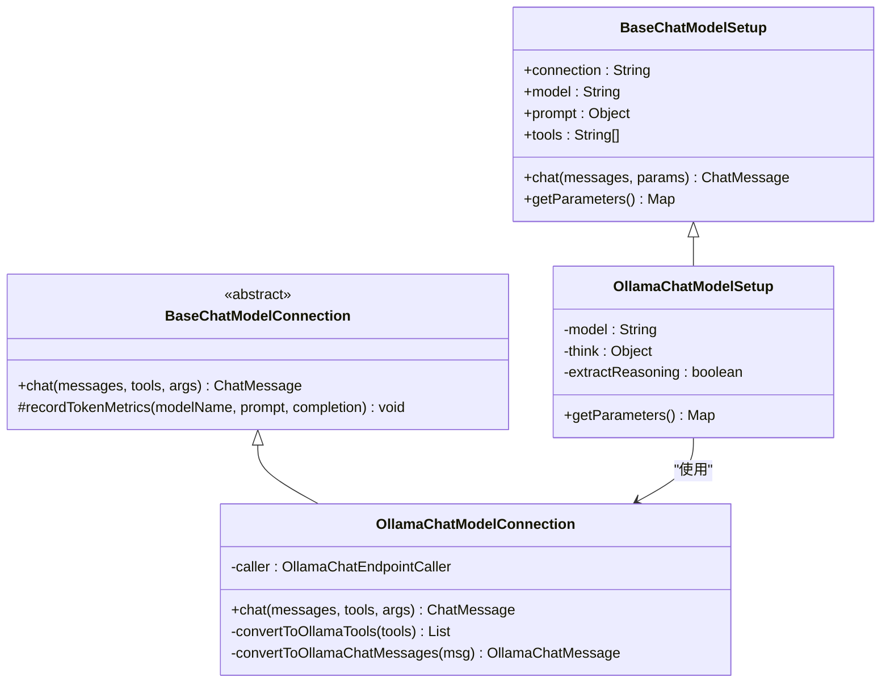
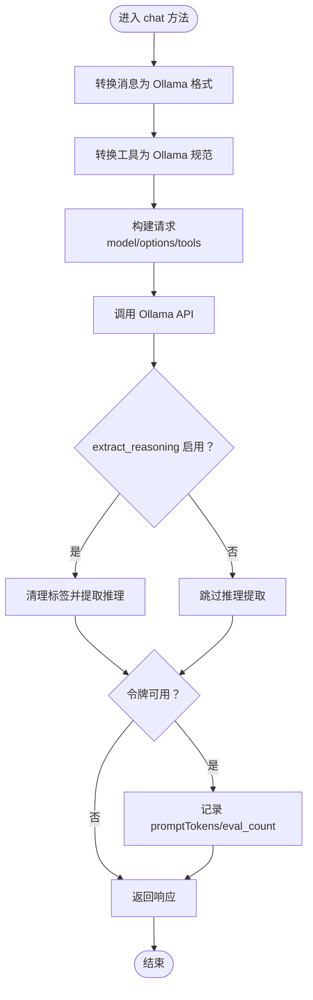
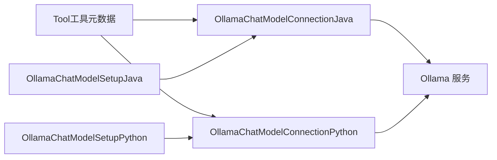

# Ollama 本地聊天模型集成

<cite>
**本文引用的文件**
- [OllamaChatModelSetup.java](file://integrations/chat-models/ollama/src/main/java/org/apache/flink/agents/integrations/chatmodels/ollama/OllamaChatModelSetup.java)
- [OllamaChatModelConnection.java](file://integrations/chat-models/ollama/src/main/java/org/apache/flink/agents/integrations/chatmodels/ollama/OllamaChatModelConnection.java)
- [BaseChatModelSetup.java](file://api/src/main/java/org/apache/flink/agents/api/chat/model/BaseChatModelSetup.java)
- [BaseChatModelConnection.java](file://api/src/main/java/org/apache/flink/agents/api/chat/model/BaseChatModelConnection.java)
- [ollama_chat_model.py](file://python/flink_agents/integrations/chat_models/ollama_chat_model.py)
- [OllamaPreparationUtils.java](file://e2e-test/flink-agents-end-to-end-tests-integration/src/test/java/org/apache/flink/agents/integration/test/OllamaPreparationUtils.java)
- [ollama_pull_model.sh（集成测试）](file://e2e-test/flink-agents-end-to-end-tests-integration/src/test/resources/ollama_pull_model.sh)
- [ollama_pull_model.sh（Python端到端）](file://python/flink_agents/e2e_tests/scripts/ollama_pull_model.sh)
- [test_ollama_chat_model.py](file://python/flink_agents/integrations/chat_models/tests/test_ollama_chat_model.py)
- [start_ollama_server.sh（Python测试）](file://python/flink_agents/integrations/chat_models/tests/start_ollama_server.sh)
- [ChatModelCrossLanguageAgent.java](file://e2e-test/flink-agents-end-to-end-tests-resource-cross-language/src/test/java/org/apache/flink/agents/resource/test/ChatModelCrossLanguageAgent.java)
- [Tool.java](file://api/src/main/java/org/apache/flink/agents/api/tools/Tool.java)
</cite>

## 目录
1. [简介](#简介)
2. [项目结构](#项目结构)
3. [核心组件](#核心组件)
4. [架构总览](#架构总览)
5. [组件详解](#组件详解)
6. [依赖关系分析](#依赖关系分析)
7. [性能与优化](#性能与优化)
8. [故障排查指南](#故障排查指南)
9. [结论](#结论)
10. [附录：本地环境搭建与使用](#附录本地环境搭建与使用)

## 简介
本文件面向需要在本地部署与运行 Ollama 大语言模型的开发者，系统性介绍 Flink Agents 中 Ollama 本地聊天模型的集成实现。内容涵盖：
- OllamaChatModelSetup 与 OllamaChatModelConnection 的配置与使用
- 本地部署要求、模型下载与运行配置
- 本地模型优势（隐私保护、离线可用、无 API 限制）
- 完整本地环境搭建指南（含 Docker 安装、模型选择与性能调优）
- Ollama API 请求格式、响应处理与错误管理
- 在代理中配置本地 Ollama 模型的实践示例
- 性能优化建议（内存管理、GPU 加速、模型量化）

## 项目结构
Flink Agents 将“抽象接口”与“具体实现”分层设计：
- 抽象层位于 api 模块，定义通用的资源生命周期与消息格式
- Java 实现位于 integrations/chat-models/ollama（基于 ollama4j 客户端）
- Python 实现位于 python/flink_agents/integrations/chat_models（基于 ollama 官方 Python SDK）

图表来源
- [BaseChatModelSetup.java](file://api/src/main/java/org/apache/flink/agents/api/chat/model/BaseChatModelSetup.java#L37-L101)
- [BaseChatModelConnection.java](file://api/src/main/java/org/apache/flink/agents/api/chat/model/BaseChatModelConnection.java#L32-L78)
- [OllamaChatModelSetup.java](file://integrations/chat-models/ollama/src/main/java/org/apache/flink/agents/integrations/chatmodels/ollama/OllamaChatModelSetup.java#L56-L98)
- [OllamaChatModelConnection.java](file://integrations/chat-models/ollama/src/main/java/org/apache/flink/agents/integrations/chatmodels/ollama/OllamaChatModelConnection.java#L62-L84)
- [ollama_chat_model.py](file://python/flink_agents/integrations/chat_models/ollama_chat_model.py#L36-L276)

章节来源
- [BaseChatModelSetup.java](file://api/src/main/java/org/apache/flink/agents/api/chat/model/BaseChatModelSetup.java#L37-L101)
- [BaseChatModelConnection.java](file://api/src/main/java/org/apache/flink/agents/api/chat/model/BaseChatModelConnection.java#L32-L78)
- [OllamaChatModelSetup.java](file://integrations/chat-models/ollama/src/main/java/org/apache/flink/agents/integrations/chatmodels/ollama/OllamaChatModelSetup.java#L56-L98)
- [OllamaChatModelConnection.java](file://integrations/chat-models/ollama/src/main/java/org/apache/flink/agents/integrations/chatmodels/ollama/OllamaChatModelConnection.java#L62-L84)
- [ollama_chat_model.py](file://python/flink_agents/integrations/chat_models/ollama_chat_model.py#L36-L276)

## 核心组件
- BaseChatModelSetup：负责从资源描述符解析参数（connection/model/prompt/tools），并协调 BaseChatModelConnection 执行对话；支持动态注入提示词与工具列表。
- BaseChatModelConnection：定义 chat 接口与令牌用量记录能力，子类实现具体服务端对接。
- OllamaChatModelSetup（Java/Python）：封装 Ollama 特定参数（如 think、extract_reasoning、keep_alive、temperature、num_ctx 等），并将参数传递给连接层。
- OllamaChatModelConnection（Java/Python）：完成消息角色映射、工具规格转换、推理标签抽取、工具调用回填与令牌统计。

章节来源
- [BaseChatModelSetup.java](file://api/src/main/java/org/apache/flink/agents/api/chat/model/BaseChatModelSetup.java#L37-L101)
- [BaseChatModelConnection.java](file://api/src/main/java/org/apache/flink/agents/api/chat/model/BaseChatModelConnection.java#L32-L78)
- [OllamaChatModelSetup.java](file://integrations/chat-models/ollama/src/main/java/org/apache/flink/agents/integrations/chatmodels/ollama/OllamaChatModelSetup.java#L56-L98)
- [OllamaChatModelConnection.java](file://integrations/chat-models/ollama/src/main/java/org/apache/flink/agents/integrations/chatmodels/ollama/OllamaChatModelConnection.java#L62-L84)
- [ollama_chat_model.py](file://python/flink_agents/integrations/chat_models/ollama_chat_model.py#L36-L276)

## 架构总览
下图展示了 Java 与 Python 双实现的统一抽象与调用链路：

图表来源
- [BaseChatModelSetup.java](file://api/src/main/java/org/apache/flink/agents/api/chat/model/BaseChatModelSetup.java#L54-L101)
- [BaseChatModelConnection.java](file://api/src/main/java/org/apache/flink/agents/api/chat/model/BaseChatModelConnection.java#L50-L78)
- [OllamaChatModelConnection.java](file://integrations/chat-models/ollama/src/main/java/org/apache/flink/agents/integrations/chatmodels/ollama/OllamaChatModelConnection.java#L180-L244)
- [ollama_chat_model.py](file://python/flink_agents/integrations/chat_models/ollama_chat_model.py#L84-L148)

## 组件详解

### Java 实现：OllamaChatModelSetup 与 OllamaChatModelConnection
- 配置要点
  - 连接参数：endpoint（必填）、requestTimeout（可选）
  - 模型参数：model（必填）、think（布尔或特定级别）、extract_reasoning（是否抽取<think>内容）
  - 工具参数：通过 BaseChatModelSetup 的 tools 列表注入
- 关键流程
  - 角色映射：将框架消息角色映射到 Ollama 支持的角色
  - 工具规格转换：将 Tool 的输入 JSON Schema 转换为 Ollama 工具规范
  - 思考模式：根据 think 参数选择启用/禁用/指定级别
  - 推理抽取：当 extract_reasoning 为真时，从响应中分离<think>内容
  - 令牌统计：若模型名可用，记录提示与生成令牌数
- 错误处理
  - endpoint 为空抛出非法参数异常
  - 角色映射失败与序列化异常以运行时异常形式上抛

图表来源
- [BaseChatModelSetup.java](file://api/src/main/java/org/apache/flink/agents/api/chat/model/BaseChatModelSetup.java#L37-L101)
- [BaseChatModelConnection.java](file://api/src/main/java/org/apache/flink/agents/api/chat/model/BaseChatModelConnection.java#L32-L78)
- [OllamaChatModelSetup.java](file://integrations/chat-models/ollama/src/main/java/org/apache/flink/agents/integrations/chatmodels/ollama/OllamaChatModelSetup.java#L56-L98)
- [OllamaChatModelConnection.java](file://integrations/chat-models/ollama/src/main/java/org/apache/flink/agents/integrations/chatmodels/ollama/OllamaChatModelConnection.java#L62-L84)

章节来源
- [OllamaChatModelSetup.java](file://integrations/chat-models/ollama/src/main/java/org/apache/flink/agents/integrations/chatmodels/ollama/OllamaChatModelSetup.java#L56-L98)
- [OllamaChatModelConnection.java](file://integrations/chat-models/ollama/src/main/java/org/apache/flink/agents/integrations/chatmodels/ollama/OllamaChatModelConnection.java#L62-L84)
- [OllamaChatModelConnection.java](file://integrations/chat-models/ollama/src/main/java/org/apache/flink/agents/integrations/chatmodels/ollama/OllamaChatModelConnection.java#L168-L244)

### Python 实现：OllamaChatModelSetup 与 OllamaChatModelConnection
- 配置要点
  - 连接参数：base_url（默认 http://localhost:11434）、request_timeout（默认 30 秒）
  - 模型参数：model、temperature、num_ctx、keep_alive、think、extract_reasoning
  - 附加参数：additional_kwargs 透传至 Ollama API
- 关键流程
  - 消息转换：将 ChatMessage 转为 Ollama Message，保留工具调用
  - 工具转换：将 Tool 元数据转换为 OpenAI 风格的工具规范
  - 推理抽取：从响应内容中提取<think>标签内的推理过程
  - 令牌统计：若可用，记录 promptTokens 与 completionTokens
- 错误处理
  - 异常统一包装为运行时异常向上抛出

图表来源
- [ollama_chat_model.py](file://python/flink_agents/integrations/chat_models/ollama_chat_model.py#L84-L148)

章节来源
- [ollama_chat_model.py](file://python/flink_agents/integrations/chat_models/ollama_chat_model.py#L36-L276)

### 跨语言桥接与示例
- Java 侧通过资源描述符声明连接与设置，Python 侧通过 ResourceDescriptor 包装 Java 实现
- 示例：在跨语言测试中，Java 声明 endpoint 与超时，Python 设置模型、工具与推理抽取开关

章节来源
- [ChatModelCrossLanguageAgent.java](file://e2e-test/flink-agents-end-to-end-tests-resource-cross-language/src/test/java/org/apache/flink/agents/resource/test/ChatModelCrossLanguageAgent.java#L67-L92)
- [ollama_chat_model.py](file://python/flink_agents/integrations/chat_models/ollama_chat_model.py#L232-L276)

## 依赖关系分析
- 组件耦合
  - BaseChatModelSetup 与 BaseChatModelConnection 通过资源类型解耦，具体实现（Java/Python）均遵循同一抽象
  - 工具元数据由 Tool 提供，经转换后注入 Ollama API
- 外部依赖
  - Java 实现依赖 ollama4j 客户端（消息角色映射、工具规格、同步调用）
  - Python 实现依赖官方 ollama SDK（消息、工具、推理标签、令牌统计）
- 潜在循环依赖
  - 无直接循环；连接与设置分别持有对方名称，通过资源解析间接关联

图表来源
- [Tool.java](file://api/src/main/java/org/apache/flink/agents/api/tools/Tool.java#L30-L70)
- [OllamaChatModelConnection.java](file://integrations/chat-models/ollama/src/main/java/org/apache/flink/agents/integrations/chatmodels/ollama/OllamaChatModelConnection.java#L112-L159)
- [ollama_chat_model.py](file://python/flink_agents/integrations/chat_models/ollama_chat_model.py#L94-L107)

章节来源
- [Tool.java](file://api/src/main/java/org/apache/flink/agents/api/tools/Tool.java#L30-L70)
- [OllamaChatModelConnection.java](file://integrations/chat-models/ollama/src/main/java/org/apache/flink/agents/integrations/chatmodels/ollama/OllamaChatModelConnection.java#L112-L159)
- [ollama_chat_model.py](file://python/flink_agents/integrations/chat_models/ollama_chat_model.py#L94-L107)

## 性能与优化
- 内存管理
  - 使用 keep_alive 控制模型驻留时间，减少重复加载开销（Python 实现提供该参数）
  - 合理设置 num_ctx（上下文长度），避免过长导致显存压力
- GPU 加速与量化
  - 优先选择支持 GPU 的模型镜像与硬件配置
  - 对于资源受限场景，优先选择更小的模型或开启量化（具体取决于 Ollama 镜像与运行参数）
- 超时与并发
  - requestTimeout/超时设置需结合网络与模型大小权衡
  - 并发调用时注意令牌用量统计与限流策略
- 推理抽取与工具调用
  - extract_reasoning 会进行字符串处理与正则匹配，建议仅在需要时启用
  - 工具调用转换为 JSON Schema，确保输入 schema 精简以降低序列化成本

[本节为通用性能建议，不直接分析具体文件]

## 故障排查指南
- 常见问题
  - Ollama 未启动或端口不可达：检查本地服务状态与端口占用
  - 模型未下载：先执行模型拉取脚本，再尝试推理
  - 工具调用失败：确认工具输入 schema 的 properties 与 required 字段完整
  - 推理标签未提取：确认响应内容包含<think>标签且 extract_reasoning 开启
- 定位手段
  - 查看连接层异常堆栈与参数校验日志
  - 使用端到端测试脚本验证本地环境与模型可用性
- 参考脚本
  - 模型拉取脚本（集成测试与 Python 端到端）
  - 本地启动与拉取脚本（Python 测试）

章节来源
- [OllamaPreparationUtils.java](file://e2e-test/flink-agents-end-to-end-tests-integration/src/test/java/org/apache/flink/agents/integration/test/OllamaPreparationUtils.java#L30-L46)
- [ollama_pull_model.sh（集成测试）](file://e2e-test/flink-agents-end-to-end-tests-integration/src/test/resources/ollama_pull_model.sh#L19-L20)
- [ollama_pull_model.sh（Python端到端）](file://python/flink_agents/e2e_tests/scripts/ollama_pull_model.sh#L20-L21)
- [start_ollama_server.sh（Python测试）](file://python/flink_agents/integrations/chat_models/tests/start_ollama_server.sh#L23-L40)

## 结论
Flink Agents 对 Ollama 的集成以统一抽象为核心，Java 与 Python 双实现共享一致的参数体系与调用流程。通过连接层与设置层的清晰分工，开发者可以便捷地在本地部署 Ollama，实现隐私保护、离线可用与无 API 限制的聊天体验。配合工具与推理抽取能力，可在复杂工作流中实现智能决策与可观测性。

[本节为总结性内容，不直接分析具体文件]

## 附录：本地环境搭建与使用

### 本地部署与模型准备
- 安装 Ollama
  - Linux/macOS 可使用安装脚本一键安装
  - Windows 用户请参考官方安装指南
- 启动服务
  - 默认监听 http://localhost:11434
- 拉取模型
  - 使用提供的脚本或命令拉取所需模型（如 qwen3:1.7b 或其他）
- 验证可用性
  - 通过端到端测试脚本自动检测与拉取模型

章节来源
- [start_ollama_server.sh（Python测试）](file://python/flink_agents/integrations/chat_models/tests/start_ollama_server.sh#L23-L40)
- [ollama_pull_model.sh（集成测试）](file://e2e-test/flink-agents-end-to-end-tests-integration/src/test/resources/ollama_pull_model.sh#L19-L20)
- [ollama_pull_model.sh（Python端到端）](file://python/flink_agents/e2e_tests/scripts/ollama_pull_model.sh#L20-L21)

### 在代理中配置本地 Ollama 模型
- Java 方式
  - 声明连接：endpoint 指向本地地址，必要时设置 requestTimeout
  - 声明设置：指定 model、tools、extract_reasoning 等参数
  - 通过 BaseChatModelSetup.chat 调用，内部自动解析提示词与工具
- Python 方式
  - 声明连接：base_url 指向本地地址，request_timeout 可调
  - 声明设置：指定 model、temperature、num_ctx、keep_alive、think、extract_reasoning
  - 通过 OllamaChatModelSetup.chat 调用，内部完成消息与工具转换

章节来源
- [OllamaChatModelConnection.java](file://integrations/chat-models/ollama/src/main/java/org/apache/flink/agents/integrations/chatmodels/ollama/OllamaChatModelConnection.java#L73-L99)
- [OllamaChatModelSetup.java](file://integrations/chat-models/ollama/src/main/java/org/apache/flink/agents/integrations/chatmodels/ollama/OllamaChatModelSetup.java#L62-L89)
- [ollama_chat_model.py](file://python/flink_agents/integrations/chat_models/ollama_chat_model.py#L64-L99)
- [ollama_chat_model.py](file://python/flink_agents/integrations/chat_models/ollama_chat_model.py#L232-L276)

### Ollama API 请求与响应要点
- 请求格式
  - Java：通过 OllamaChatRequest 构建，包含 messages、model、thinking、tools
  - Python：通过 client.chat 发起，携带 messages、model、tools、options、keep_alive、think
- 响应处理
  - 提取 assistant 回复内容与工具调用
  - 若启用推理抽取，将<think>标签内内容放入额外参数
  - 记录 promptTokens 与 eval_count（若可用）
- 错误管理
  - endpoint 校验、角色映射异常、序列化异常等均以运行时异常抛出

章节来源
- [OllamaChatModelConnection.java](file://integrations/chat-models/ollama/src/main/java/org/apache/flink/agents/integrations/chatmodels/ollama/OllamaChatModelConnection.java#L180-L244)
- [ollama_chat_model.py](file://python/flink_agents/integrations/chat_models/ollama_chat_model.py#L84-L148)

### 性能优化建议
- 选择合适模型与上下文长度（num_ctx）
- 合理设置 keep_alive，避免频繁加载
- 控制 requestTimeout，平衡延迟与稳定性
- 仅在需要时启用 extract_reasoning，减少字符串处理开销
- 工具 schema 精简，降低序列化与传输成本

[本节为通用优化建议，不直接分析具体文件]