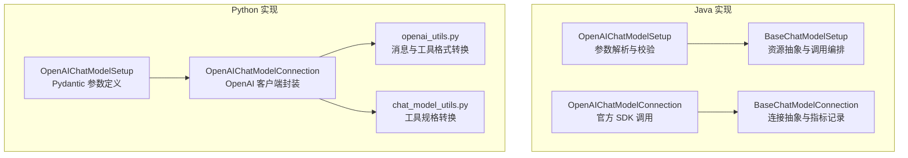
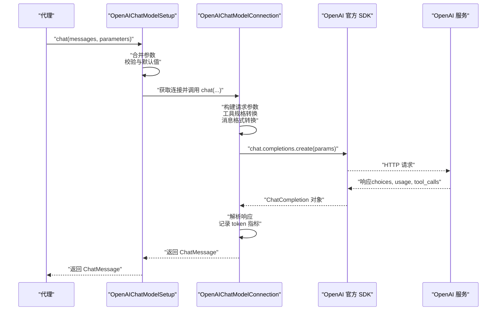
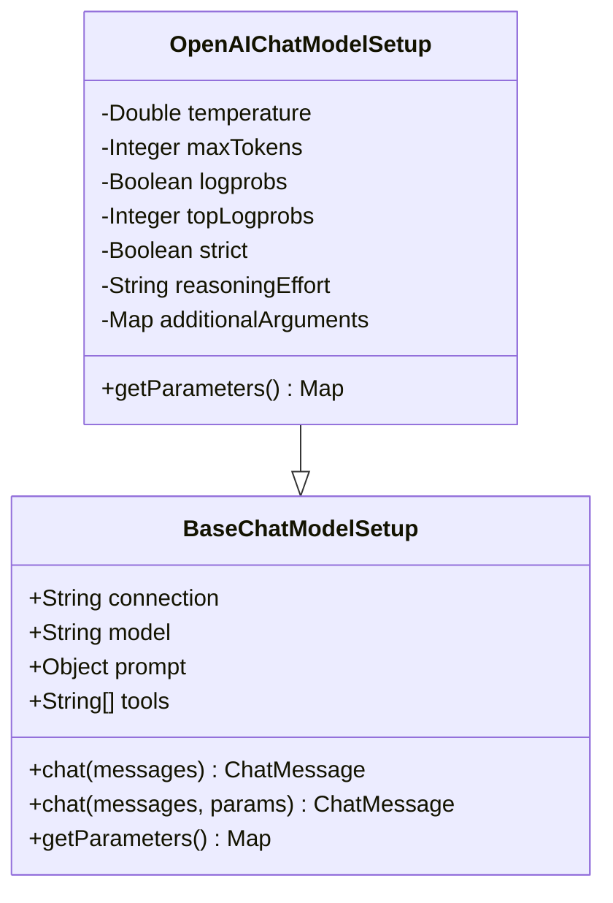
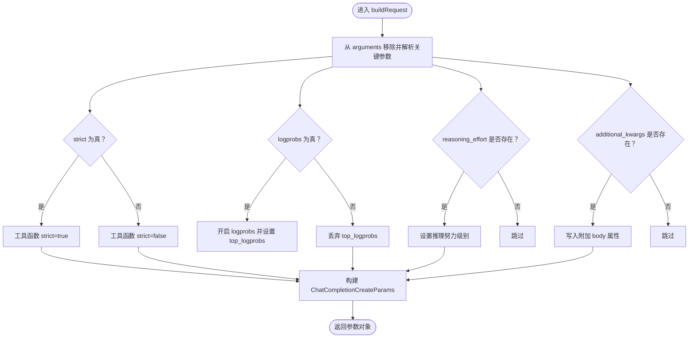
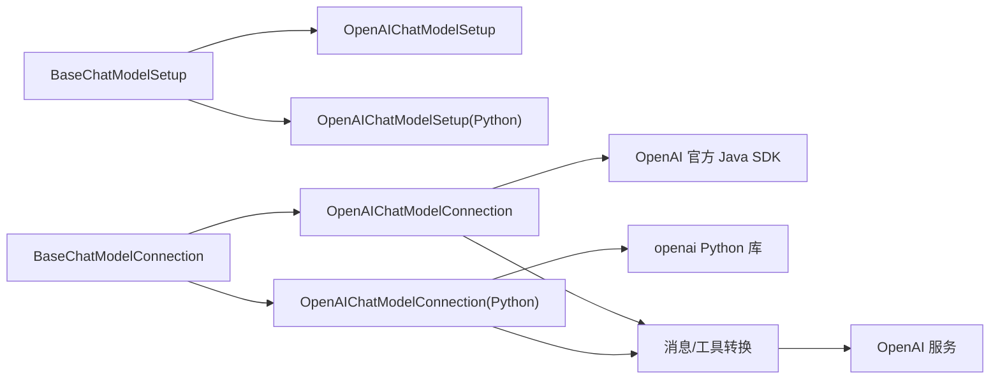

# OpenAI 聊天模型集成

<cite>
**本文引用的文件**
- [OpenAIChatModelSetup.java](file://integrations/chat-models/openai/src/main/java/org/apache/flink/agents/integrations/chatmodels/openai/OpenAIChatModelSetup.java)
- [OpenAIChatModelConnection.java](file://integrations/chat-models/openai/src/main/java/org/apache/flink/agents/integrations/chatmodels/openai/OpenAIChatModelConnection.java)
- [BaseChatModelSetup.java](file://api/src/main/java/org/apache/flink/agents/api/chat/model/BaseChatModelSetup.java)
- [BaseChatModelConnection.java](file://api/src/main/java/org/apache/flink/agents/api/chat/model/BaseChatModelConnection.java)
- [ChatModelSetup.java](file://api/src/main/java/org/apache/flink/agents/api/annotation/ChatModelSetup.java)
- [openai_chat_model.py](file://python/flink_agents/integrations/chat_models/openai/openai_chat_model.py)
- [openai_utils.py](file://python/flink_agents/integrations/chat_models/openai/openai_utils.py)
- [chat_model_utils.py](file://python/flink_agents/integrations/chat_models/chat_model_utils.py)
- [ChatModelIntegrationAgent.java](file://e2e-test/flink-agents-end-to-end-tests-integration/src/test/java/org/apache/flink/agents/integration/test/ChatModelIntegrationAgent.java)
</cite>

## 目录
1. [简介](#简介)
2. [项目结构](#项目结构)
3. [核心组件](#核心组件)
4. [架构总览](#架构总览)
5. [组件详解](#组件详解)
6. [依赖关系分析](#依赖关系分析)
7. [性能与稳定性](#性能与稳定性)
8. [故障排查指南](#故障排查指南)
9. [结论](#结论)
10. [附录：完整配置示例与最佳实践](#附录完整配置示例与最佳实践)

## 简介
本文件面向在 Flink Agents 中集成 OpenAI Chat Completions API 的开发者，系统性讲解 OpenAI 聊天模型的配置与使用，重点覆盖：
- OpenAIChatModelSetup 的参数体系与校验规则（温度、最大令牌数、logprobs/top_logprobs、严格模式、推理努力级别等）
- OpenAIChatModelConnection 的连接参数与请求构建逻辑（API Key、超时、重试、默认头、模型回退）
- OpenAI 特有参数 seed、user 的透传机制
- 连接池与客户端复用策略、错误处理与重试机制
- 在代理中声明与使用 OpenAI 模型的完整流程与示例
- 性能优化建议与最佳实践

## 项目结构
OpenAI 集成由 Java 与 Python 双栈实现组成，分别位于 integrations/chat-models/openai 与 python/flink_agents/integrations/chat_models/openai。二者共享统一的抽象层 BaseChatModelSetup/BaseChatModelConnection。

图表来源
- [OpenAIChatModelSetup.java](file://integrations/chat-models/openai/src/main/java/org/apache/flink/agents/integrations/chatmodels/openai/OpenAIChatModelSetup.java#L61-L220)
- [OpenAIChatModelConnection.java](file://integrations/chat-models/openai/src/main/java/org/apache/flink/agents/integrations/chatmodels/openai/OpenAIChatModelConnection.java#L94-L460)
- [BaseChatModelSetup.java](file://api/src/main/java/org/apache/flink/agents/api/chat/model/BaseChatModelSetup.java#L37-L128)
- [BaseChatModelConnection.java](file://api/src/main/java/org/apache/flink/agents/api/chat/model/BaseChatModelConnection.java#L32-L79)
- [openai_chat_model.py](file://python/flink_agents/integrations/chat_models/openai/openai_chat_model.py#L41-L298)
- [openai_utils.py](file://python/flink_agents/integrations/chat_models/openai/openai_utils.py#L44-L223)
- [chat_model_utils.py](file://python/flink_agents/integrations/chat_models/chat_model_utils.py#L23-L41)

章节来源
- [OpenAIChatModelSetup.java](file://integrations/chat-models/openai/src/main/java/org/apache/flink/agents/integrations/chatmodels/openai/OpenAIChatModelSetup.java#L1-L220)
- [OpenAIChatModelConnection.java](file://integrations/chat-models/openai/src/main/java/org/apache/flink/agents/integrations/chatmodels/openai/OpenAIChatModelConnection.java#L1-L460)
- [BaseChatModelSetup.java](file://api/src/main/java/org/apache/flink/agents/api/chat/model/BaseChatModelSetup.java#L1-L128)
- [BaseChatModelConnection.java](file://api/src/main/java/org/apache/flink/agents/api/chat/model/BaseChatModelConnection.java#L1-L79)
- [openai_chat_model.py](file://python/flink_agents/integrations/chat_models/openai/openai_chat_model.py#L1-L298)
- [openai_utils.py](file://python/flink_agents/integrations/chat_models/openai/openai_utils.py#L1-L223)
- [chat_model_utils.py](file://python/flink_agents/integrations/chat_models/chat_model_utils.py#L1-L41)

## 核心组件
- OpenAIChatModelSetup（Java）：负责解析与校验聊天模型参数，生成 OpenAI 请求参数映射；支持 temperature、max_tokens、logprobs、top_logprobs、strict、reasoning_effort、additional_kwargs 等。
- OpenAIChatModelConnection（Java）：基于官方 Java SDK 构建请求，支持 api_key、api_base_url、timeout、max_retries、default_headers、model 回退；负责工具绑定、消息格式转换、响应解析与 token 指标记录。
- BaseChatModelSetup/BaseChatModelConnection：抽象层，定义资源类型、参数合并、工具加载、指标上报等通用行为。
- Python 对应实现：openai_chat_model.py 提供 Pydantic 参数定义与客户端封装；openai_utils.py 负责消息与工具格式转换；chat_model_utils.py 将工具元数据转为 OpenAI 规范。

章节来源
- [OpenAIChatModelSetup.java](file://integrations/chat-models/openai/src/main/java/org/apache/flink/agents/integrations/chatmodels/openai/OpenAIChatModelSetup.java#L61-L178)
- [OpenAIChatModelConnection.java](file://integrations/chat-models/openai/src/main/java/org/apache/flink/agents/integrations/chatmodels/openai/OpenAIChatModelConnection.java#L94-L226)
- [BaseChatModelSetup.java](file://api/src/main/java/org/apache/flink/agents/api/chat/model/BaseChatModelSetup.java#L37-L101)
- [BaseChatModelConnection.java](file://api/src/main/java/org/apache/flink/agents/api/chat/model/BaseChatModelConnection.java#L32-L77)
- [openai_chat_model.py](file://python/flink_agents/integrations/chat_models/openai/openai_chat_model.py#L199-L298)
- [openai_utils.py](file://python/flink_agents/integrations/chat_models/openai/openai_utils.py#L124-L223)
- [chat_model_utils.py](file://python/flink_agents/integrations/chat_models/chat_model_utils.py#L23-L41)

## 架构总览
下图展示了从代理到 OpenAI 的调用链路，涵盖参数传递、工具绑定、消息转换与响应解析。

图表来源
- [BaseChatModelSetup.java](file://api/src/main/java/org/apache/flink/agents/api/chat/model/BaseChatModelSetup.java#L54-L101)
- [OpenAIChatModelConnection.java](file://integrations/chat-models/openai/src/main/java/org/apache/flink/agents/integrations/chatmodels/openai/OpenAIChatModelConnection.java#L139-L165)
- [openai_chat_model.py](file://python/flink_agents/integrations/chat_models/openai/openai_chat_model.py#L137-L186)

## 组件详解

### OpenAIChatModelSetup（Java）
- 默认值与校验
  - 温度：范围 [0.0, 2.0]，默认 0.1
  - 最大令牌数：必须大于 0（可空）
  - top_logprobs：范围 [0, 20]，默认 0
  - strict：布尔，默认 false
  - reasoning_effort：取值限定为 "low"|"medium"|"high"
  - additional_kwargs：透传任意键值对（如 seed、user）
  - model：若未指定则回退为 "gpt-3.5-turbo"
- 参数映射
  - 将内部字段映射为 OpenAI 请求参数字典，仅在启用 logprobs 时携带 top_logprobs
  - 支持将额外参数 additional_kwargs 原样放入请求体

图表来源
- [BaseChatModelSetup.java](file://api/src/main/java/org/apache/flink/agents/api/chat/model/BaseChatModelSetup.java#L37-L128)
- [OpenAIChatModelSetup.java](file://integrations/chat-models/openai/src/main/java/org/apache/flink/agents/integrations/chatmodels/openai/OpenAIChatModelSetup.java#L61-L178)

章节来源
- [OpenAIChatModelSetup.java](file://integrations/chat-models/openai/src/main/java/org/apache/flink/agents/integrations/chatmodels/openai/OpenAIChatModelSetup.java#L61-L178)
- [BaseChatModelSetup.java](file://api/src/main/java/org/apache/flink/agents/api/chat/model/BaseChatModelSetup.java#L37-L101)

### OpenAIChatModelConnection（Java）
- 连接参数
  - api_key（必填）：用于鉴权
  - api_base_url（可选）：默认 https://api.openai.com/v1
  - timeout（秒）：请求超时
  - max_retries（>=0）：最大重试次数
  - default_headers（可选）：默认请求头
  - model（可选）：作为默认模型名回退
- 请求构建
  - 从 arguments 中移除并解析 strict、model、temperature、max_tokens、logprobs、top_logprobs、reasoning_effort、additional_kwargs
  - 工具绑定：根据工具元数据构造 FunctionDefinition，并在 strict 模式下启用严格参数校验
  - 消息转换：SYSTEM/USER/ASSISTANT/TOOL 角色映射，支持 assistant 的 tool_calls 与 refusal 字段
- 响应解析
  - 提取第一条 choice 的内容与 tool_calls，生成 ChatMessage
  - 若存在 usage，则记录 token 指标（promptTokens/completionTokens）
- 关闭与资源释放
  - 关闭底层 OpenAIClient

图表来源
- [OpenAIChatModelConnection.java](file://integrations/chat-models/openai/src/main/java/org/apache/flink/agents/integrations/chatmodels/openai/OpenAIChatModelConnection.java#L167-L226)

章节来源
- [OpenAIChatModelConnection.java](file://integrations/chat-models/openai/src/main/java/org/apache/flink/agents/integrations/chatmodels/openai/OpenAIChatModelConnection.java#L94-L226)
- [BaseChatModelConnection.java](file://api/src/main/java/org/apache/flink/agents/api/chat/model/BaseChatModelConnection.java#L61-L77)

### Python 实现要点
- OpenAIChatModelConnection
  - 支持 reuse_client 控制是否复用客户端实例，异步场景可关闭复用提升稳定性
  - 通过 resolve_openai_credentials 解析 api_key/base_url，优先级：参数 > 环境变量 > openai 模块 > 默认值
  - 调用 OpenAI 客户端 chat.completions.create，支持 tools 与 additional_kwargs 透传
  - 记录 usage 中的 promptTokens/completionTokens 到 extra_args
- OpenAIChatModelSetup（Pydantic）
  - 定义 model、temperature、max_tokens、logprobs、top_logprobs、strict、reasoning_effort、additional_kwargs 等字段
  - 提供 model_kwargs 属性，组合基础参数与 additional_kwargs
- openai_utils.py
  - convert_to_openai_messages/convert_from_openai_message：角色与字段映射
  - resolve_openai_credentials：凭据解析与校验
- chat_model_utils.py
  - to_openai_tool：将工具元数据转换为 OpenAI function 规格

章节来源
- [openai_chat_model.py](file://python/flink_agents/integrations/chat_models/openai/openai_chat_model.py#L41-L194)
- [openai_chat_model.py](file://python/flink_agents/integrations/chat_models/openai/openai_chat_model.py#L199-L298)
- [openai_utils.py](file://python/flink_agents/integrations/chat_models/openai/openai_utils.py#L44-L223)
- [chat_model_utils.py](file://python/flink_agents/integrations/chat_models/chat_model_utils.py#L23-L41)

### OpenAI 特有参数与使用场景
- seed
  - 作用：控制随机性，便于结果可复现
  - 使用：通过 additional_kwargs 传入，随请求体发送
- user
  - 作用：标识请求归属用户，便于审计与速率限制
  - 使用：通过 additional_kwargs 传入，随请求体发送
- reasoning_effort
  - 作用：针对具备推理能力的模型（如 gpt-4o）控制推理强度
  - 取值："low"|"medium"|"high"
  - 使用：在 setup 中设置 reasoning_effort，或在每次调用时通过参数传入

章节来源
- [OpenAIChatModelSetup.java](file://integrations/chat-models/openai/src/main/java/org/apache/flink/agents/integrations/chatmodels/openai/OpenAIChatModelSetup.java#L110-L115)
- [OpenAIChatModelConnection.java](file://integrations/chat-models/openai/src/main/java/org/apache/flink/agents/integrations/chatmodels/openai/OpenAIChatModelConnection.java#L212-L215)
- [openai_chat_model.py](file://python/flink_agents/integrations/chat_models/openai/openai_chat_model.py#L258-L261)

### 在代理中配置与使用 OpenAI 模型
- 声明连接（ChatModelConnection）
  - Java：在资源描述符中添加 api_key、api_base_url、timeout、max_retries、default_headers、model 等参数
  - Python：通过 resolve_openai_credentials 自动解析 api_key/base_url，也可显式传参
- 声明模型（ChatModelSetup）
  - Java：通过 ResourceDescriptor.Builder 指定 connection、model、temperature、max_tokens、strict、reasoning_effort、tools、additional_kwargs
  - Python：通过 OpenAIChatModelSetup 初始化上述字段
- 示例（Java）
  - 参考 ChatModelIntegrationAgent 中 OPENAI 分支的资源声明与工具绑定
- 示例（Python）
  - 参考 openai_chat_model.py 中的 OpenAIChatModelConnection 与 OpenAIChatModelSetup 的字段定义与初始化

章节来源
- [ChatModelIntegrationAgent.java](file://e2e-test/flink-agents-end-to-end-tests-integration/src/test/java/org/apache/flink/agents/integration/test/ChatModelIntegrationAgent.java#L82-L139)
- [openai_chat_model.py](file://python/flink_agents/integrations/chat_models/openai/openai_chat_model.py#L199-L298)

## 依赖关系分析
- 抽象层耦合
  - BaseChatModelSetup 与 BaseChatModelConnection 提供统一的资源类型与调用协议，OpenAI 实现遵循该协议
- Java 与 Python 实现
  - Java 侧直接使用官方 Java SDK；Python 侧使用 openai 库并通过工具与消息转换模块适配框架规范
- 工具与消息转换
  - Java：convertTools/parseFunctionParameters 将工具元数据转换为 FunctionDefinition；convertToOpenAIMessage/convertResponse 处理消息与 tool_calls
  - Python：to_openai_tool 与 openai_utils 的消息转换函数完成相同职责

图表来源
- [BaseChatModelSetup.java](file://api/src/main/java/org/apache/flink/agents/api/chat/model/BaseChatModelSetup.java#L37-L128)
- [BaseChatModelConnection.java](file://api/src/main/java/org/apache/flink/agents/api/chat/model/BaseChatModelConnection.java#L32-L79)
- [OpenAIChatModelSetup.java](file://integrations/chat-models/openai/src/main/java/org/apache/flink/agents/integrations/chatmodels/openai/OpenAIChatModelSetup.java#L61-L178)
- [OpenAIChatModelConnection.java](file://integrations/chat-models/openai/src/main/java/org/apache/flink/agents/integrations/chatmodels/openai/OpenAIChatModelConnection.java#L94-L226)
- [openai_chat_model.py](file://python/flink_agents/integrations/chat_models/openai/openai_chat_model.py#L41-L194)
- [openai_utils.py](file://python/flink_agents/integrations/chat_models/openai/openai_utils.py#L124-L223)
- [chat_model_utils.py](file://python/flink_agents/integrations/chat_models/chat_model_utils.py#L23-L41)

## 性能与稳定性
- 连接池与客户端复用
  - Java：官方 SDK 内部管理连接池；OpenAIChatModelConnection 保持单实例客户端，减少握手开销
  - Python：OpenAIChatModelConnection 支持 reuse_client；在高并发/异步场景建议关闭复用以避免连接竞争
- 超时与重试
  - Java：通过 timeout 与 max_retries 控制请求超时与重试上限
  - Python：通过 timeout 与 max_retries 控制请求超时与重试上限
- 日志与可观测性
  - Java：在存在 usage 时记录 promptTokens/completionTokens 指标
  - Python：在存在 usage 时将 token 指标写入响应 extra_args，便于上层统计
- 工具与消息转换
  - 严格模式（strict=true）可降低参数不匹配导致的失败率，但会增加 schema 校验成本
  - 合理设置 reasoning_effort，在需要更强推理能力时选择 medium/high

章节来源
- [OpenAIChatModelConnection.java](file://integrations/chat-models/openai/src/main/java/org/apache/flink/agents/integrations/chatmodels/openai/OpenAIChatModelConnection.java#L118-L136)
- [BaseChatModelConnection.java](file://api/src/main/java/org/apache/flink/agents/api/chat/model/BaseChatModelConnection.java#L61-L77)
- [openai_chat_model.py](file://python/flink_agents/integrations/chat_models/openai/openai_chat_model.py#L60-L81)
- [openai_chat_model.py](file://python/flink_agents/integrations/chat_models/openai/openai_chat_model.py#L127-L135)

## 故障排查指南
- 常见错误与定位
  - api_key 缺失或为空：连接阶段即抛出异常
  - temperature 超出范围：setup 校验阶段抛出异常
  - max_tokens 非正：setup 校验阶段抛出异常
  - top_logprobs 超界：setup 校验阶段抛出异常
  - reasoning_effort 非法：setup 校验阶段抛出异常
  - Tool 消息缺少 externalId：消息转换阶段抛出异常
  - Assistant tool_calls 缺少 id：响应转换阶段抛出异常
- 建议排查步骤
  - 检查环境变量与资源描述符中的 api_key、api_base_url、timeout、max_retries、default_headers、model
  - 校验 temperature/max_tokens/top_logprobs/reasoning_effort 的取值范围
  - 确认工具 schema 与 strict 模式下的参数匹配
  - 查看响应 usage 是否存在，确认 token 指标是否正确记录
- 相关实现位置
  - 连接参数校验与构建：OpenAIChatModelConnection
  - 参数校验与映射：OpenAIChatModelSetup
  - 消息与工具转换：OpenAIChatModelConnection 与 openai_utils.py

章节来源
- [OpenAIChatModelConnection.java](file://integrations/chat-models/openai/src/main/java/org/apache/flink/agents/integrations/chatmodels/openai/OpenAIChatModelConnection.java#L106-L136)
- [OpenAIChatModelSetup.java](file://integrations/chat-models/openai/src/main/java/org/apache/flink/agents/integrations/chatmodels/openai/OpenAIChatModelSetup.java#L84-L115)
- [openai_utils.py](file://python/flink_agents/integrations/chat_models/openai/openai_utils.py#L178-L194)

## 结论
OpenAI 聊天模型集成在 Flink Agents 中通过清晰的抽象层与双栈实现，提供了完善的参数体系、工具绑定、消息转换与指标记录能力。通过合理配置 temperature、max_tokens、logprobs、strict、reasoning_effort 以及 additional_kwargs（seed、user），可在保证稳定性的同时获得灵活的推理与工具调用能力。建议在生产环境中结合连接复用、超时与重试策略，配合严格的参数校验与日志监控，确保系统的可靠性与性能。

## 附录：完整配置示例与最佳实践

### 环境变量与 API 密钥管理
- Java
  - 在资源描述符中设置 api_key；可选设置 api_base_url、timeout、max_retries、default_headers、model
- Python
  - 通过 resolve_openai_credentials 解析 api_key/base_url，支持参数、环境变量、openai 模块与默认值的优先级顺序

章节来源
- [OpenAIChatModelConnection.java](file://integrations/chat-models/openai/src/main/java/org/apache/flink/agents/integrations/chatmodels/openai/OpenAIChatModelConnection.java#L106-L136)
- [openai_utils.py](file://python/flink_agents/integrations/chat_models/openai/openai_utils.py#L44-L95)

### 模型选择与工具绑定
- Java
  - 在 OpenAIChatModelSetup 中设置 model、temperature、max_tokens、strict、reasoning_effort、tools、additional_kwargs
- Python
  - 在 OpenAIChatModelSetup 中设置对应字段；通过 to_openai_tool 将工具元数据转换为 OpenAI 规范

章节来源
- [OpenAIChatModelSetup.java](file://integrations/chat-models/openai/src/main/java/org/apache/flink/agents/integrations/chatmodels/openai/OpenAIChatModelSetup.java#L154-L178)
- [openai_chat_model.py](file://python/flink_agents/integrations/chat_models/openai/openai_chat_model.py#L199-L298)
- [chat_model_utils.py](file://python/flink_agents/integrations/chat_models/chat_model_utils.py#L23-L41)

### OpenAI 特有参数 seed 与 user 的使用
- 通过 additional_kwargs 传入，随请求体发送至 OpenAI
- seed 用于控制随机性，user 用于标识用户归属

章节来源
- [OpenAIChatModelSetup.java](file://integrations/chat-models/openai/src/main/java/org/apache/flink/agents/integrations/chatmodels/openai/OpenAIChatModelSetup.java#L117-L122)
- [OpenAIChatModelConnection.java](file://integrations/chat-models/openai/src/main/java/org/apache/flink/agents/integrations/chatmodels/openai/OpenAIChatModelConnection.java#L217-L223)
- [openai_chat_model.py](file://python/flink_agents/integrations/chat_models/openai/openai_chat_model.py#L251-L253)

### 推理努力级别 reasoning_effort
- 取值："low"|"medium"|"high"
- Java：在 setup 中设置或在参数中传入
- Python：在 OpenAIChatModelSetup 中设置

章节来源
- [OpenAIChatModelSetup.java](file://integrations/chat-models/openai/src/main/java/org/apache/flink/agents/integrations/chatmodels/openai/OpenAIChatModelSetup.java#L67-L115)
- [OpenAIChatModelConnection.java](file://integrations/chat-models/openai/src/main/java/org/apache/flink/agents/integrations/chatmodels/openai/OpenAIChatModelConnection.java#L212-L215)
- [openai_chat_model.py](file://python/flink_agents/integrations/chat_models/openai/openai_chat_model.py#L258-L261)

### 连接池管理、错误处理与重试机制
- Java
  - 官方 SDK 内部连接池；通过 timeout 与 max_retries 控制超时与重试
  - 出错时抛出运行时异常，需在外层捕获并处理
- Python
  - 可通过 reuse_client 控制客户端复用；通过 timeout 与 max_retries 控制超时与重试
  - 出错时抛出运行时异常，需在外层捕获并处理

章节来源
- [OpenAIChatModelConnection.java](file://integrations/chat-models/openai/src/main/java/org/apache/flink/agents/integrations/chatmodels/openai/OpenAIChatModelConnection.java#L118-L136)
- [openai_chat_model.py](file://python/flink_agents/integrations/chat_models/openai/openai_chat_model.py#L60-L81)
- [openai_chat_model.py](file://python/flink_agents/integrations/chat_models/openai/openai_chat_model.py#L127-L135)

### 在代理中配置与使用 OpenAI 模型（示例路径）
- Java 代理示例：参考 ChatModelIntegrationAgent 中 OPENAI 分支的资源声明与工具绑定
- Python 代理示例：参考 openai_chat_model.py 中的 OpenAIChatModelConnection 与 OpenAIChatModelSetup 的字段定义与初始化

章节来源
- [ChatModelIntegrationAgent.java](file://e2e-test/flink-agents-end-to-end-tests-integration/src/test/java/org/apache/flink/agents/integration/test/ChatModelIntegrationAgent.java#L82-L139)
- [openai_chat_model.py](file://python/flink_agents/integrations/chat_models/openai/openai_chat_model.py#L199-L298)