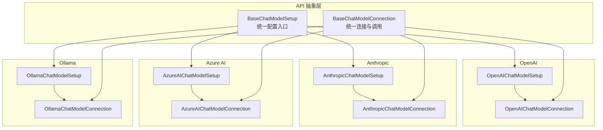
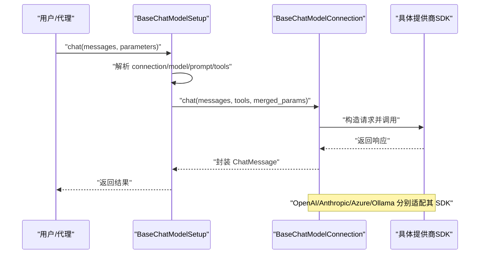
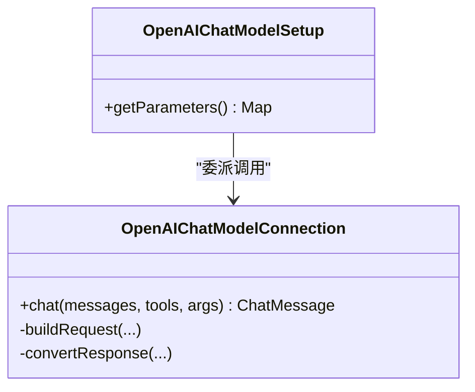
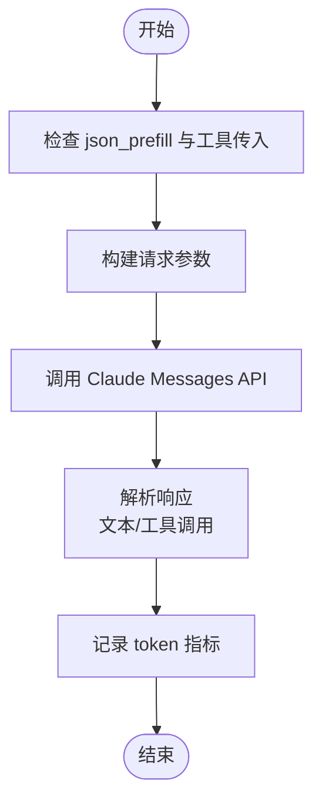
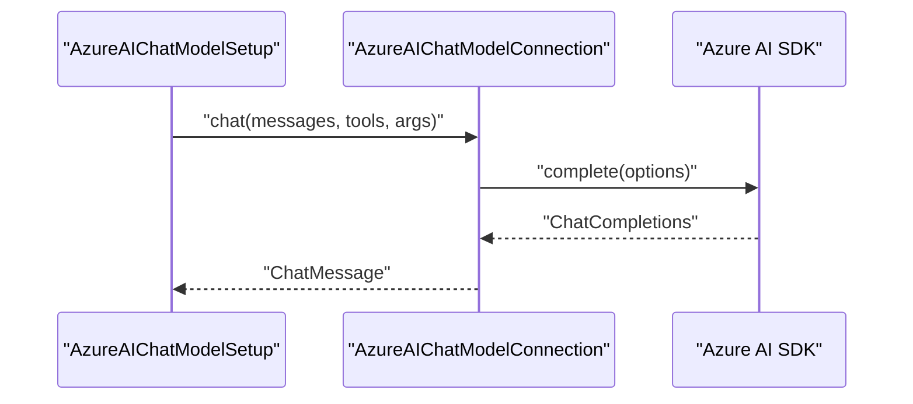
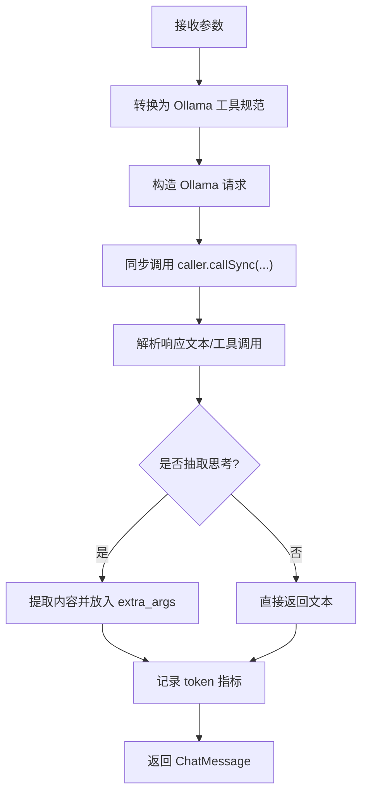
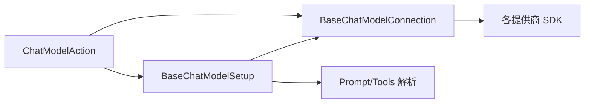

# 聊天模型集成

<cite>
**本文引用的文件**
- [BaseChatModelConnection.java](file://api/src/main/java/org/apache/flink/agents/api/chat/model/BaseChatModelConnection.java)
- [BaseChatModelSetup.java](file://api/src/main/java/org/apache/flink/agents/api/chat/model/BaseChatModelSetup.java)
- [OpenAIChatModelConnection.java](file://integrations/chat-models/openai/src/main/java/org/apache/flink/agents/integrations/chatmodels/openai/OpenAIChatModelConnection.java)
- [OpenAIChatModelSetup.java](file://integrations/chat-models/openai/src/main/java/org/apache/flink/agents/integrations/chatmodels/openai/OpenAIChatModelSetup.java)
- [AnthropicChatModelConnection.java](file://integrations/chat-models/anthropic/src/main/java/org/apache/flink/agents/integrations/chatmodels/anthropic/AnthropicChatModelConnection.java)
- [AnthropicChatModelSetup.java](file://integrations/chat-models/anthropic/src/main/java/org/apache/flink/agents/integrations/chatmodels/anthropic/AnthropicChatModelSetup.java)
- [AzureAIChatModelConnection.java](file://integrations/chat-models/azureai/src/main/java/org/apache/flink/agents/integrations/chatmodels/azureai/AzureAIChatModelConnection.java)
- [AzureAIChatModelSetup.java](file://integrations/chat-models/azureai/src/main/java/org/apache/flink/agents/integrations/chatmodels/azureai/AzureAIChatModelSetup.java)
- [OllamaChatModelConnection.java](file://integrations/chat-models/ollama/src/main/java/org/apache/flink/agents/integrations/chatmodels/ollama/OllamaChatModelConnection.java)
- [OllamaChatModelSetup.java](file://integrations/chat-models/ollama/src/main/java/org/apache/flink/agents/integrations/chatmodels/ollama/OllamaChatModelSetup.java)
- [ChatModelIntegrationTest.java](file://e2e-test/flink-agents-end-to-end-tests-integration/src/test/java/org/apache/flink/agents/integration/test/ChatModelIntegrationTest.java)
- [ChatModelIntegrationAgent.java](file://e2e-test/flink-agents-end-to-end-tests-integration/src/test/java/org/apache/flink/agents/integration/test/ChatModelIntegrationAgent.java)
- [AgentConfigOptions.java](file://api/src/main/java/org/apache/flink/agents/api/configuration/AgentConfigOptions.java)
- [ChatModelAction.java](file://plan/src/main/java/org/apache/flink/agents/plan/actions/ChatModelAction.java)
</cite>

## 目录
1. [简介](#简介)
2. [项目结构](#项目结构)
3. [核心组件](#核心组件)
4. [架构总览](#架构总览)
5. [详细组件分析](#详细组件分析)
6. [依赖关系分析](#依赖关系分析)
7. [性能与可靠性](#性能与可靠性)
8. [故障排除指南](#故障排除指南)
9. [结论](#结论)
10. [附录：配置与示例](#附录配置与示例)

## 简介
本文件系统性梳理 Apache Flink Agents 在聊天模型集成方面的设计与实现，覆盖 OpenAI、Anthropic Claude、Azure AI 以及本地 Ollama 四大提供商。内容包括：
- 统一抽象层（BaseChatModelConnection/BaseChatModelSetup）的设计理念与职责边界
- 各提供商的连接与参数适配方式、认证与超时策略
- 工具调用（Function Calling）与消息格式转换的实现要点
- 连接池与重试策略、指标采集与可观测性
- 面向开发者的配置清单、使用示例与常见问题排查

## 项目结构
Flink Agents 将“资源声明”与“执行适配”解耦：
- 抽象层位于 api 模块，定义通用接口与生命周期
- 各提供商的实现位于 integrations/chat-models 下的子模块
- 端到端测试位于 e2e-test 模块，验证多提供商集成

图表来源
- [BaseChatModelSetup.java](file://api/src/main/java/org/apache/flink/agents/api/chat/model/BaseChatModelSetup.java#L37-L127)
- [BaseChatModelConnection.java](file://api/src/main/java/org/apache/flink/agents/api/chat/model/BaseChatModelConnection.java#L38-L78)
- [OpenAIChatModelSetup.java](file://integrations/chat-models/openai/src/main/java/org/apache/flink/agents/integrations/chatmodels/openai/OpenAIChatModelSetup.java#L61-L219)
- [OpenAIChatModelConnection.java](file://integrations/chat-models/openai/src/main/java/org/apache/flink/agents/integrations/chatmodels/openai/OpenAIChatModelConnection.java#L94-L459)
- [AnthropicChatModelSetup.java](file://integrations/chat-models/anthropic/src/main/java/org/apache/flink/agents/integrations/chatmodels/anthropic/AnthropicChatModelSetup.java#L74-L175)
- [AnthropicChatModelConnection.java](file://integrations/chat-models/anthropic/src/main/java/org/apache/flink/agents/integrations/chatmodels/anthropic/AnthropicChatModelConnection.java#L81-L529)
- [AzureAIChatModelSetup.java](file://integrations/chat-models/azureai/src/main/java/org/apache/flink/agents/integrations/chatmodels/azureai/AzureAIChatModelSetup.java#L51-L66)
- [AzureAIChatModelConnection.java](file://integrations/chat-models/azureai/src/main/java/org/apache/flink/agents/integrations/chatmodels/azureai/AzureAIChatModelConnection.java#L63-L233)
- [OllamaChatModelSetup.java](file://integrations/chat-models/ollama/src/main/java/org/apache/flink/agents/integrations/chatmodels/ollama/OllamaChatModelSetup.java#L56-L99)
- [OllamaChatModelConnection.java](file://integrations/chat-models/ollama/src/main/java/org/apache/flink/agents/integrations/chatmodels/ollama/OllamaChatModelConnection.java#L62-L278)

章节来源
- [BaseChatModelConnection.java](file://api/src/main/java/org/apache/flink/agents/api/chat/model/BaseChatModelConnection.java#L38-L78)
- [BaseChatModelSetup.java](file://api/src/main/java/org/apache/flink/agents/api/chat/model/BaseChatModelSetup.java#L37-L127)

## 核心组件
- BaseChatModelConnection：抽象聊天模型连接，负责统一的连接配置、超时、重试、认证与调用生命周期；提供 token 指标记录能力
- BaseChatModelSetup：抽象聊天模型设置，负责将“连接名+模型参数+工具列表+提示词模板”组装为一次聊天请求，并委派给对应连接执行

关键职责与交互
- Setup 从资源图解析 connection、model、prompt、tools 等参数，构建最终调用参数字典
- Connection 执行实际 API 调用，进行消息格式转换、工具定义转换、响应解析与指标上报
- 统一的异常与重试策略由上层动作层（ChatModelAction）控制

章节来源
- [BaseChatModelConnection.java](file://api/src/main/java/org/apache/flink/agents/api/chat/model/BaseChatModelConnection.java#L38-L78)
- [BaseChatModelSetup.java](file://api/src/main/java/org/apache/flink/agents/api/chat/model/BaseChatModelSetup.java#L54-L101)

## 架构总览
下图展示了从“资源声明”到“实际调用”的完整链路，以及各提供商的适配差异。

图表来源
- [BaseChatModelSetup.java](file://api/src/main/java/org/apache/flink/agents/api/chat/model/BaseChatModelSetup.java#L54-L101)
- [BaseChatModelConnection.java](file://api/src/main/java/org/apache/flink/agents/api/chat/model/BaseChatModelConnection.java#L58-L77)
- [OpenAIChatModelConnection.java](file://integrations/chat-models/openai/src/main/java/org/apache/flink/agents/integrations/chatmodels/openai/OpenAIChatModelConnection.java#L139-L165)
- [AnthropicChatModelConnection.java](file://integrations/chat-models/anthropic/src/main/java/org/apache/flink/agents/integrations/chatmodels/anthropic/AnthropicChatModelConnection.java#L119-L155)
- [AzureAIChatModelConnection.java](file://integrations/chat-models/azureai/src/main/java/org/apache/flink/agents/integrations/chatmodels/azureai/AzureAIChatModelConnection.java#L164-L205)
- [OllamaChatModelConnection.java](file://integrations/chat-models/ollama/src/main/java/org/apache/flink/agents/integrations/chatmodels/ollama/OllamaChatModelConnection.java#L179-L244)

## 详细组件分析

### OpenAI 集成
- 连接参数
  - 必填：api_key
  - 可选：api_base_url、timeout（秒）、max_retries、default_headers、model
- 请求参数
  - 支持 temperature、max_tokens、logprobs/top_logprobs、reasoning_effort、strict、additional_kwargs 等
  - 工具调用通过 Function Definition 定义，支持 strict 模式
- 响应解析
  - 提取 content、refusal、tool_calls 并映射为统一格式
  - 记录 promptTokens/completionTokens 指标
- 错误与重试
  - 通过 SDK 层 maxRetries 与 timeout 控制；上层动作层可配置重试策略

图表来源
- [OpenAIChatModelSetup.java](file://integrations/chat-models/openai/src/main/java/org/apache/flink/agents/integrations/chatmodels/openai/OpenAIChatModelSetup.java#L154-L178)
- [OpenAIChatModelConnection.java](file://integrations/chat-models/openai/src/main/java/org/apache/flink/agents/integrations/chatmodels/openai/OpenAIChatModelConnection.java#L139-L165)

章节来源
- [OpenAIChatModelConnection.java](file://integrations/chat-models/openai/src/main/java/org/apache/flink/agents/integrations/chatmodels/openai/OpenAIChatModelConnection.java#L94-L137)
- [OpenAIChatModelConnection.java](file://integrations/chat-models/openai/src/main/java/org/apache/flink/agents/integrations/chatmodels/openai/OpenAIChatModelConnection.java#L167-L226)
- [OpenAIChatModelConnection.java](file://integrations/chat-models/openai/src/main/java/org/apache/flink/agents/integrations/chatmodels/openai/OpenAIChatModelConnection.java#L356-L403)
- [OpenAIChatModelSetup.java](file://integrations/chat-models/openai/src/main/java/org/apache/flink/agents/integrations/chatmodels/openai/OpenAIChatModelSetup.java#L61-L127)

### Anthropic Claude 集成
- 连接参数
  - 必填：api_key
  - 可选：timeout、max_retries、model
- 请求参数
  - 支持 temperature、max_tokens、strict_tools、json_prefill、additional_kwargs（如 top_k、top_p、stop_sequences）
  - json_prefill 与工具调用互斥，自动禁用
- 响应解析
  - 支持 text 内容与 tool_use 块；当无工具调用时尝试从 Markdown 代码块提取 JSON
  - 记录 inputTokens/outputTokens 指标
- 错误与重试
  - SDK 层 maxRetries 与 timeout；上层动作层可配置重试策略

图表来源
- [AnthropicChatModelConnection.java](file://integrations/chat-models/anthropic/src/main/java/org/apache/flink/agents/integrations/chatmodels/anthropic/AnthropicChatModelConnection.java#L119-L155)
- [AnthropicChatModelConnection.java](file://integrations/chat-models/anthropic/src/main/java/org/apache/flink/agents/integrations/chatmodels/anthropic/AnthropicChatModelConnection.java#L366-L421)

章节来源
- [AnthropicChatModelConnection.java](file://integrations/chat-models/anthropic/src/main/java/org/apache/flink/agents/integrations/chatmodels/anthropic/AnthropicChatModelConnection.java#L81-L112)
- [AnthropicChatModelConnection.java](file://integrations/chat-models/anthropic/src/main/java/org/apache/flink/agents/integrations/chatmodels/anthropic/AnthropicChatModelConnection.java#L157-L233)
- [AnthropicChatModelConnection.java](file://integrations/chat-models/anthropic/src/main/java/org/apache/flink/agents/integrations/chatmodels/anthropic/AnthropicChatModelConnection.java#L434-L463)
- [AnthropicChatModelSetup.java](file://integrations/chat-models/anthropic/src/main/java/org/apache/flink/agents/integrations/chatmodels/anthropic/AnthropicChatModelSetup.java#L74-L124)

### Azure AI 集成
- 连接参数
  - 必填：endpoint、apiKey
- 请求参数
  - 仅 model 作为参数透传至 ChatCompletionsOptions
  - 工具通过 FunctionDefinition 结构传递
- 响应解析
  - 解析 assistant 内容与 tool_calls，转换为统一格式
  - 记录 promptTokens/completionTokens 指标
- 错误与重试
  - 通过 SDK 层配置；上层动作层可配置重试策略

图表来源
- [AzureAIChatModelSetup.java](file://integrations/chat-models/azureai/src/main/java/org/apache/flink/agents/integrations/chatmodels/azureai/AzureAIChatModelSetup.java#L51-L66)
- [AzureAIChatModelConnection.java](file://integrations/chat-models/azureai/src/main/java/org/apache/flink/agents/integrations/chatmodels/azureai/AzureAIChatModelConnection.java#L164-L205)

章节来源
- [AzureAIChatModelConnection.java](file://integrations/chat-models/azureai/src/main/java/org/apache/flink/agents/integrations/chatmodels/azureai/AzureAIChatModelConnection.java#L63-L90)
- [AzureAIChatModelConnection.java](file://integrations/chat-models/azureai/src/main/java/org/apache/flink/agents/integrations/chatmodels/azureai/AzureAIChatModelConnection.java#L164-L205)
- [AzureAIChatModelSetup.java](file://integrations/chat-models/azureai/src/main/java/org/apache/flink/agents/integrations/chatmodels/azureai/AzureAIChatModelSetup.java#L51-L66)

### Ollama 集成
- 连接参数
  - 必填：endpoint
  - 可选：requestTimeout
- 请求参数
  - model、think（映射为 ThinkMode）、extract_reasoning（抽取<think>...</think>）
  - 工具通过 Ollama 工具规范转换
- 响应解析
  - 提取 assistant 文本与 tool_calls，附加 reasoning 到 extra_args
  - 记录 promptEvalCount/evalCount 指标
- 错误与重试
  - 通过 SDK 层配置；上层动作层可配置重试策略

图表来源
- [OllamaChatModelConnection.java](file://integrations/chat-models/ollama/src/main/java/org/apache/flink/agents/integrations/chatmodels/ollama/OllamaChatModelConnection.java#L179-L244)
- [OllamaChatModelConnection.java](file://integrations/chat-models/ollama/src/main/java/org/apache/flink/agents/integrations/chatmodels/ollama/OllamaChatModelConnection.java#L257-L277)

章节来源
- [OllamaChatModelConnection.java](file://integrations/chat-models/ollama/src/main/java/org/apache/flink/agents/integrations/chatmodels/ollama/OllamaChatModelConnection.java#L62-L84)
- [OllamaChatModelConnection.java](file://integrations/chat-models/ollama/src/main/java/org/apache/flink/agents/integrations/chatmodels/ollama/OllamaChatModelConnection.java#L179-L244)
- [OllamaChatModelSetup.java](file://integrations/chat-models/ollama/src/main/java/org/apache/flink/agents/integrations/chatmodels/ollama/OllamaChatModelSetup.java#L56-L99)

## 依赖关系分析
- BaseChatModelSetup 依赖 Resource 图解析 connection、prompt、tools，并将参数合并后委派给 BaseChatModelConnection
- 各提供商 Connection 仅关注自身 SDK 的请求/响应转换与指标上报
- 上层动作层（ChatModelAction）负责重试、忽略或抛出异常等错误处理策略

图表来源
- [BaseChatModelSetup.java](file://api/src/main/java/org/apache/flink/agents/api/chat/model/BaseChatModelSetup.java#L54-L101)
- [ChatModelAction.java](file://plan/src/main/java/org/apache/flink/agents/plan/actions/ChatModelAction.java#L236-L270)

章节来源
- [BaseChatModelSetup.java](file://api/src/main/java/org/apache/flink/agents/api/chat/model/BaseChatModelSetup.java#L54-L101)
- [ChatModelAction.java](file://plan/src/main/java/org/apache/flink/agents/plan/actions/ChatModelAction.java#L236-L270)

## 性能与可靠性
- 连接与超时
  - OpenAI：支持 timeout、max_retries、default_headers
  - Anthropic：支持 timeout、max_retries
  - Azure AI：通过 SDK 凭据与 endpoint 构建客户端
  - Ollama：支持 requestTimeout
- 指标采集
  - 统一通过 recordTokenMetrics 记录 promptTokens/completionTokens 或等价指标
- 重试策略
  - SDK 层 maxRetries（OpenAI/Anthropic）与上层动作层重试策略组合使用
  - ChatModelAction 支持 IGNORE/RETRY/FAIL 三种策略与最大重试次数

章节来源
- [OpenAIChatModelConnection.java](file://integrations/chat-models/openai/src/main/java/org/apache/flink/agents/integrations/chatmodels/openai/OpenAIChatModelConnection.java#L118-L126)
- [AnthropicChatModelConnection.java](file://integrations/chat-models/anthropic/src/main/java/org/apache/flink/agents/integrations/chatmodels/anthropic/AnthropicChatModelConnection.java#L100-L108)
- [AzureAIChatModelConnection.java](file://integrations/chat-models/azureai/src/main/java/org/apache/flink/agents/integrations/chatmodels/azureai/AzureAIChatModelConnection.java#L80-L90)
- [OllamaChatModelConnection.java](file://integrations/chat-models/ollama/src/main/java/org/apache/flink/agents/integrations/chatmodels/ollama/OllamaChatModelConnection.java#L80-L84)
- [BaseChatModelConnection.java](file://api/src/main/java/org/apache/flink/agents/api/chat/model/BaseChatModelConnection.java#L68-L77)
- [ChatModelAction.java](file://plan/src/main/java/org/apache/flink/agents/plan/actions/ChatModelAction.java#L236-L270)

## 故障排除指南
- 认证失败
  - OpenAI：确认 api_key 非空且有效；检查 api_base_url 是否正确
  - Anthropic：确认 api_key 非空
  - Azure AI：确认 endpoint 与 apiKey 正确
  - Ollama：确认 endpoint 可达且无需鉴权
- 连接超时
  - OpenAI/Anthropic：增大 timeout、max_retries
  - Azure AI/Ollama：调整 requestTimeout
- 工具调用异常
  - OpenAI：确保工具 schema JSON 正确；strict 模式需严格匹配
  - Anthropic：json_prefill 与工具调用互斥；必要时关闭 json_prefill
  - Azure AI/Ollama：确保工具 schema 符合各自规范
- 上层重试与忽略
  - 使用 ChatModelAction 的重试策略与错误处理策略，避免单次失败导致任务中断

章节来源
- [OpenAIChatModelConnection.java](file://integrations/chat-models/openai/src/main/java/org/apache/flink/agents/integrations/chatmodels/openai/OpenAIChatModelConnection.java#L106-L136)
- [AnthropicChatModelConnection.java](file://integrations/chat-models/anthropic/src/main/java/org/apache/flink/agents/integrations/chatmodels/anthropic/AnthropicChatModelConnection.java#L93-L112)
- [AzureAIChatModelConnection.java](file://integrations/chat-models/azureai/src/main/java/org/apache/flink/agents/integrations/chatmodels/azureai/AzureAIChatModelConnection.java#L80-L90)
- [OllamaChatModelConnection.java](file://integrations/chat-models/ollama/src/main/java/org/apache/flink/agents/integrations/chatmodels/ollama/OllamaChatModelConnection.java#L76-L84)
- [ChatModelAction.java](file://plan/src/main/java/org/apache/flink/agents/plan/actions/ChatModelAction.java#L236-L270)

## 结论
Flink Agents 通过统一的抽象层屏蔽了不同聊天模型提供商的差异，使开发者能够以一致的方式声明连接与参数，并在运行时按需切换提供商。OpenAI 提供最丰富的参数与工具能力；Anthropic 在结构化输出与 JSON 强约束方面有优势；Azure AI 适合企业级托管场景；Ollama 适合本地私有部署。结合 SDK 层与上层动作层的重试与错误处理策略，可在生产环境中获得稳定可靠的体验。

## 附录：配置与示例

### 环境变量与端点配置
- OpenAI
  - OPENAI_API_KEY：必填
  - OPENAI_BASE_URL：可选，默认官方域名
- Anthropic
  - ANTHROPIC_API_KEY：必填
- Azure AI
  - AZURE_AI_ENDPOINT：必填
  - AZURE_AI_KEY：必填
- Ollama
  - OLLAMA_ENDPOINT：默认 http://localhost:11434

章节来源
- [ChatModelIntegrationTest.java](file://e2e-test/flink-agents-end-to-end-tests-integration/src/test/java/org/apache/flink/agents/integration/test/ChatModelIntegrationTest.java#L56-L62)
- [ChatModelIntegrationAgent.java](file://e2e-test/flink-agents-end-to-end-tests-integration/src/test/java/org/apache/flink/agents/integration/test/ChatModelIntegrationAgent.java#L88-L96)

### 参数与模型选择建议
- OpenAI
  - 推荐模型：gpt-4o-mini（轻量）、gpt-4o（综合）、gpt-4-turbo（推理）
  - 关键参数：temperature、max_tokens、reasoning_effort、strict
- Anthropic
  - 推荐模型：claude-3-5-sonnet-latest、claude-3-opus-latest
  - 关键参数：temperature、max_tokens、strict_tools、json_prefill
- Azure AI
  - 推荐模型：gpt-4o、gpt-4-turbo
  - 关键参数：model（与已部署模型一致）
- Ollama
  - 推荐模型：qwen3:4b、llama3.2:1b
  - 关键参数：model、think、extract_reasoning

章节来源
- [OpenAIChatModelSetup.java](file://integrations/chat-models/openai/src/main/java/org/apache/flink/agents/integrations/chatmodels/openai/OpenAIChatModelSetup.java#L61-L127)
- [AnthropicChatModelSetup.java](file://integrations/chat-models/anthropic/src/main/java/org/apache/flink/agents/integrations/chatmodels/anthropic/AnthropicChatModelSetup.java#L74-L124)
- [AzureAIChatModelSetup.java](file://integrations/chat-models/azureai/src/main/java/org/apache/flink/agents/integrations/chatmodels/azureai/AzureAIChatModelSetup.java#L51-L66)
- [OllamaChatModelSetup.java](file://integrations/chat-models/ollama/src/main/java/org/apache/flink/agents/integrations/chatmodels/ollama/OllamaChatModelSetup.java#L56-L99)

### 在代理中使用不同模型的步骤
- 声明连接资源（@ChatModelConnection）
  - OpenAI：api_key、api_base_url、timeout、max_retries、default_headers、model
  - Anthropic：api_key、timeout、max_retries、model
  - Azure AI：endpoint、apiKey
  - Ollama：endpoint、requestTimeout
- 声明设置资源（@ChatModelSetup）
  - OpenAI：connection、model、temperature、max_tokens、strict、reasoning_effort、tools、additional_kwargs
  - Anthropic：connection、model、temperature、max_tokens、strict_tools、json_prefill、tools、additional_kwargs
  - Azure AI：connection、model、tools、prompt
  - Ollama：connection、model、think、extract_reasoning、tools、prompt
- 在动作中调用 chat 方法，传入 messages 与可选参数

章节来源
- [OpenAIChatModelConnection.java](file://integrations/chat-models/openai/src/main/java/org/apache/flink/agents/integrations/chatmodels/openai/OpenAIChatModelConnection.java#L102-L137)
- [AnthropicChatModelConnection.java](file://integrations/chat-models/anthropic/src/main/java/org/apache/flink/agents/integrations/chatmodels/anthropic/AnthropicChatModelConnection.java#L89-L112)
- [AzureAIChatModelConnection.java](file://integrations/chat-models/azureai/src/main/java/org/apache/flink/agents/integrations/chatmodels/azureai/AzureAIChatModelConnection.java#L76-L90)
- [OllamaChatModelConnection.java](file://integrations/chat-models/ollama/src/main/java/org/apache/flink/agents/integrations/chatmodels/ollama/OllamaChatModelConnection.java#L73-L99)
- [OpenAIChatModelSetup.java](file://integrations/chat-models/openai/src/main/java/org/apache/flink/agents/integrations/chatmodels/openai/OpenAIChatModelSetup.java#L77-L127)
- [AnthropicChatModelSetup.java](file://integrations/chat-models/anthropic/src/main/java/org/apache/flink/agents/integrations/chatmodels/anthropic/AnthropicChatModelSetup.java#L88-L124)
- [AzureAIChatModelSetup.java](file://integrations/chat-models/azureai/src/main/java/org/apache/flink/agents/integrations/chatmodels/azureai/AzureAIChatModelSetup.java#L53-L57)
- [OllamaChatModelSetup.java](file://integrations/chat-models/ollama/src/main/java/org/apache/flink/agents/integrations/chatmodels/ollama/OllamaChatModelSetup.java#L62-L89)