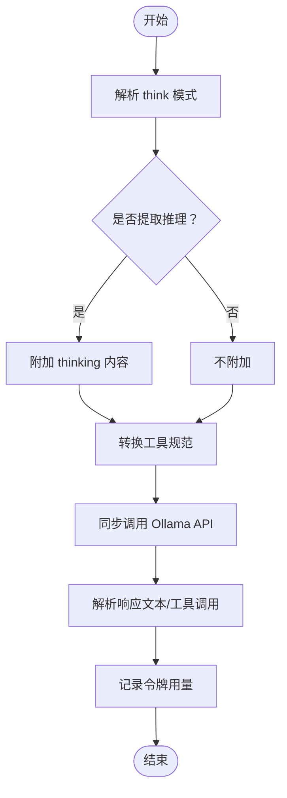

# 集成系统

<cite>
**本文引用的文件**
- [README.md](file://README.md)
- [api/pom.xml](file://api/pom.xml)
- [integrations/pom.xml](file://integrations/pom.xml)
- [python/pyproject.toml](file://python/pyproject.toml)
- [OpenAI 聊天模型连接](file://integrations/chat-models/openai/src/main/java/org/apache/flink/agents/integrations/chatmodels/openai/OpenAIChatModelConnection.java)
- [Anthropic 聊天模型连接](file://integrations/chat-models/anthropic/src/main/java/org/apache/flink/agents/integrations/chatmodels/anthropic/AnthropicChatModelConnection.java)
- [Azure AI 聊天模型连接](file://integrations/chat-models/azureai/src/main/java/org/apache/flink/agents/integrations/chatmodels/azureai/AzureAIChatModelConnection.java)
- [Ollama 聊天模型连接](file://integrations/chat-models/ollama/src/main/java/org/apache/flink/agents/integrations/chatmodels/ollama/OllamaChatModelConnection.java)
- [Ollama 嵌入模型连接](file://integrations/embedding-models/ollama/src/main/java/org/apache/flink/agents/integrations/embeddingmodels/ollama/OllamaEmbeddingModelConnection.java)
- [Elasticsearch 向量存储](file://integrations/vector-stores/elasticsearch/src/main/java/org/apache/flink/agents/integrations/vectorstores/elasticsearch/ElasticsearchVectorStore.java)
- [MCP 服务器](file://integrations/mcp/src/main/java/org/apache/flink/agents/integrations/mcp/MCPServer.java)
- [MCP 认证接口](file://integrations/mcp/src/main/java/org/apache/flink/agents/integrations/mcp/auth/Auth.java)
</cite>

## 目录
1. [简介](#简介)
2. [项目结构](#项目结构)
3. [核心组件](#核心组件)
4. [架构总览](#架构总览)
5. [详细组件分析](#详细组件分析)
6. [依赖关系分析](#依赖关系分析)
7. [性能考量](#性能考量)
8. [故障排除指南](#故障排除指南)
9. [结论](#结论)
10. [附录](#附录)

## 简介
本文件面向需要扩展 Apache Flink Agents 集成能力的开发者，系统性梳理并说明框架对多种外部服务的集成方案，包括：
- 聊天模型：OpenAI、Anthropic、Azure AI、Ollama
- 嵌入模型：Ollama
- 向量存储：Elasticsearch
- MCP 协议支持：通过统一资源抽象暴露工具与提示词

文档覆盖配置方法、认证机制、使用限制、性能与最佳实践、自定义集成开发指南以及常见问题排查。

## 项目结构
项目采用多模块组织，核心 API 模块提供通用抽象，各集成模块在独立子模块中实现具体适配器。Python 包含跨语言桥接与端到端测试资源。

图表来源
- [api/pom.xml](file://api/pom.xml#L30-L65)
- [integrations/pom.xml](file://integrations/pom.xml#L33-L45)
- [python/pyproject.toml](file://python/pyproject.toml#L44-L59)

章节来源
- [README.md](file://README.md#L1-L44)
- [api/pom.xml](file://api/pom.xml#L30-L65)
- [integrations/pom.xml](file://integrations/pom.xml#L33-L45)
- [python/pyproject.toml](file://python/pyproject.toml#L44-L59)

## 核心组件
- 聊天模型连接：封装第三方 LLM API，负责消息格式转换、工具调用、参数透传与令牌用量统计。
- 嵌入模型连接：将文本转为向量，支持单条与批量处理。
- 向量存储：基于 Elasticsearch 的近似最近邻检索，支持集合管理、过滤查询与批量写入。
- MCP 服务器：通过 HTTP/SSE 连接 MCP 服务器，列举工具与提示词，并进行调用。

章节来源
- [OpenAI 聊天模型连接](file://integrations/chat-models/openai/src/main/java/org/apache/flink/agents/integrations/chatmodels/openai/OpenAIChatModelConnection.java#L62-L93)
- [Anthropic 聊天模型连接](file://integrations/chat-models/anthropic/src/main/java/org/apache/flink/agents/integrations/chatmodels/anthropic/AnthropicChatModelConnection.java#L55-L80)
- [Azure AI 聊天模型连接](file://integrations/chat-models/azureai/src/main/java/org/apache/flink/agents/integrations/chatmodels/azureai/AzureAIChatModelConnection.java#L40-L62)
- [Ollama 聊天模型连接](file://integrations/chat-models/ollama/src/main/java/org/apache/flink/agents/integrations/chatmodels/ollama/OllamaChatModelConnection.java#L40-L61)
- [Ollama 嵌入模型连接](file://integrations/embedding-models/ollama/src/main/java/org/apache/flink/agents/integrations/embeddingmodels/ollama/OllamaEmbeddingModelConnection.java#L34-L35)
- [Elasticsearch 向量存储](file://integrations/vector-stores/elasticsearch/src/main/java/org/apache/flink/agents/integrations/vectorstores/elasticsearch/ElasticsearchVectorStore.java#L74-L117)
- [MCP 服务器](file://integrations/mcp/src/main/java/org/apache/flink/agents/integrations/mcp/MCPServer.java#L50-L77)

## 架构总览
下图展示从代理到外部服务的典型调用链路与数据流。

图表来源
- [OpenAI 聊天模型连接](file://integrations/chat-models/openai/src/main/java/org/apache/flink/agents/integrations/chatmodels/openai/OpenAIChatModelConnection.java#L139-L165)
- [Anthropic 聊天模型连接](file://integrations/chat-models/anthropic/src/main/java/org/apache/flink/agents/integrations/chatmodels/anthropic/AnthropicChatModelConnection.java#L120-L155)
- [Azure AI 聊天模型连接](file://integrations/chat-models/azureai/src/main/java/org/apache/flink/agents/integrations/chatmodels/azureai/AzureAIChatModelConnection.java#L164-L205)
- [Ollama 聊天模型连接](file://integrations/chat-models/ollama/src/main/java/org/apache/flink/agents/integrations/chatmodels/ollama/OllamaChatModelConnection.java#L179-L244)

## 详细组件分析

### OpenAI 聊天模型集成
- 支持参数
  - 必填：api_key
  - 可选：api_base_url、timeout（秒）、max_retries、default_headers、model
- 特性
  - 工具调用：函数式工具，支持严格模式
  - 日志概率：可开启 logprobs 与 top_logprobs
  - 推理努力：reasoning_effort
  - 附加参数：additional_kwargs 透传至请求体
  - 令牌用量：根据响应 usage 统计
- 使用限制
  - api_key 必须非空；超时与重试次数需为非负数
- 配置示例（路径）
  - [OpenAI 聊天模型连接](file://integrations/chat-models/openai/src/main/java/org/apache/flink/agents/integrations/chatmodels/openai/OpenAIChatModelConnection.java#L77-L92)

图表来源
- [OpenAI 聊天模型连接](file://integrations/chat-models/openai/src/main/java/org/apache/flink/agents/integrations/chatmodels/openai/OpenAIChatModelConnection.java#L102-L137)
- [OpenAI 聊天模型连接](file://integrations/chat-models/openai/src/main/java/org/apache/flink/agents/integrations/chatmodels/openai/OpenAIChatModelConnection.java#L167-L226)
- [OpenAI 聊天模型连接](file://integrations/chat-models/openai/src/main/java/org/apache/flink/agents/integrations/chatmodels/openai/OpenAIChatModelConnection.java#L356-L374)

章节来源
- [OpenAI 聊天模型连接](file://integrations/chat-models/openai/src/main/java/org/apache/flink/agents/integrations/chatmodels/openai/OpenAIChatModelConnection.java#L62-L137)
- [OpenAI 聊天模型连接](file://integrations/chat-models/openai/src/main/java/org/apache/flink/agents/integrations/chatmodels/openai/OpenAIChatModelConnection.java#L139-L226)
- [OpenAI 聊天模型连接](file://integrations/chat-models/openai/src/main/java/org/apache/flink/agents/integrations/chatmodels/openai/OpenAIChatModelConnection.java#L228-L453)

### Anthropic 聊天模型集成
- 支持参数
  - 必填：api_key
  - 可选：timeout、max_retries、model
- 特性
  - 严格工具：strict_tools，启用结构化输出
  - JSON 预填充：json_prefill 强制 JSON 输出（禁用原生工具调用）
  - 头部透传：anthropic-beta 结构化输出头
  - 令牌用量：inputTokens/outputTokens
- 使用限制
  - 工具调用与 JSON 预填充互斥
- 配置示例（路径）
  - [Anthropic 聊天模型连接](file://integrations/chat-models/anthropic/src/main/java/org/apache/flink/agents/integrations/chatmodels/anthropic/AnthropicChatModelConnection.java#L56-L80)

图表来源
- [Anthropic 聊天模型连接](file://integrations/chat-models/anthropic/src/main/java/org/apache/flink/agents/integrations/chatmodels/anthropic/AnthropicChatModelConnection.java#L120-L233)
- [Anthropic 聊天模型连接](file://integrations/chat-models/anthropic/src/main/java/org/apache/flink/agents/integrations/chatmodels/anthropic/AnthropicChatModelConnection.java#L366-L421)
- [Anthropic 聊天模型连接](file://integrations/chat-models/anthropic/src/main/java/org/apache/flink/agents/integrations/chatmodels/anthropic/AnthropicChatModelConnection.java#L434-L463)

章节来源
- [Anthropic 聊天模型连接](file://integrations/chat-models/anthropic/src/main/java/org/apache/flink/agents/integrations/chatmodels/anthropic/AnthropicChatModelConnection.java#L55-L112)
- [Anthropic 聊天模型连接](file://integrations/chat-models/anthropic/src/main/java/org/apache/flink/agents/integrations/chatmodels/anthropic/AnthropicChatModelConnection.java#L157-L233)
- [Anthropic 聊天模型连接](file://integrations/chat-models/anthropic/src/main/java/org/apache/flink/agents/integrations/chatmodels/anthropic/AnthropicChatModelConnection.java#L366-L463)

### Azure AI 聊天模型集成
- 支持参数
  - 必填：endpoint、apiKey
- 特性
  - 工具调用：函数式工具定义
  - 令牌用量：promptTokens/completionTokens
- 使用限制
  - endpoint 必须非空
- 配置示例（路径）
  - [Azure AI 聊天模型连接](file://integrations/chat-models/azureai/src/main/java/org/apache/flink/agents/integrations/chatmodels/azureai/AzureAIChatModelConnection.java#L48-L62)

图表来源
- [Azure AI 聊天模型连接](file://integrations/chat-models/azureai/src/main/java/org/apache/flink/agents/integrations/chatmodels/azureai/AzureAIChatModelConnection.java#L164-L205)

章节来源
- [Azure AI 聊天模型连接](file://integrations/chat-models/azureai/src/main/java/org/apache/flink/agents/integrations/chatmodels/azureai/AzureAIChatModelConnection.java#L40-L90)
- [Azure AI 聊天模型连接](file://integrations/chat-models/azureai/src/main/java/org/apache/flink/agents/integrations/chatmodels/azureai/AzureAIChatModelConnection.java#L164-L232)

### Ollama 聊天模型集成
- 支持参数
  - 必填：endpoint
  - 可选：requestTimeout（秒）
- 特性
  - 思维模式：think（启用/禁用/仅思考）
  - 推理提取：extract_reasoning 控制是否附加思考内容
  - 工具调用：本地工具规范转换
  - 令牌用量：promptEvalCount/evalCount
- 使用限制
  - endpoint 必须非空
- 配置示例（路径）
  - [Ollama 聊天模型连接](file://integrations/chat-models/ollama/src/main/java/org/apache/flink/agents/integrations/chatmodels/ollama/OllamaChatModelConnection.java#L48-L61)

图表来源
- [Ollama 聊天模型连接](file://integrations/chat-models/ollama/src/main/java/org/apache/flink/agents/integrations/chatmodels/ollama/OllamaChatModelConnection.java#L179-L244)

章节来源
- [Ollama 聊天模型连接](file://integrations/chat-models/ollama/src/main/java/org/apache/flink/agents/integrations/chatmodels/ollama/OllamaChatModelConnection.java#L62-L84)
- [Ollama 聊天模型连接](file://integrations/chat-models/ollama/src/main/java/org/apache/flink/agents/integrations/chatmodels/ollama/OllamaChatModelConnection.java#L179-L277)

### Ollama 嵌入模型集成
- 支持参数
  - 可选：host（默认 http://localhost:11434）、model（默认 nomic-embed-text）
- 特性
  - 自动拉取模型
  - 单条与批量嵌入
  - 浮点数组输出
- 使用限制
  - 输入文本为空或返回嵌入数量不匹配时抛出异常
- 配置示例（路径）
  - [Ollama 嵌入模型连接](file://integrations/embedding-models/ollama/src/main/java/org/apache/flink/agents/integrations/embeddingmodels/ollama/OllamaEmbeddingModelConnection.java#L34-L53)

图表来源
- [Ollama 嵌入模型连接](file://integrations/embedding-models/ollama/src/main/java/org/apache/flink/agents/integrations/embeddingmodels/ollama/OllamaEmbeddingModelConnection.java#L55-L83)
- [Ollama 嵌入模型连接](file://integrations/embedding-models/ollama/src/main/java/org/apache/flink/agents/integrations/embeddingmodels/ollama/OllamaEmbeddingModelConnection.java#L85-L117)

章节来源
- [Ollama 嵌入模型连接](file://integrations/embedding-models/ollama/src/main/java/org/apache/flink/agents/integrations/embeddingmodels/ollama/OllamaEmbeddingModelConnection.java#L34-L53)
- [Ollama 嵌入模型连接](file://integrations/embedding-models/ollama/src/main/java/org/apache/flink/agents/integrations/embeddingmodels/ollama/OllamaEmbeddingModelConnection.java#L55-L117)

### Elasticsearch 向量存储集成
- 支持参数（资源描述符）
  - 必填：index、vector_field
  - 可选：content_field、metadata_field、dims（默认 768）、k、num_candidates、filter_query、store_in_content_field（默认 true）
  - 连接：host 或 hosts（逗号分隔），认证支持 API Key（base64 或 id/secret）或 Basic Auth
- 特性
  - 集合管理：创建/获取/删除索引及元数据索引
  - 查询：KNN 向量检索，支持过滤查询、limit/offset
  - 写入：批量索引，自动刷新
  - 读取：按 ID 批量获取或全量检索
  - 删除：按 ID 批量删除或按过滤条件删除
- 使用限制
  - k 应不小于 num_candidates
  - 默认最大结果窗口为 10000
- 配置示例（路径）
  - [Elasticsearch 向量存储](file://integrations/vector-stores/elasticsearch/src/main/java/org/apache/flink/agents/integrations/vectorstores/elasticsearch/ElasticsearchVectorStore.java#L84-L116)

图表来源
- [Elasticsearch 向量存储](file://integrations/vector-stores/elasticsearch/src/main/java/org/apache/flink/agents/integrations/vectorstores/elasticsearch/ElasticsearchVectorStore.java#L702-L741)

章节来源
- [Elasticsearch 向量存储](file://integrations/vector-stores/elasticsearch/src/main/java/org/apache/flink/agents/integrations/vectorstores/elasticsearch/ElasticsearchVectorStore.java#L74-L250)
- [Elasticsearch 向量存储](file://integrations/vector-stores/elasticsearch/src/main/java/org/apache/flink/agents/integrations/vectorstores/elasticsearch/ElasticsearchVectorStore.java#L257-L480)
- [Elasticsearch 向量存储](file://integrations/vector-stores/elasticsearch/src/main/java/org/apache/flink/agents/integrations/vectorstores/elasticsearch/ElasticsearchVectorStore.java#L481-L800)

### MCP 协议支持
- 资源类型：MCP_SERVER
- 认证方式：Bearer Token、Basic Auth、API Key（通过自定义头部）
- 功能：列举工具与提示词、按名称获取工具/提示词、调用工具、获取提示词消息
- 使用限制：endpoint 必须为 http/https 有效 URL
- 配置示例（路径）
  - [MCP 服务器](file://integrations/mcp/src/main/java/org/apache/flink/agents/integrations/mcp/MCPServer.java#L50-L77)
  - [MCP 认证接口](file://integrations/mcp/src/main/java/org/apache/flink/agents/integrations/mcp/auth/Auth.java#L27-L43)

图表来源
- [MCP 服务器](file://integrations/mcp/src/main/java/org/apache/flink/agents/integrations/mcp/MCPServer.java#L265-L390)

章节来源
- [MCP 服务器](file://integrations/mcp/src/main/java/org/apache/flink/agents/integrations/mcp/MCPServer.java#L50-L194)
- [MCP 服务器](file://integrations/mcp/src/main/java/org/apache/flink/agents/integrations/mcp/MCPServer.java#L200-L240)
- [MCP 服务器](file://integrations/mcp/src/main/java/org/apache/flink/agents/integrations/mcp/MCPServer.java#L265-L390)
- [MCP 认证接口](file://integrations/mcp/src/main/java/org/apache/flink/agents/integrations/mcp/auth/Auth.java#L27-L60)

## 依赖关系分析
- Java 侧依赖
  - flink-metrics-core、flink-streaming-java、flink-table-api-java 等用于指标与流处理
  - 第三方 SDK：OpenAI、Anthropic、Azure AI Inference、Ollama4j、Elasticsearch 客户端
- Python 侧依赖
  - mcp、ollama、openai、anthropic、chromadb 等
- 集成模块版本
  - ollama4j、elasticsearch、openai、anthropic 等由父 POM 统一声明

图表来源
- [integrations/pom.xml](file://integrations/pom.xml#L33-L38)
- [api/pom.xml](file://api/pom.xml#L30-L65)
- [python/pyproject.toml](file://python/pyproject.toml#L44-L59)

章节来源
- [integrations/pom.xml](file://integrations/pom.xml#L33-L38)
- [api/pom.xml](file://api/pom.xml#L30-L65)
- [python/pyproject.toml](file://python/pyproject.toml#L44-L59)

## 性能考量
- 连接与超时
  - OpenAI/Anthropic/Azure AI：支持 timeout 与 max_retries，建议结合服务端限流策略设置合理重试上限
  - Ollama：requestTimeout 控制请求超时
  - Elasticsearch：REST 客户端默认超时可通过上层参数传递
- 令牌用量
  - 各聊天模型连接在成功响应后记录 promptTokens/completionTokens，便于成本控制与监控
- 批量写入
  - Elasticsearch 使用批量请求（Bulk）提升写入吞吐，注意错误检查与重试
- 查询优化
  - KNN 查询的 num_candidates 与 k 需平衡召回与性能；filter_query 会增加后处理开销
- 并发与资源
  - 建议在代理层面控制并发度，避免对第三方服务造成瞬时压力
  - 对于本地 Ollama，确保模型已拉取并驻留内存以减少冷启动

[本节为通用指导，无需特定文件来源]

## 故障排除指南
- OpenAI
  - 缺少 api_key 或为空：抛出非法参数异常
  - 请求失败：捕获运行时异常并包含原始错误
  - 响应无选择：抛出状态异常
  - 参考路径
    - [OpenAI 聊天模型连接](file://integrations/chat-models/openai/src/main/java/org/apache/flink/agents/integrations/chatmodels/openai/OpenAIChatModelConnection.java#L106-L109)
    - [OpenAI 聊天模型连接](file://integrations/chat-models/openai/src/main/java/org/apache/flink/agents/integrations/chatmodels/openai/OpenAIChatModelConnection.java#L162-L165)
    - [OpenAI 聊天模型连接](file://integrations/chat-models/openai/src/main/java/org/apache/flink/agents/integrations/chatmodels/openai/OpenAIChatModelConnection.java#L358-L360)
- Anthropic
  - 工具调用与 JSON 预填充冲突：自动禁用 JSON 预填充
  - 令牌用量缺失：当模型名不可用时不记录
  - 参考路径
    - [Anthropic 聊天模型连接](file://integrations/chat-models/anthropic/src/main/java/org/apache/flink/agents/integrations/chatmodels/anthropic/AnthropicChatModelConnection.java#L127-L132)
    - [Anthropic 聊天模型连接](file://integrations/chat-models/anthropic/src/main/java/org/apache/flink/agents/integrations/chatmodels/anthropic/AnthropicChatModelConnection.java#L146-L149)
- Azure AI
  - endpoint 为空：抛出非法参数异常
  - 工具调用转换：确保输入 schema 正确解析
  - 参考路径
    - [Azure AI 聊天模型连接](file://integrations/chat-models/azureai/src/main/java/org/apache/flink/agents/integrations/chatmodels/azureai/AzureAIChatModelConnection.java#L80-L84)
    - [Azure AI 聊天模型连接](file://integrations/chat-models/azureai/src/main/java/org/apache/flink/agents/integrations/chatmodels/azureai/AzureAIChatModelConnection.java#L92-L112)
- Ollama
  - endpoint 为空：抛出非法参数异常
  - 思维模式与推理提取：根据参数动态启用
  - 参考路径
    - [Ollama 聊天模型连接](file://integrations/chat-models/ollama/src/main/java/org/apache/flink/agents/integrations/chatmodels/ollama/OllamaChatModelConnection.java#L76-L79)
    - [Ollama 嵌入模型连接](file://integrations/embedding-models/ollama/src/main/java/org/apache/flink/agents/integrations/embeddingmodels/ollama/OllamaEmbeddingModelConnection.java#L43-L50)
- Elasticsearch
  - k 与 num_candidates 不一致：抛出非法参数异常
  - 最大结果窗口：默认限制为 10000
  - 参考路径
    - [Elasticsearch 向量存储](file://integrations/vector-stores/elasticsearch/src/main/java/org/apache/flink/agents/integrations/vectorstores/elasticsearch/ElasticsearchVectorStore.java#L194-L199)
    - [Elasticsearch 向量存储](file://integrations/vector-stores/elasticsearch/src/main/java/org/apache/flink/agents/integrations/vectorstores/elasticsearch/ElasticsearchVectorStore.java#L123-L124)
- MCP
  - endpoint 非法：校验 http/https 与主机
  - 认证失败：确保 Auth 实现正确设置请求头
  - 参考路径
    - [MCP 服务器](file://integrations/mcp/src/main/java/org/apache/flink/agents/integrations/mcp/MCPServer.java#L243-L258)
    - [MCP 认证接口](file://integrations/mcp/src/main/java/org/apache/flink/agents/integrations/mcp/auth/Auth.java#L43-L58)

章节来源
- [OpenAI 聊天模型连接](file://integrations/chat-models/openai/src/main/java/org/apache/flink/agents/integrations/chatmodels/openai/OpenAIChatModelConnection.java#L106-L109)
- [Anthropic 聊天模型连接](file://integrations/chat-models/anthropic/src/main/java/org/apache/flink/agents/integrations/chatmodels/anthropic/AnthropicChatModelConnection.java#L127-L132)
- [Azure AI 聊天模型连接](file://integrations/chat-models/azureai/src/main/java/org/apache/flink/agents/integrations/chatmodels/azureai/AzureAIChatModelConnection.java#L80-L84)
- [Ollama 聊天模型连接](file://integrations/chat-models/ollama/src/main/java/org/apache/flink/agents/integrations/chatmodels/ollama/OllamaChatModelConnection.java#L76-L79)
- [Ollama 嵌入模型连接](file://integrations/embedding-models/ollama/src/main/java/org/apache/flink/agents/integrations/embeddingmodels/ollama/OllamaEmbeddingModelConnection.java#L43-L50)
- [Elasticsearch 向量存储](file://integrations/vector-stores/elasticsearch/src/main/java/org/apache/flink/agents/integrations/vectorstores/elasticsearch/ElasticsearchVectorStore.java#L194-L199)
- [MCP 服务器](file://integrations/mcp/src/main/java/org/apache/flink/agents/integrations/mcp/MCPServer.java#L243-L258)
- [MCP 认证接口](file://integrations/mcp/src/main/java/org/apache/flink/agents/integrations/mcp/auth/Auth.java#L43-L58)

## 结论
本集成体系通过统一的资源抽象与严格的参数校验，为多种外部服务提供了稳定、可扩展的接入方式。开发者可依据本文档的配置要点、认证机制与性能建议快速完成集成，并在出现异常时按故障排除指南定位问题。对于新增服务，建议遵循现有连接类的职责划分与生命周期管理，确保工具/提示词/消息格式的标准化与可观测性。

[本节为总结性内容，无需特定文件来源]

## 附录
- 环境变量与密钥管理
  - OpenAI：通过 api_key 传入；可配合 default_headers 注入自定义头
  - Anthropic：通过 api_key 传入
  - Azure AI：通过 endpoint 与 apiKey 传入
  - Ollama：通过 endpoint 传入；嵌入模型支持 host 与 model
  - Elasticsearch：支持 username/password 或 api_key_base64/id+secret；host/hosts 二选一
  - MCP：通过 endpoint、headers、timeout 与 auth 配置
  - 参考路径
    - [OpenAI 聊天模型连接](file://integrations/chat-models/openai/src/main/java/org/apache/flink/agents/integrations/chatmodels/openai/OpenAIChatModelConnection.java#L111-L136)
    - [Anthropic 聊天模型连接](file://integrations/chat-models/anthropic/src/main/java/org/apache/flink/agents/integrations/chatmodels/anthropic/AnthropicChatModelConnection.java#L98-L111)
    - [Azure AI 聊天模型连接](file://integrations/chat-models/azureai/src/main/java/org/apache/flink/agents/integrations/chatmodels/azureai/AzureAIChatModelConnection.java#L80-L89)
    - [Ollama 聊天模型连接](file://integrations/chat-models/ollama/src/main/java/org/apache/flink/agents/integrations/chatmodels/ollama/OllamaChatModelConnection.java#L76-L83)
    - [Ollama 嵌入模型连接](file://integrations/embedding-models/ollama/src/main/java/org/apache/flink/agents/integrations/embeddingmodels/ollama/OllamaEmbeddingModelConnection.java#L43-L52)
    - [Elasticsearch 向量存储](file://integrations/vector-stores/elasticsearch/src/main/java/org/apache/flink/agents/integrations/vectorstores/elasticsearch/ElasticsearchVectorStore.java#L219-L243)
    - [MCP 服务器](file://integrations/mcp/src/main/java/org/apache/flink/agents/integrations/mcp/MCPServer.java#L136-L146)
- 网络连接设置
  - OpenAI/Anthropic/Azure AI：可设置超时与最大重试
  - Ollama：可设置 requestTimeout
  - Elasticsearch：通过 hosts/host 设置节点地址
  - MCP：通过 timeoutSeconds 设置请求超时
  - 参考路径
    - [OpenAI 聊天模型连接](file://integrations/chat-models/openai/src/main/java/org/apache/flink/agents/integrations/chatmodels/openai/OpenAIChatModelConnection.java#L118-L126)
    - [Anthropic 聊天模型连接](file://integrations/chat-models/anthropic/src/main/java/org/apache/flink/agents/integrations/chatmodels/anthropic/AnthropicChatModelConnection.java#L100-L108)
    - [Azure AI 聊天模型连接](file://integrations/chat-models/azureai/src/main/java/org/apache/flink/agents/integrations/chatmodels/azureai/AzureAIChatModelConnection.java#L80-L89)
    - [Ollama 聊天模型连接](file://integrations/chat-models/ollama/src/main/java/org/apache/flink/agents/integrations/chatmodels/ollama/OllamaChatModelConnection.java#L80-L83)
    - [Elasticsearch 向量存储](file://integrations/vector-stores/elasticsearch/src/main/java/org/apache/flink/agents/integrations/vectorstores/elasticsearch/ElasticsearchVectorStore.java#L202-L214)
    - [MCP 服务器](file://integrations/mcp/src/main/java/org/apache/flink/agents/integrations/mcp/MCPServer.java#L144-L145)
- 自定义集成开发指南
  - 聊天模型：继承 BaseChatModelConnection，实现 chat 方法与消息/工具转换
  - 嵌入模型：继承 BaseEmbeddingModelConnection，实现 embed 单条/批量
  - 向量存储：继承 BaseVectorStore/CollectionManageableVectorStore，实现查询/写入/集合管理
  - MCP：实现 Resource，提供 listTools/listPrompts/callTool/getPrompt
  - 参考路径
    - [OpenAI 聊天模型连接](file://integrations/chat-models/openai/src/main/java/org/apache/flink/agents/integrations/chatmodels/openai/OpenAIChatModelConnection.java#L94-L137)
    - [Ollama 嵌入模型连接](file://integrations/embedding-models/ollama/src/main/java/org/apache/flink/agents/integrations/embeddingmodels/ollama/OllamaEmbeddingModelConnection.java#L35-L53)
    - [Elasticsearch 向量存储](file://integrations/vector-stores/elasticsearch/src/main/java/org/apache/flink/agents/integrations/vectorstores/elasticsearch/ElasticsearchVectorStore.java#L118-L171)
    - [MCP 服务器](file://integrations/mcp/src/main/java/org/apache/flink/agents/integrations/mcp/MCPServer.java#L78-L146)