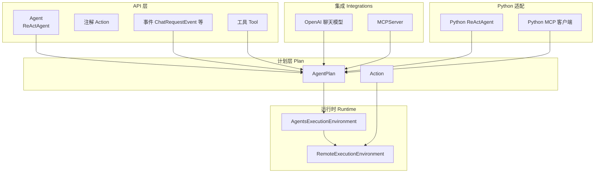
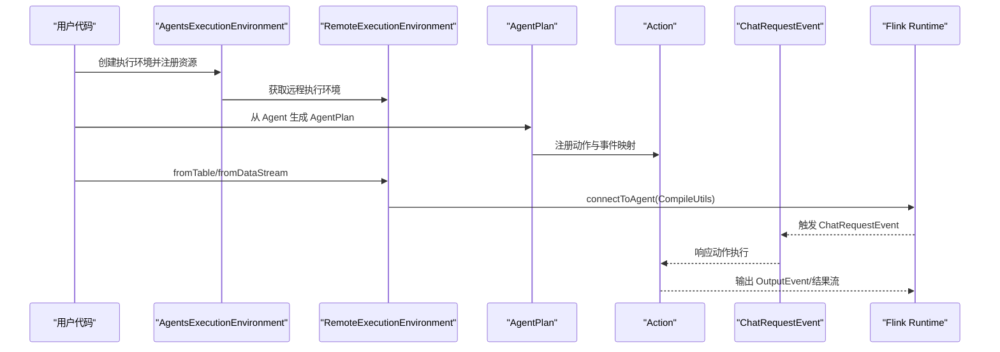
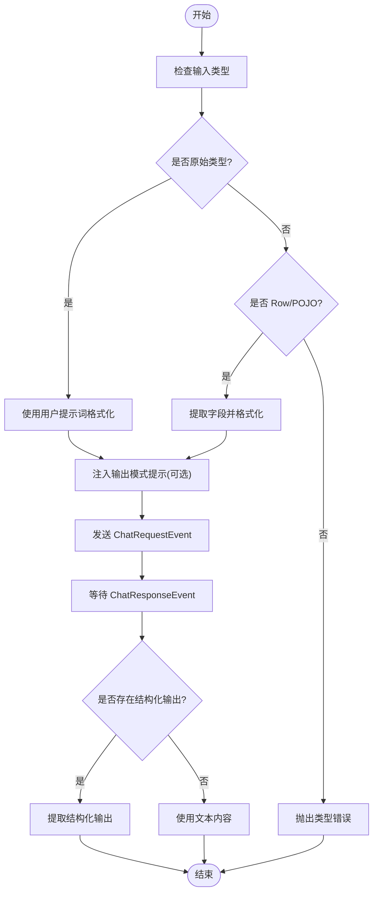
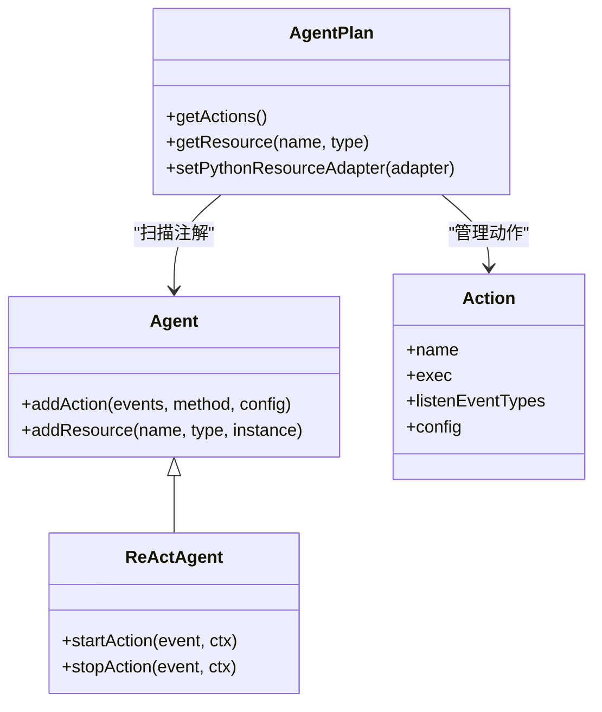
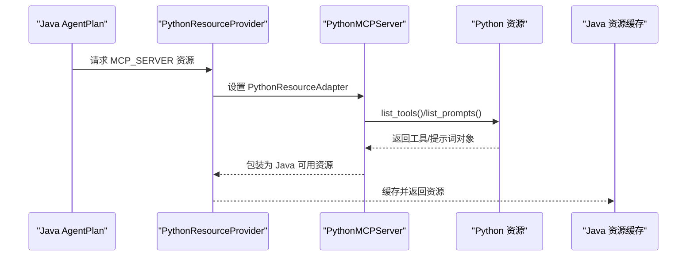
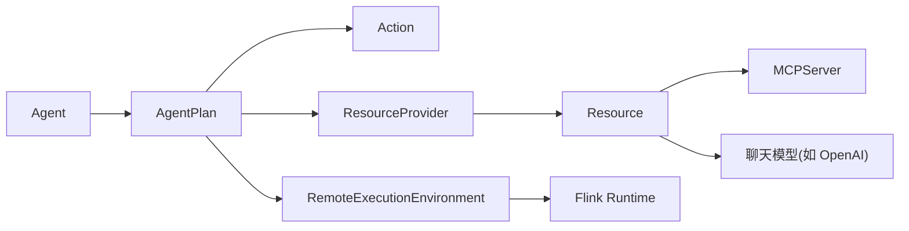

# 项目概述

<cite>
**本文引用的文件**
- [README.md](file://README.md)
- [Agent.java](file://api/src/main/java/org/apache/flink/agents/api/agents/Agent.java)
- [ReActAgent.java](file://api/src/main/java/org/apache/flink/agents/api/agents/ReActAgent.java)
- [AgentsExecutionEnvironment.java](file://api/src/main/java/org/apache/flink/agents/api/AgentsExecutionEnvironment.java)
- [AgentPlan.java](file://plan/src/main/java/org/apache/flink/agents/plan/AgentPlan.java)
- [Action.java](file://plan/src/main/java/org/apache/flink/agents/plan/actions/Action.java)
- [Action.java](file://api/src/main/java/org/apache/flink/agents/api/annotation/Action.java)
- [ChatRequestEvent.java](file://api/src/main/java/org/apache/flink/agents/api/event/ChatRequestEvent.java)
- [Tool.java](file://api/src/main/java/org/apache/flink/agents/api/tools/Tool.java)
- [RemoteExecutionEnvironment.java](file://runtime/src/main/java/org/apache/flink/agents/runtime/env/RemoteExecutionEnvironment.java)
- [ReActAgentTest.java](file://e2e-test/flink-agents-end-to-end-tests-integration/src/test/java/org/apache/flink/agents/integration/test/ReActAgentTest.java)
- [react_agent.py](file://python/flink_agents/api/agents/react_agent.py)
- [OpenAIChatModelSetup.java](file://integrations/chat-models/openai/src/main/java/org/apache/flink/agents/integrations/chatmodels/openai/OpenAIChatModelSetup.java)
- [MCPServer.java](file://integrations/mcp/src/main/java/org/apache/flink/agents/integrations/mcp/MCPServer.java)
- [PythonMCPServer.java](file://plan/src/main/java/org/apache/flink/agents/plan/resource/python/PythonMCPServer.java)
- [mcp.py](file://python/flink_agents/integrations/mcp/mcp.py)
</cite>

## 目录
1. [引言](#引言)
2. [项目结构](#项目结构)
3. [核心组件](#核心组件)
4. [架构总览](#架构总览)
5. [详细组件分析](#详细组件分析)
6. [依赖关系分析](#依赖关系分析)
7. [性能考量](#性能考量)
8. [故障排查指南](#故障排查指南)
9. [结论](#结论)
10. [附录](#附录)

## 引言
Apache Flink Agents 是一个基于 Apache Flink 的智能体（Agent）框架，旨在通过流式数据处理与分布式执行，构建具备事件驱动、工具调用与跨语言互操作能力的智能代理系统。其核心价值在于：
- 借助 Flink 的流处理与分布式计算能力，实现高吞吐、低延迟、可扩展的智能体执行环境；
- 提供 ReAct 代理机制，结合大模型函数调用能力，实现“思考-行动-观察”的闭环；
- 支持跨语言资源（Java/Python）与 MCP 协议，统一抽象工具、提示词与向量存储等外部能力；
- 以声明式计划（AgentPlan）编译与序列化，确保跨运行时的一致性与可移植性。

本项目定位于“面向实时与大规模数据场景的智能体平台”，既适合初学者快速上手，也满足专家对性能、可扩展性与工程化的深度需求。

## 项目结构
项目采用多模块分层组织，围绕 API、计划（Plan）、运行时（Runtime）、集成（Integrations）与端到端测试（E2E）展开：
- api：对外 API 与注解、事件、工具、资源描述符等核心抽象；
- plan：将用户定义的 Agent 编译为可序列化的 AgentPlan，并管理资源提供者与动作映射；
- runtime：与 Flink 运行时集成，负责远程执行、表/流转换、资源缓存与生命周期管理；
- integrations：各类外部服务集成（聊天模型、嵌入模型、MCP、向量库等）；
- python：Python 端 API 与运行时适配，实现跨语言互操作；
- e2e-test：端到端集成测试与跨语言测试，覆盖典型使用场景；
- tools：构建脚本与发布工具链。

图表来源
- [Agent.java](file://api/src/main/java/org/apache/flink/agents/api/agents/Agent.java#L34-L131)
- [ReActAgent.java](file://api/src/main/java/org/apache/flink/agents/api/agents/ReActAgent.java#L51-L183)
- [AgentsExecutionEnvironment.java](file://api/src/main/java/org/apache/flink/agents/api/AgentsExecutionEnvironment.java#L43-L223)
- [AgentPlan.java](file://plan/src/main/java/org/apache/flink/agents/plan/AgentPlan.java#L73-L625)
- [Action.java](file://plan/src/main/java/org/apache/flink/agents/plan/actions/Action.java#L43-L100)
- [RemoteExecutionEnvironment.java](file://runtime/src/main/java/org/apache/flink/agents/runtime/env/RemoteExecutionEnvironment.java#L50-L217)
- [OpenAIChatModelSetup.java](file://integrations/chat-models/openai/src/main/java/org/apache/flink/agents/integrations/chatmodels/openai/OpenAIChatModelSetup.java#L61-L220)
- [MCPServer.java](file://integrations/mcp/src/main/java/org/apache/flink/agents/integrations/mcp/MCPServer.java#L78-L438)
- [react_agent.py](file://python/flink_agents/api/agents/react_agent.py#L42-L212)
- [mcp.py](file://python/flink_agents/integrations/mcp/mcp.py#L136-L330)

章节来源
- [README.md](file://README.md#L1-L44)
- [AgentsExecutionEnvironment.java](file://api/src/main/java/org/apache/flink/agents/api/AgentsExecutionEnvironment.java#L43-L223)

## 核心组件
- 智能体基类与内置 ReAct 实现
  - Agent：定义动作注册、资源注册与错误处理策略等通用能力；
  - ReActAgent：内置“思考-行动-观察”流程，自动将输入格式化为消息并请求聊天模型，再按输出模式解析结果。
- 执行环境
  - AgentsExecutionEnvironment：统一入口，支持本地与远程（Flink）执行环境；
  - RemoteExecutionEnvironment：桥接 Flink DataStream/Table，生成可执行流水线。
- 计划与动作
  - AgentPlan：扫描注解与资源，生成可序列化的 AgentPlan，维护动作映射与资源提供者；
  - Action：封装事件监听、函数签名校验与配置。
- 事件与工具
  - ChatRequestEvent：封装模型请求参数与输出模式；
  - Tool：统一工具抽象，支持函数工具与 MCP 工具。
- 资源与跨语言
  - Resource/ResourceDescriptor：资源类型与描述符；
  - Python 侧适配：ReActAgent、MCP 客户端与资源包装器，实现 Java/Python 互通。

章节来源
- [Agent.java](file://api/src/main/java/org/apache/flink/agents/api/agents/Agent.java#L34-L131)
- [ReActAgent.java](file://api/src/main/java/org/apache/flink/agents/api/agents/ReActAgent.java#L51-L183)
- [AgentsExecutionEnvironment.java](file://api/src/main/java/org/apache/flink/agents/api/AgentsExecutionEnvironment.java#L43-L223)
- [AgentPlan.java](file://plan/src/main/java/org/apache/flink/agents/plan/AgentPlan.java#L73-L625)
- [Action.java](file://plan/src/main/java/org/apache/flink/agents/plan/actions/Action.java#L43-L100)
- [ChatRequestEvent.java](file://api/src/main/java/org/apache/flink/agents/api/event/ChatRequestEvent.java#L29-L58)
- [Tool.java](file://api/src/main/java/org/apache/flink/agents/api/tools/Tool.java#L30-L70)
- [react_agent.py](file://python/flink_agents/api/agents/react_agent.py#L42-L212)

## 架构总览
下图展示从用户定义 Agent 到 Flink 流水线执行的关键路径，以及跨语言与 MCP 集成点：

图表来源
- [AgentsExecutionEnvironment.java](file://api/src/main/java/org/apache/flink/agents/api/AgentsExecutionEnvironment.java#L68-L121)
- [RemoteExecutionEnvironment.java](file://runtime/src/main/java/org/apache/flink/agents/runtime/env/RemoteExecutionEnvironment.java#L50-L217)
- [AgentPlan.java](file://plan/src/main/java/org/apache/flink/agents/plan/AgentPlan.java#L132-L141)
- [Action.java](file://plan/src/main/java/org/apache/flink/agents/plan/actions/Action.java#L43-L100)
- [ChatRequestEvent.java](file://api/src/main/java/org/apache/flink/agents/api/event/ChatRequestEvent.java#L29-L58)

## 详细组件分析

### ReAct 代理机制
- 输入适配：支持原始类型、Row 与 POJO，自动注入用户提示词；
- 输出约束：可选输出模式（RowTypeInfo 或 Pydantic 模型），通过系统提示词约束 LLM 输出格式；
- 动作编排：startAction 发送 ChatRequestEvent；stopAction 接收 ChatResponseEvent 并输出结构化结果。

图表来源
- [ReActAgent.java](file://api/src/main/java/org/apache/flink/agents/api/agents/ReActAgent.java#L103-L181)
- [react_agent.py](file://python/flink_agents/api/agents/react_agent.py#L144-L212)

章节来源
- [ReActAgent.java](file://api/src/main/java/org/apache/flink/agents/api/agents/ReActAgent.java#L51-L183)
- [react_agent.py](file://python/flink_agents/api/agents/react_agent.py#L42-L212)

### 事件驱动与动作模型
- 注解驱动：@Action 标注方法监听特定事件类型；
- 动作封装：Action 绑定函数签名与配置，保证事件触发时的类型安全；
- 内置动作：AgentPlan 自动注册聊天模型、工具调用与上下文检索等内置动作。

图表来源
- [Agent.java](file://api/src/main/java/org/apache/flink/agents/api/agents/Agent.java#L34-L131)
- [ReActAgent.java](file://api/src/main/java/org/apache/flink/agents/api/agents/ReActAgent.java#L51-L183)
- [Action.java](file://plan/src/main/java/org/apache/flink/agents/plan/actions/Action.java#L43-L100)
- [AgentPlan.java](file://plan/src/main/java/org/apache/flink/agents/plan/AgentPlan.java#L73-L282)

章节来源
- [Action.java](file://api/src/main/java/org/apache/flink/agents/api/annotation/Action.java#L28-L54)
- [Action.java](file://plan/src/main/java/org/apache/flink/agents/plan/actions/Action.java#L43-L100)
- [AgentPlan.java](file://plan/src/main/java/org/apache/flink/agents/plan/AgentPlan.java#L298-L361)

### 跨语言执行（Java-Python 互操作）
- 资源适配：Java 侧通过 PythonResourceProvider 与 PythonMCPServer 包装 Python 资源；
- MCP 协议：Java 与 Python 两端均提供 MCPServer/MCPTool/MCPPrompt 抽象，统一工具与提示词发现与调用；
- 传输与序列化：通过 PythonResourceAdapter 调用 Python 对象方法，保持资源生命周期与参数传递一致性。

图表来源
- [AgentPlan.java](file://plan/src/main/java/org/apache/flink/agents/plan/AgentPlan.java#L143-L197)
- [PythonMCPServer.java](file://plan/src/main/java/org/apache/flink/agents/plan/resource/python/PythonMCPServer.java#L32-L92)
- [MCPServer.java](file://integrations/mcp/src/main/java/org/apache/flink/agents/integrations/mcp/MCPServer.java#L78-L438)
- [mcp.py](file://python/flink_agents/integrations/mcp/mcp.py#L136-L330)

章节来源
- [AgentPlan.java](file://plan/src/main/java/org/apache/flink/agents/plan/AgentPlan.java#L143-L197)
- [PythonMCPServer.java](file://plan/src/main/java/org/apache/flink/agents/plan/resource/python/PythonMCPServer.java#L32-L92)
- [MCPServer.java](file://integrations/mcp/src/main/java/org/apache/flink/agents/integrations/mcp/MCPServer.java#L78-L438)
- [mcp.py](file://python/flink_agents/integrations/mcp/mcp.py#L136-L330)

### 工具调用能力
- 函数工具：支持静态方法或 POJO 工具，自动提取元数据与参数模式；
- MCP 工具：从 MCP 服务器动态发现工具，统一调用接口；
- 结果解析：支持结构化输出与文本回退，便于下游处理。

章节来源
- [Tool.java](file://api/src/main/java/org/apache/flink/agents/api/tools/Tool.java#L30-L70)
- [mcp.py](file://python/flink_agents/integrations/mcp/mcp.py#L46-L78)

### 聊天模型与参数配置
- OpenAI 集成：提供温度、最大令牌数、严格模式、推理强度与附加参数等配置项；
- 参数校验：对非法范围进行校验并抛出异常，保障运行稳定性。

章节来源
- [OpenAIChatModelSetup.java](file://integrations/chat-models/openai/src/main/java/org/apache/flink/agents/integrations/chatmodels/openai/OpenAIChatModelSetup.java#L61-L220)

### 执行环境与 Flink 集成
- 远程执行：RemoteExecutionEnvironment 将 DataStream/Table 转换为可执行 Agent 流水线；
- 表/流桥接：支持从 Table 转 DataStream，并可指定键选择器进行状态化处理；
- 配置加载：从 Flink 配置目录加载 YAML 中的 agent 配置。

章节来源
- [RemoteExecutionEnvironment.java](file://runtime/src/main/java/org/apache/flink/agents/runtime/env/RemoteExecutionEnvironment.java#L50-L217)

## 依赖关系分析
- 组件耦合
  - AgentPlan 与 Action：强内聚的动作注册与事件映射；
  - Agent 与资源：弱耦合的资源注册与延迟提供；
  - 运行时与 Flink：通过 CompileUtils 连接，避免直接耦合具体算子。
- 外部依赖
  - MCP 客户端 SDK（Java/Python）用于协议通信；
  - 各聊天模型 SDK（如 OpenAI）用于参数化调用；
  - Python 运行时与 pemja 用于跨语言调用。

图表来源
- [AgentPlan.java](file://plan/src/main/java/org/apache/flink/agents/plan/AgentPlan.java#L334-L598)
- [RemoteExecutionEnvironment.java](file://runtime/src/main/java/org/apache/flink/agents/runtime/env/RemoteExecutionEnvironment.java#L120-L217)

章节来源
- [AgentPlan.java](file://plan/src/main/java/org/apache/flink/agents/plan/AgentPlan.java#L334-L598)
- [RemoteExecutionEnvironment.java](file://runtime/src/main/java/org/apache/flink/agents/runtime/env/RemoteExecutionEnvironment.java#L120-L217)

## 性能考量
- 流处理与并行度：利用 Flink 的背压与并行度控制，合理设置 KeySelector 与分区策略；
- 资源缓存：AgentPlan 对资源进行缓存，减少重复创建开销；
- 序列化与传输：跨语言资源通过适配器统一调用，避免频繁序列化；
- 工具调用：MCP 工具与聊天模型调用建议异步化，降低阻塞风险；
- 输出模式：通过输出模式约束 LLM 输出，减少后处理成本。

## 故障排查指南
- 资源冲突：重复注册同名资源会抛出异常，检查资源名称与类型；
- 类型不匹配：输入类型必须为原始类型、Row 或 POJO，否则需提供用户提示词；
- 输出模式不一致：若 LLM 输出不符合模式，可能导致解析失败，建议放宽模式或增加示例；
- MCP 连接问题：检查端点、认证与超时配置，确认网络可达；
- 配置加载失败：确认 Flink 配置目录与 YAML 文件格式正确。

章节来源
- [Agent.java](file://api/src/main/java/org/apache/flink/agents/api/agents/Agent.java#L97-L111)
- [ReActAgent.java](file://api/src/main/java/org/apache/flink/agents/api/agents/ReActAgent.java#L122-L147)
- [MCPServer.java](file://integrations/mcp/src/main/java/org/apache/flink/agents/integrations/mcp/MCPServer.java#L242-L258)
- [RemoteExecutionEnvironment.java](file://runtime/src/main/java/org/apache/flink/agents/runtime/env/RemoteExecutionEnvironment.java#L102-L117)

## 结论
Apache Flink Agents 以 Flink 为底座，提供了面向实时与大规模数据场景的智能体平台。通过 ReAct 机制、事件驱动与工具调用、跨语言互操作与 MCP 协议，项目在工程化与可扩展性之间取得平衡。对于初学者，可从内置 ReActAgent 与简单工具入手；对于专家，可通过自定义动作、资源提供者与 Flink 优化实现高性能生产级应用。

## 附录
- 使用场景示例
  - 数据表上的智能计算：将表格输入接入 ReActAgent，绑定工具与聊天模型，输出结构化结果；
  - 事件驱动的业务流程：以事件为触发点，串联工具调用与外部服务交互；
  - 跨语言工具复用：通过 MCP 将 Python 工具无缝接入 Java 智能体。

章节来源
- [ReActAgentTest.java](file://e2e-test/flink-agents-end-to-end-tests-integration/src/test/java/org/apache/flink/agents/integration/test/ReActAgentTest.java#L77-L190)